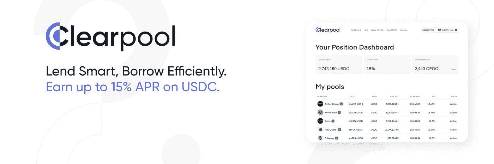

# 解释了 Clearpool 的 DeFi 策略

> 原文：<https://medium.com/coinmonks/clearpools-defi-strategy-explained-6623efa2fa57?source=collection_archive---------16----------------------->

Source: Clearpool Finance

好吧，如果你还没有听说过 Clearpool，那么现在是一个很好的机会来了解更多关于这个上升的 DeFi 贷款协议。

过去的一个月对 DeFi 市场来说并不好，TVL 在 6 月 29 日跌至[744.7 亿美元](https://defillama.com/)。从卢纳/UST 的崩溃开始，我们目睹了连锁反应蔓延到整个 DeFi 市场，因为 Celsius、Babel Finance、BlockFi 和许多其他公司暴露了它们的漏洞。DeFi 市场已经被该领域的大玩家撼动，然而，它也照亮了继续构建和提供可持续价值的协议。其中之一是 Clearpool，这是一个面向机构借款人的分散式贷款平台。

尽管时局动荡，但 Clearpool 继续通过以下策略脱颖而出:

**#1 Clearpool 在区块链上运行，由智能合约编写。**

与不透明的中央银行不同，所有交易活动都记录在区块链上，可以很容易地跟踪。基于 Clearpool 对信誉和良好市场实践的重视，智能合同的使用还确保了与各种贷款人和借款人的合同得到严格遵守。

**#2 未抵押贷款**

通过无抵押贷款，Clearpool 为借款人提供了最大的资本效率。再加上简单的入职流程，自 3 月份推出以来，Clearpool 上未经许可的借款人数量不断增加也就不足为奇了。截至 7 月 3 日，贷款发放总额已突破 1.6 亿美元！

**#3 Clearpool 与信用评级机构 X-Margin 合作，X-Margin 使用零知识技术、加密技术和机密计算进行信用风险分析。**

我们的合作伙伴在我们的所有借款人被批准建立借款人才库之前，在入职流程中对他们进行实时风险监控。即使有了最新的借款人池 TPS Capital(与最近申请破产的 3AC 有关)，X-Margin 对挑战的反应也非常积极。借款人立即被降级为 B 级，在收到全额还款(包括利息)后，借款人资金池立即关闭。

**#4 Clearpool 通过促进 Jane Street 和 BlockTower Capital 之间的许可池，将 TradFi 引入 DeFi。**

华尔街巨头 Jane Street 已经通过 Clearpool 与 BlockTower Capital 建立了一个许可贷款池，获得了高达 5000 万美元的贷款。获得华尔街最大交易公司之一的信任，也为后续 TradFi 借款人寻求从多元化贷款机构获得更廉价的信贷铺平了道路。

在合作伙伴 Hex Trust 的支持下，#5 Clearpool 继续促进健康的贷款活动，Hex Trust 为协议资金提供机构级安全保障。

领先的数字资产托管公司 Hex Trust 与 Clearpool 合作，为协议的资金、合规服务和交易监控服务提供机构级托管。由于资金存储在 Hex Trust 的冷钱包中，这为度过熊市提供了最高水平的安全性和灵活性。

**#6 贷款人和借款人的完全灵活性**

经过严格的检查后，获得批准的借款人可以建立一个借款人才库，并获得多元化的贷款人才库，从而降低大规模撤回贷款的风险。他们在偿还利息和本金方面也有充分的灵活性。利率也是由市场供求决定的。在高利用率的情况下，利率会更高，反之亦然。

贷款人可以选择他们想要贷款的借款人，也可以在任何时候提款，没有任何锁定期，也没有退出费。

**#7 令牌持有者和协议的强大路线图。**

第三季度，预计将推出本地堆栈。还将有一个回购机制，承诺使$CPOOL 成为通货紧缩的象征，对寻求资本收益的持有者有利。Clearpool 最近还宣布了在 Polygon 网络上推出的计划，这可能会看到该协议在 TVL、利息收入和令牌激励方面的强劲增长。

**展望**

Clearpool 拥有一支在债务资本市场拥有多年经验的强大团队，清楚地认识到了 TradFi 公司所关心的问题，并提供了创新的解决方案来解决这些问题。熊市暴露了许多有不良市场行为的公司。展望未来，对透明度和安全性的要求会越来越高。当不良行为者被淘汰时，像 Clearpool 这样的可持续协议就证明了他们在安全地将 TradFi 连接到 DeFi 方面的领导地位。

> 交易新手？尝试[加密交易机器人](/coinmonks/crypto-trading-bot-c2ffce8acb2a)或[复制交易](/coinmonks/top-10-crypto-copy-trading-platforms-for-beginners-d0c37c7d698c)

**有用链接**

Clearpool 白皮书:[https://docs.clearpool.finance/resources/whitepaper](https://docs.clearpool.finance/resources/whitepaper)

Clearpool 推特:[https://twitter.com/ClearpoolFin](https://twitter.com/ClearpoolFin)

Clearpool 网站:[https://app.clearpool.finance/](https://app.clearpool.finance/)

Clearpool 首席执行官接受 CryptoVista 采访:[https://crypto vista . com/whos-who-in-crypto-Robert-alcorn-CEO-and-co-founder-of-clear pool/](https://cryptovista.com/whos-who-in-crypto-robert-alcorn-ceo-and-co-founder-of-clearpool/)

中金公司投资总监首席运营官的推特帖子:【https://twitter.com/ianw888/status/1534307153514795008

Hex Trust 和 Clearpool 的 AMA 外卖:[https://twitter.com/jinming_n/status/1541423299716333568](https://twitter.com/jinming_n/status/1541423299716333568)