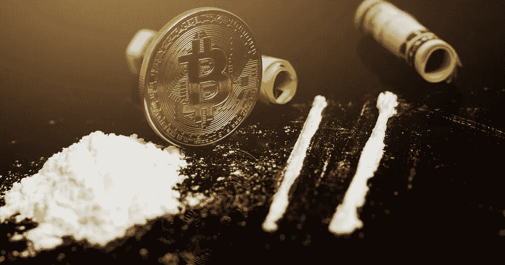
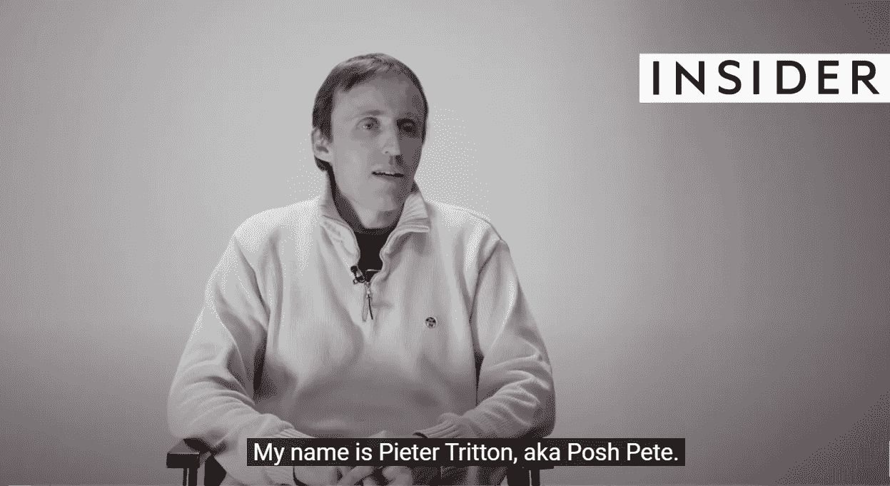
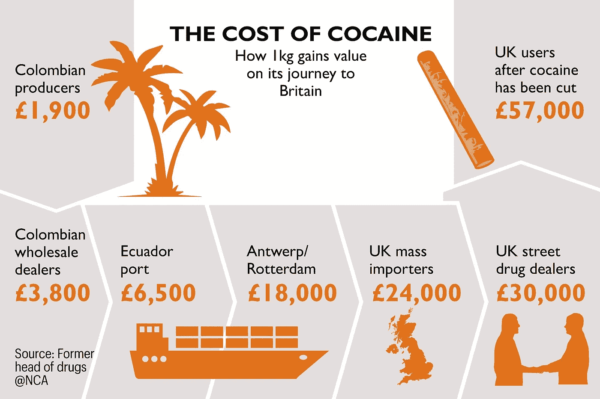

# 可卡因和比特币已经达到平价。

> 原文：<https://medium.com/coinmonks/cocaine-and-bitcoin-has-reached-parity-b2f277e0d563?source=collection_archive---------19----------------------->

A kg of Cocaine and 1 Btc is approximately the same price now.

是的，这是一个你可能不知道的随机事实。

如果是你干的，我需要知道原因和方式。

但是根据你从哪里得到可卡因，1 公斤的白粉和 1 个比特币的价格差不多(约 20-25000 美元)。

这是我在观看某人解释可卡因贩运如何运作后学到的。

多么精彩的采访。

真正的随机，教育，有意义和有见地的世界人口贩卖叙事。

我在面试中见过的最成熟、最理智的人之一。

英国一名前可卡因贩子分享了他对犯罪生意的看法。

他给出了一些有趣的细节，听起来真像是网飞的戏剧。

他对“反毒品战争”的看法令人难以置信地合理和明智。

他的立场是禁毒战争不可能胜利。

激烈的言辞。

政府官员、当局和警察都知道这一点。

随着加密货币和 web3 的出现，追踪非法活动将变得更加困难。

Watch this fascinating interview: [https://youtu.be/lwP9H9qTuUY](https://youtu.be/lwP9H9qTuUY)

他继续就如何赢得反毒品战争提出了自己的解决方案。

准备好了吗？

使所有毒品合法化。

在严格的控制下生产它们。

然后对他们课以重税，以抵消对社会的不利影响。

把这些钱用于康复中心，更好的医疗保健，更多的资源和更好的教育。

我吐出了我的水，听到后从座位上摔了下来。

它很大胆，肯定会沙沙作响。

也许甚至把它全部放在区块链上，一丝不苟地跟踪它们。

无论多么逆势而为，这都很有意义。

几个世纪以来对毒品的定罪给人类带来了什么？

没有一个国家、民族、城市或警察部队赢得过反毒品战争。

他们勇敢地战斗，并在这里和那里取得了一些胜利，但毒品仍然走在街上，感染着年轻人，直到今天。

使他们非法迫使整个系统，卡特尔，贩运者和滥用者转入地下。

转入地下使得获取和贩运毒品的成本更高，反过来也意味着可以用更多的钱来收买卡特尔和帮派。

Even drugs has their complex logistics…

哪里有钱赚，你可以肯定人们会找到方法。

为什么今天可卡因仍然在世界各地被贩运？

为什么现在仍然有那么多吸毒者？

因为贩卖、制造和销售它们仍然可以赚钱。

没有简单的解决办法。

但是皮特说的有道理，值得思考。

看看 YouTube 的评论就知道了。

这么多关于彼得的成熟，智慧和交付的赞美。

在厄瓜多尔监狱里呆 12 年是残酷的。

它会改变人。

我只是在想，如果没有走上毒品交易的道路，没有被关进监狱，没有忍受那些创伤，他的生活会有多丰富多彩。

-

加密货币是否被用于非法活动？

-

# startups # business # startupx # growth # success # social media # culture # web 3 # strategy # hacks # ronin # horizon # harmony # Solana # bridges # eth # BTC # crypto #黑客# wallets

> 交易新手？试试[加密交易机器人](/coinmonks/crypto-trading-bot-c2ffce8acb2a)或者[复制交易](/coinmonks/top-10-crypto-copy-trading-platforms-for-beginners-d0c37c7d698c)