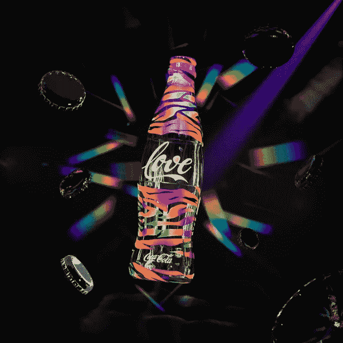

# 可口可乐骄傲 NFT 系列将在多边形网络上发布

> 原文：<https://medium.com/coinmonks/coco-cola-pride-nft-collections-to-be-released-on-the-polygon-network-5d8e9da17208?source=collection_archive---------22----------------------->

**可口可乐**最近发表了一份关于他们的[**骄傲系列 NFT 系列**](https://mint.maketafi.com/coca-cola-collection) 的声明，以庆祝 LGBTQIA+社区。是啊！这家著名的饮料公司正与艺术家 Rich Mnisi 和该系列合作，在 Matic 最不可思议的 [**NFT 市场上展出。**](https://bit.ly/3NHcyIj)

然而，这将是一个独一无二的 NFT，旨在社区成员之间传播爱。此外，根据可口可乐团队的说法，Rich Mnisi 的艺术作品“推动了身份和社区概念的界限。”

> 交易新手？尝试[加密交易机器人](/coinmonks/crypto-trading-bot-c2ffce8acb2a)或[复制交易](/coinmonks/top-10-crypto-copy-trading-platforms-for-beginners-d0c37c7d698c)

他们还表示，他的收藏灵感来自于能量不能被摧毁，只能被转移、改变形式、锁定或释放的想法。

> 爱情也是一样。它可以采取任何形式，包括激情、黑暗、信任和心碎，但它始终存在。

这些抽象的形状代表了爱情的永恒性和易变性。它们提醒我们，我们都拥有决定爱情未来的自由。爱情的定义由我们自己决定。选择自由恋爱。

## **多边形网络上发布了多少 NFT**

Mnisi 和可口可乐加在一起总共有 **136 个 NFT 在 **matic 网络**上铸造。**

不过有些收藏在**[**Opensea**](https://opensea.io/)上。pride 系列确实有 1 ETH 的底价。**

## **销售会发生什么变化？**

**NFT 的销售收入将捐赠给专注于 LGBTQIA+慈善事业的组织。**

**在最初的 12 个月里，所有的收益都将捐给有钱的 Mnisi 的慈善机构，用来支持 LGBTQIA+人民。南美洲第二古老的组织为 LGBTQIA+社区提供身体和精神保健。**

**重要的是，可口可乐公司委托制作这幅作品，希望每一个 NFT 都能**“通过辐射整个社区的色彩，传播简单的爱的信息，增加知名度”****