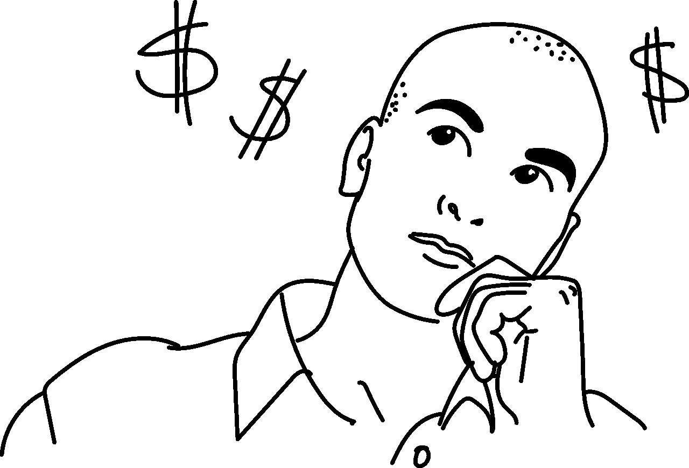

# 影响我们投资决策的认知偏差

> 原文：<https://medium.com/coinmonks/cognitive-biases-that-affect-our-investment-decisions-4465ba7d31dc?source=collection_archive---------36----------------------->

我们经常从大脑的无意识部分做出决定，这些决定是从非理性的基础上开始的，我们无法有意识地控制，除非我们意识到这一点！在本文中，我们将讨论在投资决策时经常影响我们的主要认知偏差。

> **单位偏差**

人们更喜欢购买代币的“整单位”，而不是零头，这也是 meme 币爆炸的原因。不要因为代币“便宜”就高估它的价值。

⚫ 你必须了解市值是如何运作的。

> **锚偏置**

过于依赖你得到的第一手信息。你听说过 1000 美元的比特币，你错过了它，然后它涨到 5000 美元，你不想再买了，在你看来它“太贵了”。

⚫根据它潜力，而不是它的过去来评价它。

> **确认偏差**

只寻找告诉你你想听到的信息，只关注说 X 货币好话的人，停止关注并阻止任何传播“FUD”的人。

⚫ 投资的时候，搜索研究 FUD 看看是不是真的，不要局限于自己“想听”的信息。

> **机会成本偏差**

已经发生且无法收回的成本。我们倾向于继续投入更多的钱或过度承诺，因为我们害怕失去我们最初的投资。在加密技术中，你在一种货币中有-70%，你还有 30%，那 70%已经没了。

⚫ 认为 30%投资于其他地方可能会更好，而不是等着原始投资恢复。

> **分配偏差**

你会对你的行李箱产生情感依恋，我们会对一项投资赋予更高的价值，因为我们拥有它。

⚫:为了避免这种情况，你应该问自己“如果我没有这笔投资，我今天还会投资吗？这让你的决定更加中立。

> **从众心理偏差**

投资者追随和复制其他投资者所做的事情的倾向，他们很大程度上是受情绪和本能的影响，而不是自己独立的分析。

⚫:如果你曾经感到 FOMO，这可能是由于从众心理。

> **话题性偏见**

用最近的信息和事件使我们不堪重负。“ETH 价格没意思，我准备投资小盘币”。

⚫你可以通过缩小图表来克服话题偏见。

> **生存偏差**

布拉德·皮特搬到了洛杉矶，在成为电影明星之前是一名服务员。许多人追随了他的道路，希望能做同样的事情。你不会听说成千上万的人尝试了同样的事情却失败了。有人把 2 k 美元的柴犬变成了 14 亿美元，你不会听说成千上万的人把 2 k 美元变成了 100 美元。

⚫ 媒体更喜欢报道赢家，这扭曲了你对胜算的认知。

> **权威偏见**

这是我们追随领导者的自然倾向，一旦我们相信某人是专家，我们就会相信他们所说的一切。“他们是专家，他们肯定是对的！”。

⚫ 专家可能是错的或者可能别有用心。

> 你如何停止认知偏见？
> 
> 嗯，你已经做得很好了，至少你意识到了它们！这里有一些你可以用来应对认知偏差的策略。
> 
> 1.制定一份认知偏差清单，每次你做投资决定的时候，回顾一下你的认知偏差清单。这让你意识到自己的思维缺陷。
> 2。考虑创建你自己的投资系统，这些公式可以帮助你控制你的情绪。
> 3。保存交易日志和包含所有交易的电子表格。除了财务数据，还记下一些想法。

> 交易新手？尝试[加密交易机器人](/coinmonks/crypto-trading-bot-c2ffce8acb2a)或[复制交易](/coinmonks/top-10-crypto-copy-trading-platforms-for-beginners-d0c37c7d698c)