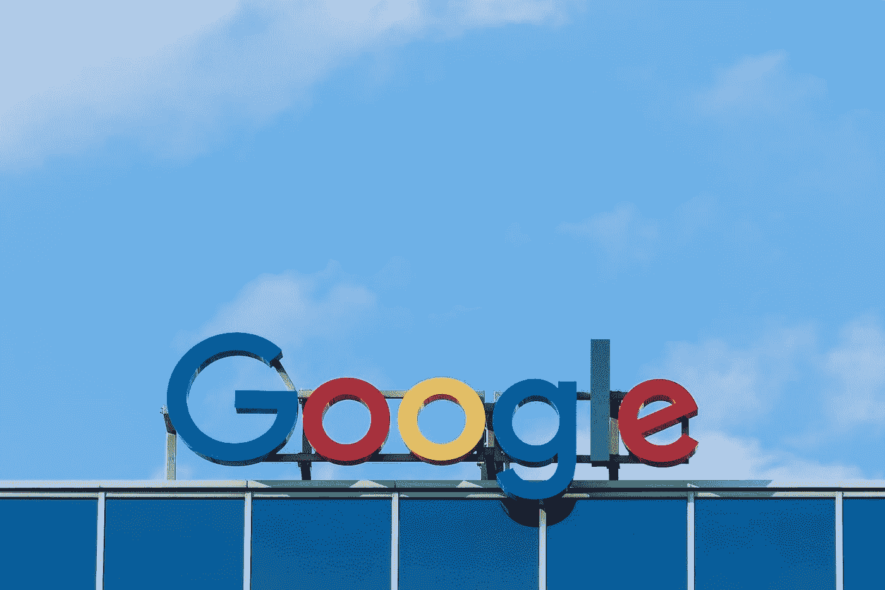

# 比特币基地成为谷歌独家加密货币支付平台

> 原文：<https://medium.com/coinmonks/coinbase-becomes-the-exclusive-cryptocurrency-payment-platform-for-google-25b91a6dbb84?source=collection_archive---------43----------------------->

**谷歌**(纳斯达克股票代码:GOOGL)宣布，它已经选择**比特币基地**(纳斯达克股票代码:COIN)作为其合作伙伴，允许其云客户以加密货币支付。

**发生了什么事情**:10 月 11 日，这家科技巨头在其云下一次会议上宣布，从明年年初开始，其云客户将能够以数字货币支付服务，如**比特币** (CRYPTO: BTC)和**以太坊** (CRYPTO: ETH)。

谷歌云副总裁兼总经理阿米特·扎维(Amit Zavery)表示，这笔交易将通过比特币基地的加密货币支付平台“比特币基地商务”进行，并将向选定的客户开放。合作协议的一部分还包括比特币基地将其部分数据相关应用从亚马逊网络服务(AWS)转移到谷歌的云基础设施，以及谷歌使用比特币基地的服务比特币基地 Prime。

虽然交易的细节尚不清楚，但谷歌云的首席执行官(CEO)托马斯·库林(Thomas Kurin)表示，这一合作关系朝着让 Web3 的构建更快更简单的目标又迈进了一步。

谷歌一直对 crypto 和 Web3 表现出浓厚的兴趣。alphabet——谷歌的母公司——迄今为止已经向 crypto 和 Web3 公司投资了 15 亿美元，包括 Voltage 和 Digital Currency Group。就在几天前，谷歌[宣布](https://cointelegraph.com/news/near-protocol-partners-with-google-cloud-to-support-web3-devs)与 Near Protocol 达成一项 Web3 合作协议，谷歌将在构建和扩展 Web3 应用和分散应用(dApps)方面向 Near 开发者提供技术支持。

比特币基地已经开始看到这项合作协议的好处。消息公布后，比特币基地的股价上涨了 5.2%。

Pawel Czerwinski 在 Unsplash 上拍摄的照片

> 交易新手？试试[加密交易机器人](/coinmonks/crypto-trading-bot-c2ffce8acb2a)或者[复制交易](/coinmonks/top-10-crypto-copy-trading-platforms-for-beginners-d0c37c7d698c)