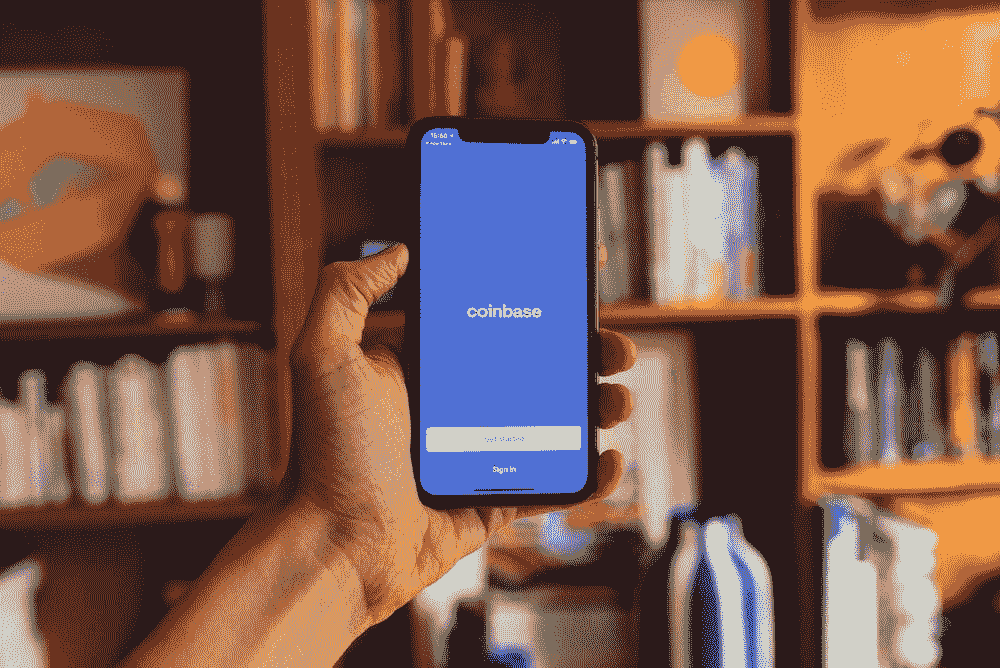

# 比特币基地密码交易所

> 原文：<https://medium.com/coinmonks/coinbase-crypto-exchange-b5d11af1c071?source=collection_archive---------42----------------------->

比特币基地是世界上最受欢迎和最知名的加密货币交易所之一。该公司成立于 2012 年，此后发展成为美国最大的比特币交易所。比特币基地是一个数字货币平台，允许用户购买、出售和存储数字货币。它还为商家和开发者提供了一个构建应用程序和接受数字货币支付的平台。