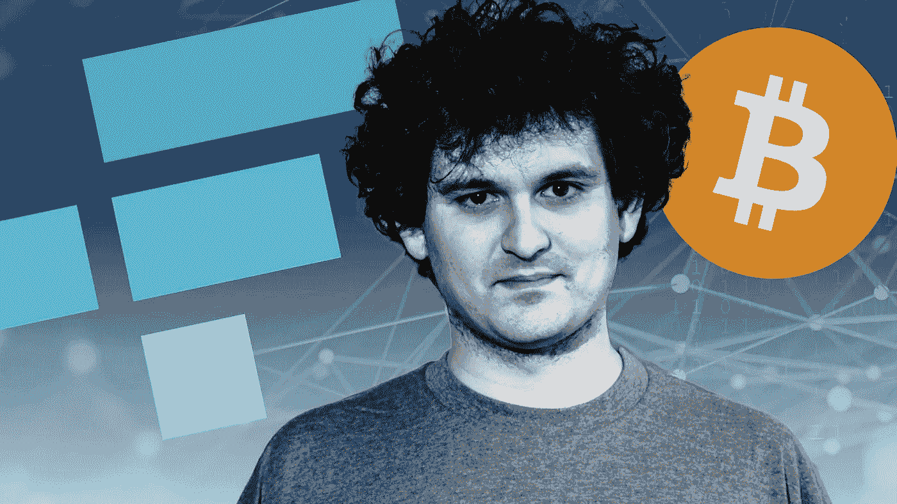
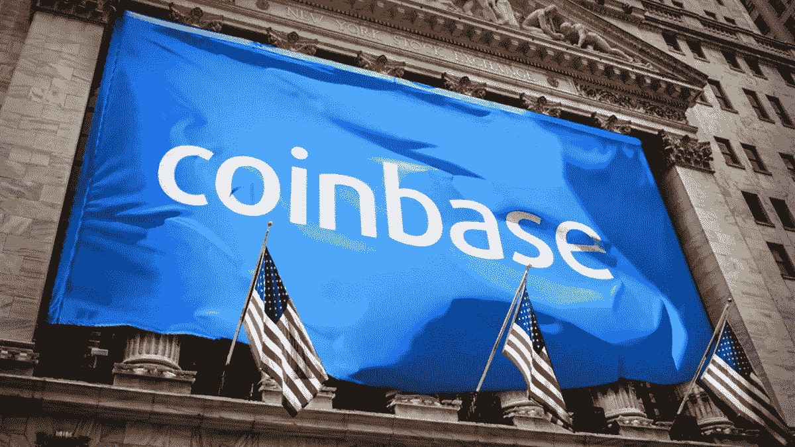
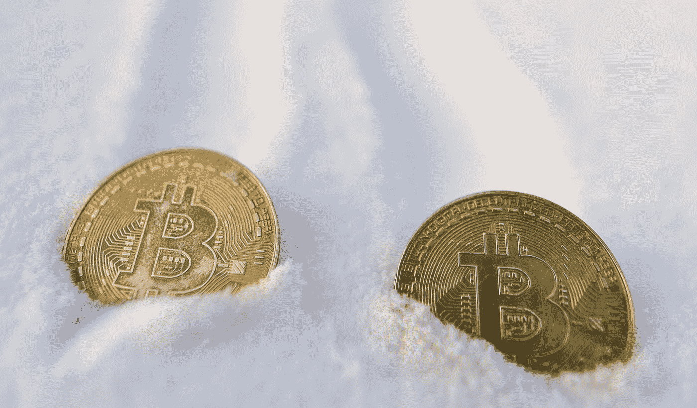

# 比特币基地在一个季度内损失了 300 美元的 1B，而 FTX 在这个隐秘的冬天赚了 300 美元的 1B

> 原文：<https://medium.com/coinmonks/coinbase-lost-1b-in-a-quarter-while-ftx-made-1b-during-the-crypto-winter-a966bc17e915?source=collection_archive---------26----------------------->

At nearly $12B, SBF is one of the richest person in crypto.

反差不能再大了。

“2022 年第二季度，比特币基地净亏损 11 亿美元”。

“**在加密热潮期间，FTX 的收入增长了 1000%”。**

我不是专业的股票分析师，但我会看头条。

鉴于 FTX 和比特币基地都是允许用户交易加密货币的加密交易所，不需要天才就能知道谁做得更好。

一家公司在一个季度内亏损了 10 亿美元，而另一家公司在这个隐秘的冬天赚了 10 亿美元。

问题是，为什么？

当 FTX 似乎在天空高高飞翔，而山姆·班克曼·弗里德(SBF 饰)带着他的数十亿美元四处购买不良资产时，为什么比特币基地却在受苦？

比特币基地成立于 2012 年，当它以 860 亿美元的 IPO 上市时，它是加密领域最大、最知名的品牌之一。

比特币基地的联合创始人兼首席执行官 Brian Armstrong 拥有约 4000 万股股票，价值 140 亿美元。

自那以后，由于熊市，比特币基地现在的市值徘徊在 160 亿美元左右。

Coinbase IPO-ed at around $86B in 2021.

FTX 成立于 2019 年，在筹集了 4 亿美元的 C 轮融资后，现在价值超过 320 亿美元。

据报道，SBF 拥有超过 50%的股份。

FTX 是加密交换团队中最年轻的成员之一，他崛起了，现在的身价几乎是 OG 成员之一比特币基地的两倍。

这让我想起了早期福特设计福特 GT 只是为了在法国勒芒 24 小时耐力赛中击败法拉利。

没人认为福特有机会。

我不得不承认，我没想到 FTX 也有机会。

当然，与亨利·福特二世和恩佐·法拉利不同，FTX 和比特币基地之间没有敌意。

但事实是，FTX 能够在这么晚的时间进入游戏，并取得如此大的进步，最终击败这个行业的巨头，这是非常令人惊讶的。

熊市对每个人的打击都一样。

FTX 在哪些方面比比特币基地做得好得多？

在比特币基地遭受痛苦、市场流血的时候赚钱。

这是所有问题中最有趣的一个。

How long will this crypto winter last?

但这仍然是一个低迷的市场，加密冬天对每个人都是一个沉重的打击。

交易量直线下降。

财富一夜之间化为乌有。

秘密游客永远离开了。

好的和坏的玩家都离开了竞技场。

但我认为，从整体来看，这对 Crypto 来说是一件好事。

所有市场都会经历周期，上升和下降。

我们需要这些周期来清除弱者、未承诺者、没有信念者和为了快速赚钱和炒作的旅游投机者。

当尘埃落定，隐秘的夏天来临，我们将会看到更新更好的东西。

-

熊市快结束了吗？

-

# startups # business # startupx # growth # success # social media # culture # web 3 # strategy # coin base # ftx # sbf # sambankmanfried # brianarmstrong # revenue # winter # eth # BTC # crypto #黑客#钱包

> 交易新手？试试[加密交易机器人](/coinmonks/crypto-trading-bot-c2ffce8acb2a)或者[复制交易](/coinmonks/top-10-crypto-copy-trading-platforms-for-beginners-d0c37c7d698c)