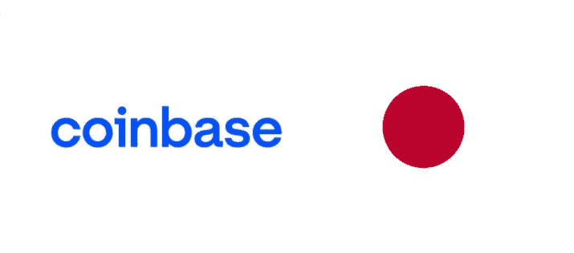

# 比特币基地将在日本推出

> 原文：<https://medium.com/coinmonks/coinbase-to-launch-in-japan-5368be187da9?source=collection_archive---------46----------------------->

[*— Sign up for Coinbase, and claim 10$ in bitcoin today here —*](https://coinbase.com/join/51kvr7)

世界各地都在发生关于加密的重大新闻，日本也很高兴加入这一激动人心的时刻。岸田文雄总理对 web3 领域做出了积极的贡献，并热情地鼓励采用和发展区块链技术。日本一直是全球主要的加密玩家，许多人认为日本是该技术开发和采用的领先国家。