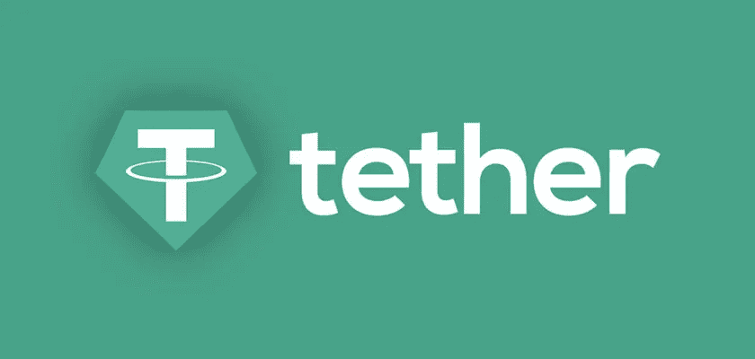

# 比特币基地警告客户不要栓绳(USDT)

> 原文：<https://medium.com/coinmonks/coinbase-warns-clients-against-tether-usdt-dd8d796f6412?source=collection_archive---------5----------------------->

这确实是一种战争行为，比特币基地在追赶泰瑟(USDT)，大胆地试图将它消灭。币安对 FTX 和他们整个安非他明消费波希米亚团队也做了同样的事情。也许，这是一个密码领域的战争时代，这是一个蔑视和破坏的时代，当分散化的乌托邦梦想逐渐破灭的时候。大鱼吃小鱼什么的。然而，在所有这些看似正义的推文中，字里行间都写了很多东西。这些问题不仅没有答案，甚至没有被提出。最初于 2012 年成立的加密货币交易所比特币基地已经发出强烈警告，要求客户放弃他们的系绳(USDT)。现在，泰瑟并不是圣人，但这是值得思考的，为什么比特币基地花了整整十年才意识到这个问题？随着所有的敌意四处蔓延，加密市场似乎要结束了。特拉(月球)，FTX，创世纪，3AC 和现在系绳。再一次，我们有一个行业巨头搅起了辣椒锅，而投资者即将亏损。

## **轮到你了系绳(USDT)！**

上周，加密影响者[本·阿姆斯壮](https://www.youtube.com/watch?v=MWfHpBZL2PI)在几乎所有的社交媒体平台上曝光了德尔泰克银行(实际上是系绳总部)。简而言之，Tether 应该存放储备的很多地方实际上都是空的。所以，这看起来是个大丑闻。然而，这个巨大的丑闻实际上是贯穿整个秘密市场血管的虚构血细胞。至少可以说是可怕的！

实际上，要指出 USDT 对加密市场的重要性是不可能的。看在上帝的份上，这是自加密货币出现以来最受欢迎的稳定币，直到今天仍然如此。

现在，美国头号加密交易所向其投资者发出了严重警告。根据[的一篇博文](https://www.coinbase.com/blog/switch-to-the-trusted-and-reputable-digital-dollar-usdc)，比特币基地建议客户将他们在 USDT 的股份兑换成美元硬币(USDC)。他们认为市场动荡是导致 USDT 不稳定并随后与美元脱钩的可能原因。

有鉴于此，比特币基地称 Circle 的美元硬币是 USDT 安全稳定的替代货币。

## **USDC 对 USDT**

为了进一步鼓励采取行动，比特币基地将免除将 Tether 兑换成美元硬币的费用。

“现在，稳定和信任对客户来说比以往任何时候都更加重要。菲亚特支持的 stablecoins(与美元等储备资产挂钩的加密货币)在波动时期为客户提供了稳定性和信心。

然而，过去几周的事件已经对一些稳定的数据进行了测试，我们已经看到了安全的飞行。我们相信美元硬币(USDC)是一种值得信赖和声誉良好的稳定硬币，因此我们正在使转换更加顺畅:从今天开始，我们将免除全球零售客户将 USDT 转换为 USDC 的费用。"

但这里有一个问题，美元硬币是比特币基地和支付平台 Circle 在 2018 年创建的稳定硬币。从根本上说，比特币基地正在创造一个巨大的 FUD，以促进他们自己的产品作为一个更好的选择。与此同时，泰瑟暴露了，而且几乎被抓了个正着。

目前，Tether (USDT)是排名第三的加密货币，市值超过 650 亿美元。另一方面，USD Coin 排名第五，市值超过 420 亿美元。

从表面上看，比特币基地的目标是一劳永逸地推翻这个稳定的货币巨人，并全力以赴。至于他们的方法，他们选择了客户安全作为他们的座右铭。但是，就是这个[比特币基地](https://blog.hi.exchange/coinbase-exchange-selling-user-data/)向出价最高者出售用户数据，[在一次黑客攻击中泄露了](https://blog.hi.exchange/coinbase-under-attack-6000-accounts-hacked/)数千个用户账户，并以[的算法稳定币](https://blog.hi.exchange/gyen-stablecoin-coinbase/)悲惨失败。

这种话语，被 CZ 币安使用，被比特币基地使用，被像迈克尔·塞勒甚至本·阿姆斯壮这样的人滥用，令人作呕。可悲的是，crypto 正淹没在永无止境的令人作呕的话语洪流中。

“[比特币基地警告客户提防系绳(USDT)](https://blog.hi.exchange/tether-usdt-coinbase/) ”最初发表在 HiExchange 博客上的是[尼玛·阿斯加里](https://blog.hi.exchange/author/nimaasgari/)

> 交易新手？尝试[加密交易机器人](/coinmonks/crypto-trading-bot-c2ffce8acb2a)或[复制交易](/coinmonks/top-10-crypto-copy-trading-platforms-for-beginners-d0c37c7d698c)