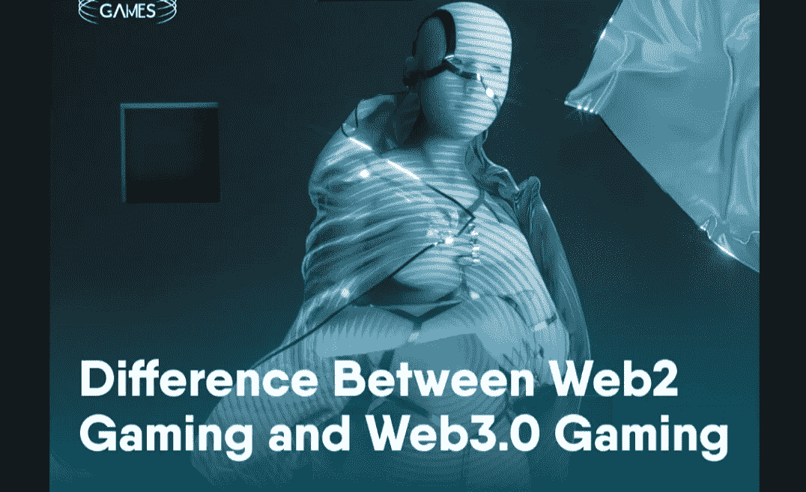

# Coinex 智能链 Web2 游戏和 Web3.0 游戏的区别

> 原文：<https://medium.com/coinmonks/coinex-smart-chain-difference-between-web2-gaming-and-web3-0-gaming-aa610574e73a?source=collection_archive---------17----------------------->

最近，区块链技术已经在许多经济领域起飞，促进了附加值、增长和创新。在区块链的众多行业中，博彩业最值得关注。根据统计，由于 GameFi 平台和

44%的投资者认为，Web2 游戏公司进入 GameFi 是 GameFi 在 2022 年增长的关键驱动力，这是我们在 Coinex Smart Chain 的一个关键愿景

鼓励实际采用区块链技术的一个用例是游戏，它鼓励用户在区块链平台上进行交易，而不仅仅是投机。它鼓励设计和开发创新，提高消费者的接受度。

在本文中，我们来看看 Web2 和 Web3.0 游戏的区别。

> 交易新手？在[最佳密码交易所](/coinmonks/crypto-exchange-dd2f9d6f3769)上尝试[密码交易机器人](/coinmonks/crypto-trading-bot-c2ffce8acb2a)或[复制交易](/coinmonks/top-10-crypto-copy-trading-platforms-for-beginners-d0c37c7d698c)

# 什么是 Web3.0 游戏？

Web3.0 游戏是利用区块链技术作为经济基础的在线视频游戏。

Web3.0 游戏是以不可替代代币(NFT)或可替代代币的形式包含玩家拥有的游戏资产的游戏。这种创新的操作含义是，玩家的资产是有形的，流动性市场的存在使资产能够像实物产品一样出售或交易。

Web3.0 游戏是通过将区块链集成到游戏生态系统中而构建的，允许游戏玩家就游戏何时以及如何发展发表意见。Web3.0 游戏还为玩家奠定了玩到赚的基础，它通过提供资产交易、可交易的游戏代币以及在玩游戏时赚取密码的机会，改变了支付到玩的方面。

Axie Infinity 是第一个成为主流的游戏赚钱项目。其他值得一提的 Web3.0 游戏项目有分散土地、沙盒、区块链 Cuties Universe 等等。

# Web2 游戏和 Web3.0 游戏的区别

# 经济价值

Web3.0 游戏和 Web2 游戏的主要区别在于包含了这种经济价值。游戏中的账户用地址来表示。任何游戏中的交易、确认和信息收集过程都需要钱包的支持。Web3.0 游戏中不可替换的代币和收藏品的伪造、繁殖、购买和出售都是利用区块链技术安全进行的。区块链技术的实施增加了交易的安全性，并提高了跟踪道具和装备的准确性。

# 投资价值

虽然 81%的 GameFi 投资者在谈到 GameFi 项目时优先考虑娱乐因素而不是收益，但对于那些希望在娱乐的同时获得一些现金的游戏玩家来说就不是这样了。有了 Web3.0 游戏，玩家可以在享受各种游戏的同时获得真正的金钱奖励，这在 Web2 游戏中是不可能的。Coinex Smart Chain platform 的区块链 Cuties Universe 是众多启用该功能的区块链平台之一，该功能可确保游戏玩家不仅不会浪费时间玩游戏，还会因他们的游戏技能和时间而获得奖励。因此，基于区块链的游戏除了好玩之外，还具有投资价值。

# 公开透明

Web2 游戏具有显著的中心化元素。另一方面，Web3.0 游戏使用分布式系统，游戏存储在区块链上，因此无法渗透。Web3.0 游戏依靠投票共识来改变游戏流程，没有单点故障。它也同样适用于网络上的所有玩家。通过这种方式，Web3.0 游戏保证了高度的透明性。

# 资产所有权

与玩家拥有完全所有权的 Web3.0 游戏相比，Web2 游戏对谁可以拥有特定的游戏资产有限制。区块链通过支持不可替代令牌(NFT)的所有权、NFT 的交易以及跨众多平台使用 NFT 来增加玩家控制。这个集中化的问题在 Web3.0 游戏中通过授予实际资产所有权得到了解决。玩家在一个游戏平台上拥有的游戏内物品可以转移到下一个平台。

# 互用性

通过跨平台连接游戏内资产和玩家，Web3.0 游戏还提供了不同游戏生态系统之间的广泛互操作性。根据人们选择建立游戏产业的区块链平台，互操作性因素会有所不同。例如，CSC chain——投资者加入的最受欢迎的 GameFi 解决方案——一个构建区块链 Cuties Universe 平台的平台，在跨链通信桥梁中提供互操作功能。Polkadot 和 Solana 是另外两个支持互操作性的区块链

# 实现 Web3 游戏的方法

# NFTs

不可替代令牌(NFT)是一种支持数字资产稀缺性和所有权的技术，就像任何其他数字货币一样。它们可以放在钱包里，从一个钱包转移到另一个钱包。在基于区块链的游戏中，游戏中的资产被转换成 NFT，从而实现资产所有权。像在任何角色扮演游戏中一样，有不同类型的资产:如普通、特殊、不普通、史诗和传奇。

在区块链的游戏中，NFTs 将定义稀有性。最好的玩家将能够收集最稀有的 NFT 并卖给其他玩家。玩家可以将 NFT 保留在游戏之外，即使游戏停止运行，它们也是他们的。

# 代币

代币是建立整个游戏经济的货币。游戏生态系统中的每个参与者(无论是开发游戏的团队、支持游戏的社区还是玩游戏的玩家)都将通过这些代币获得奖励。

随着代币价值的增加，每个人都会受益。玩家在游戏中以代币的形式赚取并收获他们辛勤劳动的收益，并可以通过兑换将这些代币兑换成真实的货币。

# 区块链

区块链是开放的，没有权限的，不可改变的。任何人都可以与之互动，并在此基础上进行构建。元宇宙的实际概念是由区块链推动的，而元宇宙是基于 Web 3.0 的概念构建的。

元宇宙也可以被视为一种第二人生的体验。玩家创建虚拟角色来虚拟地代表他们自己，并与地点、物体和其他玩家互动。通过区块链，物品可以在不同的游戏和游戏宇宙之间转移，创建一个数字多元宇宙。

# 区块链技术对游戏行业有何影响？

视频游戏市场总是在不断发展。随着更多参与者的加入，区块链、NFTs 和加密货币的引入进一步推动了该行业的发展。

与 Web2 游戏相比，玩家拥有更多的控制权。Web3.0 游戏更容易通过分散技术获得。与 Web2 游戏相比，区块链上的游戏将用户体验放在首位。

这些游戏为玩家提供了更多的激励和更好的支持，提供了持续积极的游戏体验

# Coinex 智能链(基础)

CoinEx Smart Chain 是一个 PoS 网络，允许开发人员创建他们的分散应用程序。它具有高能效和可扩展性，降低了用户的交易成本。开发工具是一流的，旨在允许开发人员将他们的 dApps 从以太坊网络移动到 CSC，或者在链上从头开始构建他们的平台。

CSC 具有完全的 EVM 兼容性，这使得将 dApps 从以太坊和其他兼容网络转移到 CSC 变得容易，而不必进行任何重大的改动。作为一个分散的网络，验证器是根据它们所下注的 CET 数来选择的。交易费用低廉，让用户在交易中收获最大利润。CSC 正在解决区块链三难问题，这在其他网络上还没有实现。

为了为 CSC(一个高性能智能链)构建生态系统，并吸引更多专注于基本加密类别的项目，我们推出了数百万美元的支持计划，招募全球优秀的开发人员在 CSC 上构建 DApps，并鼓励更多节点、机构和个人为 CSC 生态系统和社区的构建做出贡献。

# 官方资源

[网站](http://www.coinex.org/) | [推特](https://twitter.com/CoinEx_CSC) | [电报](https://t.me/CoinExChain) | [不和](https://discord.gg/5uBGRW9qSp)

> 加入 Coinmonks [电报频道](https://t.me/coincodecap)和 [Youtube 频道](https://www.youtube.com/c/coinmonks/videos)了解加密交易和投资

# 另外，阅读

*   [Pionex Dual Investment](https://coincodecap.com/pionex-dual-investment)|[adv cash Review](https://coincodecap.com/advcash-review)
*   [面向开发者的 8 个最佳加密货币 API](https://coincodecap.com/best-cryptocurrency-apis)
*   [加密交易机器人](/coinmonks/crypto-trading-bot-c2ffce8acb2a) | [维护审查](https://coincodecap.com/uphold-review)
*   [十大最佳加密货币博客](https://coincodecap.com/best-cryptocurrency-blogs) | [YouHodler 评论](https://coincodecap.com/youhodler-review)
*   [my constant Review](https://coincodecap.com/myconstant-review)|[8 款最佳摇摆交易机器人](https://coincodecap.com/best-swing-trading-bots)