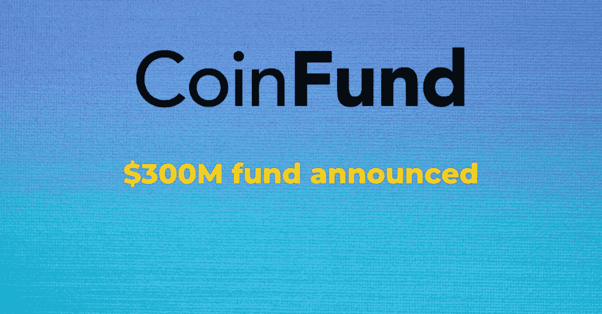

# CoinFund 推出 3 亿美元的 Web3.0 聚焦基金——DecentReviews 博客

> 原文：<https://medium.com/coinmonks/coinfund-launches-300m-web3-0-focused-fund-decentreviews-blog-6d40d5b93cfe?source=collection_archive---------29----------------------->

## 快速拍摄:

*   CoinFund 为 Web3 品牌推出 3 亿美元的基金
*   该基金还将帮助一些现有的 CoinFund 支持的品牌从种子期发展到首轮融资
*   这延续了 CoinFund 投资早期品牌的历史，包括 Solana、Rarible 和 Moonbeam