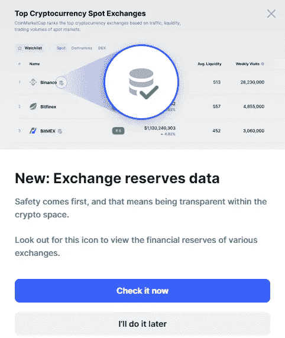
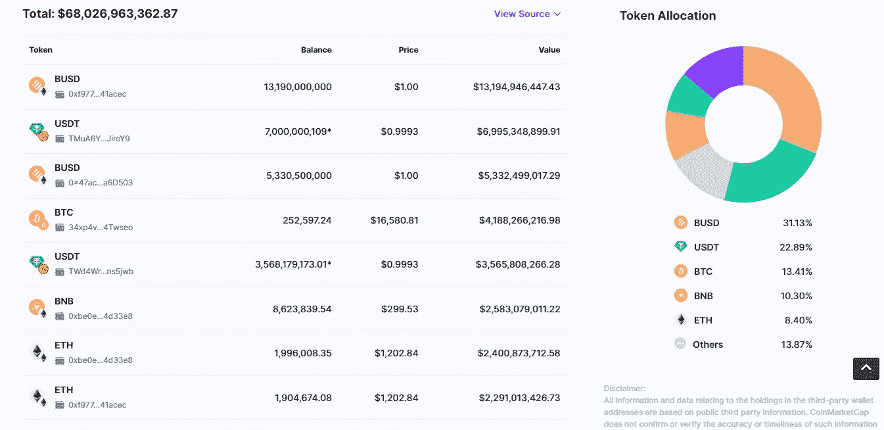
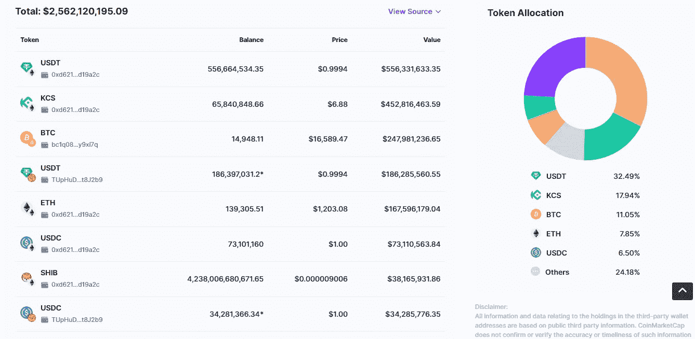
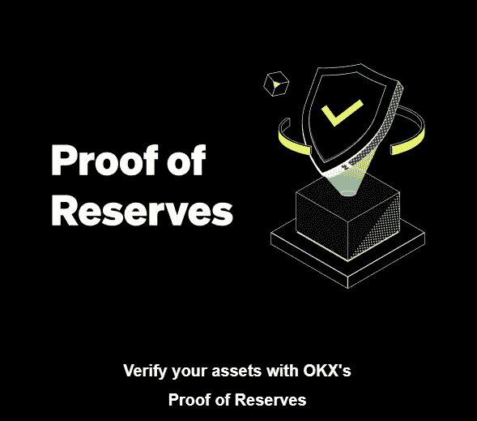

# CoinMarketCap:交易所的“储备证明”已经到来

> 原文：<https://medium.com/coinmonks/coinmarketcap-the-proof-of-reserves-tick-has-arrived-for-exchanges-ae8d2215b0ed?source=collection_archive---------20----------------------->

前天，我一直在看 CoinMarketCap，了解过去 24 小时的加密价格、优势和交易量。我收到了这个通知:

> 新:外汇储备数据。
> 
> 安全第一，这意味着在加密领域保持透明。
> 
> 请留意此图标，查看各交易所的金融储备。

The announcement of the new feature of CoinMarketCap

CoinMarketCap 也在 Twitter 上公布了这一功能。

The tweet of CoinMarketCap

显然，这项新功能是在 FTX 严重事件导致用户对交易所的信任崩溃后实现的。

什么是**储量证明(PoR)** ？这只是由第三方进行的独立审计，旨在确保托管人拥有其代表客户要求的资产。

点击该按钮，你将进入与[交易所](https://coinmarketcap.com/rankings/exchanges/)相关的 CoinMarketCap 页面，可以查看哪些交易所有此标记。今天只有几家交易所有:[币安](https://accounts.binance.com/it/register?ref=36104911)，[库币](https://www.kucoin.com/ucenter/signup?rcode=rJMKFD4)， [Bitfinex](https://www.bitfinex.com/sign-up?refcode=Eib-9E1x2) ， [OKX](https://www.okx.com/it/account/login?forward=%2Fit%2Fjoin%2F32848922) ， [Bybit](https://www.bybit.com/en-US/invite/?ref=OV0PQJ) ，[Crypto.com](https://www.newcoinpost.com/blog/cryptoworld-review5-cronos-cro)和[火币](https://www.huobi.com/it-it/register/?backUrl=%2Fit-it%2F&invite_code=2qna5)。单击这些交易所的名称会打开它们的选项卡，您可以在其中看到总储备及其分配情况。例如，[币安](https://coinmarketcap.com/exchanges/binance/)总资产 680 亿美元，前三名分别是 BUSD (31%)、USDT (22%)和 BTC (13%)。

Proof of Reserves of Binance

另一方面，KuCoin 的总资产为 25 亿美元，前三名分别是 USDT (32%)、KCS(近 18%)和 BTC (11%)。

Proof of reserves of KuCoin

CoinMarketCap 的储量证明每 5 分钟更新一次，包括:

*   总资产
*   公共钱包地址所有权
*   公共钱包的平衡、价格和价值

最近几天，我收到了许多来自各种交易所和平台的电子邮件，他们向我保证了他们工作的严肃性和道德性。

The email I received from OKX

在您看来，CoinMarketCap 的这一新功能是否足以保证用户安全，或者是否可以实现？准备金证明足以拯救一家交易所免于破产吗？

把这个空间当成一个没有审查的谈话场所。

胜利者是永不放弃的梦想家。

***免责声明*** *:我不知道任何第三方对所用图片的权利。如有任何资料来源，我保证予以引用，如有要求，我将调整立场。*

***免责声明*** *:交易加密货币具有很高的风险，可能不适合所有投资者。在决定交易加密货币之前，你应该仔细考虑你的投资目标和你的经验水平。自己做研究。此处表达的所有观点归各自作者所有，不应被视为任何形式的财务建议。*

*关于作者*

[*CRYPTO _ ALBERT*](https://twitter.com/albertovischio?t=C3Xj9pTm9Q7EZqwjrGHQdA&s=09)

*主编* [*新币帖*](https://www.newcoinpost.com/) *。我帮助人们更好地理解加密货币领域及其目的。*

> 交易新手？尝试[加密交易机器人](/coinmonks/crypto-trading-bot-c2ffce8acb2a)或[复制交易](/coinmonks/top-10-crypto-copy-trading-platforms-for-beginners-d0c37c7d698c)