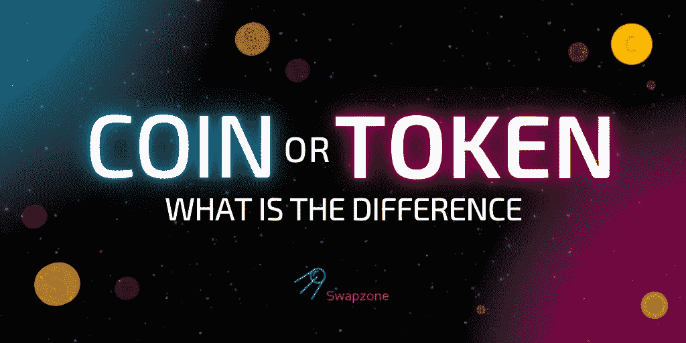

# 硬币与代币:区别在哪里？

> 原文：<https://medium.com/coinmonks/coins-vs-tokens-what-is-the-difference-8075bb323a01?source=collection_archive---------26----------------------->

加密货币是一种相对较新的货币概念，也提供了一个绝佳的交易和投资机会。这是一种由一群匿名人士创造的数字货币，从那时起，它就进入了主流的全球经济结构。加密货币有自己的一套术语，外行人可能会感到困惑。这种数字货币给每个人的生活带来了新的便利，无论是专业人士还是独立投资者。

作为一个相对较新的概念，人们很难理解加密货币背后的意识形态。然而，如果你想进入这种形式的数字货币，并计划利用它的好处，你需要先熟悉一些术语。例如，人们发现自己混淆硬币和代币是很常见的。本文主要讨论这两个术语，它们的含义以及它们之间的区别。

# 硬币是什么意思？

一枚加密硬币属于它的个人区块链。它是一种加密资产，也被称为“加密货币”。硬币与代币的主要区别在于，它有自己的原生区块链，不依赖于任何其他加密货币的区块链。下面提到了一些类型的加密资产:

*   以太坊:依靠以太区块链。
*   Litecoin:依赖于 lite 区块链。
*   比特币:依赖于比特币区块链。
*   尼奥:依靠尼奥区块链。

如前所述，这是一种数字货币。与传统货币不同，当涉及到从一个人到另一个人的硬币交易时，没有实物硬币。这些硬币位于加密资产的区块链上，它们跟踪并记录全世界每个用户进行的交易。

# 代币是什么意思？

一个令牌依赖于另一个区块链。以太是令牌区块链最常见的例子，被称为 ERC-20 令牌。代币也使用其他平台，比如 NEO 获取 NEP-5 代币。您还可以在上述平台上定制令牌。代币由 ICO 生产并通过 ICO 销售，主要用于众筹，为项目募集资金。

# 硬币和代币的区别:

硬币也被称为“本地代币”，这使得这两个术语之间的区别更加复杂。然而，这两者的属性和特征是不同的。简而言之，硬币和代币之间的唯一区别是，硬币来自它自己的区块链，而代币依赖于其他区块链。硬币只用于支付、投资和交易等。代币有许多用途，它可以用来筹集资金，购买产品和服务，等等。硬币被期望做和钱一样的工作。它们被用作记账单位并用于转账目的。硬币属于它们自己的区块链，可以表现为比特币、以太币、莱特币等等。企业用硬币来储钱，支付投资和服务。生产硬币作为 20 元代币，是为了让这个过程更顺利、更容易。

就区块链代币而言，它们是有价值的，但我们不能将代币视为“钱”，正如我们认为硬币是“钱”一样。代币依赖于其他区块链，主要是以太坊，帮助用户使用硬币产生代币。以太坊基本上是这个过程的“燃料”。代币因其便利性而受到欢迎，它们比数字现金更具功能性，而且对股东也有价值。当一个人想要对一个重要的公司决策或者与平台的技术变化相关的决策进行投票时，也使用令牌。硬币和代币很容易混淆。它们之间的区别是一条细线，因为两者都用于转移某种利润。在许多平台上，你可以使用硬币来生产代币，硬币也可以不仅仅用于支付。简单地说，代币不能像硬币那样被液化成普通货币。加密硬币可以很容易地立即转换成正常的货币。关于硬币和代币，人们非常了解的一点是，硬币是现金或货币。然而，令牌实际上用于其他任何东西。这可能包括奖励员工、发放奖金、投票、折扣等。

# 各种类型的令牌:

令牌有许多子部分，下面将一一介绍:

*   **安全代币** —这些代币负责代表一家公司的股份，同时也使用区块链的所有特权。OldFi 证券依赖代币。这些令牌还用于以电子方式存储和认证公共信息。
*   **资产代币**——这些是真货。资产代币由实际存在的资产支持，如钻石、黄金，甚至房地产。它们是数字资本市场金融交易的未来。
*   **稳定货币** —与加密货币相比，这些货币代表稳定货币。大多数稳定的货币包括实物货币，如美元和英镑。它们由储备资产支持，并从外部参考中获取其市场价值。
*   **不可替代代币(NFTs)** —不可替代代币是一种独特物品的代表，如艺术品或虚拟游戏物品，只能通过虚拟方式购买。比如虚拟足球游戏或者房地产游戏。常规令牌通常可以被分割成更小的部分，但是另一方面，NFT 不能被分割。NFT 可以通过不同的方式购买，许多用户使用一个 WAX 帐户来购买和持有 NFT。在我们的[文章](https://swapzone.io/learn/non-fungible-tokens)中阅读更多关于不可替换令牌的信息。

当涉及到硬币和代币时，总会有某种程度的混淆，因为它们之间没有非常显著的区别。将它们彼此分开的简单方法是，一个有自己的区块链，而另一个依赖于另一个区块链。硬币仅限于现金使用，而代币基本上用于其他一切。然而，这两者在现代经济结构中都有各自的意义。

> 交易新手？尝试[加密交易机器人](/coinmonks/crypto-trading-bot-c2ffce8acb2a)或[复制交易](/coinmonks/top-10-crypto-copy-trading-platforms-for-beginners-d0c37c7d698c)