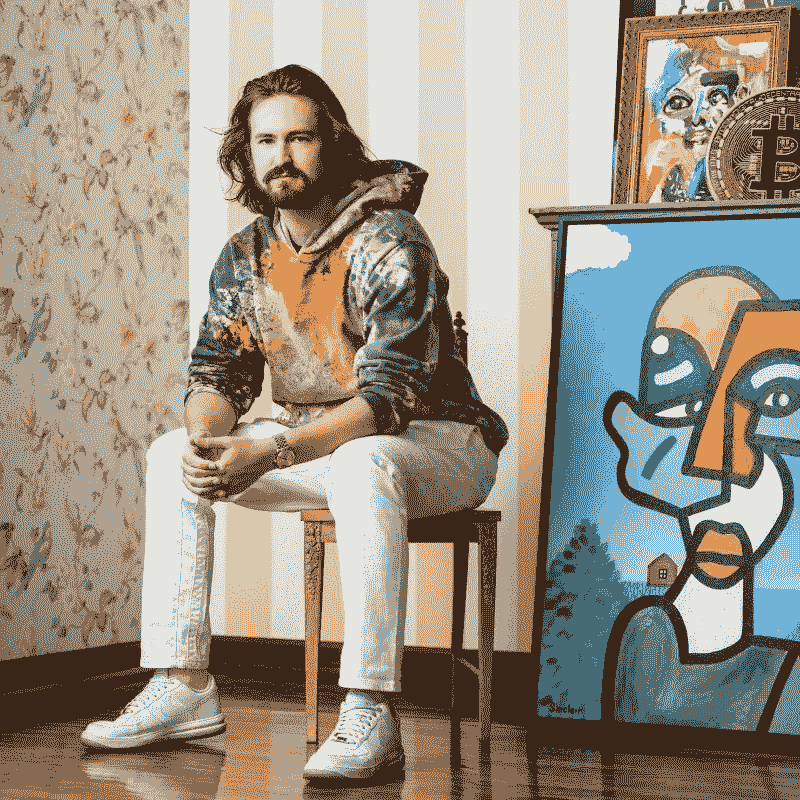
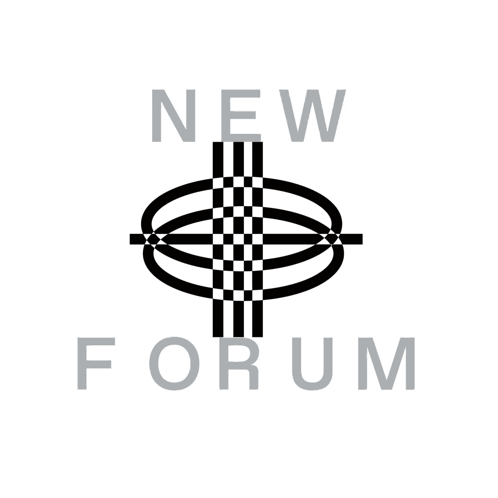

# 秘密艺术博物馆(MOC△)的创始人科尔伯恩·贝尔讨论了 MOC△的愿景和对秘密艺术家的影响& Web3

> 原文：<https://medium.com/coinmonks/colborn-bell-founder-of-museum-of-crypto-art-moc-discusses-vision-of-moc-and-impact-on-crypto-90e2fdfe8c5b?source=collection_archive---------13----------------------->

Colborn Bell | Co-Founder and Director at [Museum of Crypto Art (MOC△)](https://twitter.com/museumofcrypto)

我们的社区很荣幸地邀请到了新论坛上秘密艺术博物馆的联合创始人兼馆长科尔本·贝尔。秘密艺术博物馆是元宇宙的一个博物馆，生活在虚拟现实中，在数字世界中展览。它是一个全球性的基金会、治理工具和创新实验室，致力于保护和尊重密码艺术及其创造者。

在播客中，Colborn 谈到了 MOC△的任务及其在太空中的影响。他还讨论了分散策展和集体哲学的概念，定义了非艺术形式和密码艺术之间的区别，以及在元宇宙和 IRL 中展示作品的意义。

# **是什么让科尔邦转战 Web3 成为 MOC 的创始人△？**

科尔伯恩有机会为一个外国家族管理美国家族办公室，这个家族更多的是天使投资风险资本，通常围绕能源。在那段时间里，他偶然发现了以太坊，全球预测市场的想法花掉了他所有的每一美元，用所需的技能投资以太坊，以便在 2017 年的繁荣时期投入其中。

Colborn 补充说，这是他第一次遇到像月饼，CryptoKitties 和虚拟土地这样的项目，分散土地正在使用附加的应用程序。

2020 年 1 月，NFTs 开始重新出现在他的雷达上，特别是元宇宙和游戏。

> “2020 年 2 月，我被介绍给 SuperRare，因为一个潜在的股权投资从未达成交易，但在尽职调查中，我开始在那个网站上收集，到 2020 年 4 月，在收集了相当数量的作品并与艺术家进行了交谈，了解了他们的哲学和存在于这个空间的原因，以及为什么 NFT 对创意人员如此强大之后，博物馆诞生了……”——科尔伯恩

科尔伯恩还解释了为什么 MOC△提出了一个广泛的观点来颠覆我们对自己的认识，提出了两个问题:

> 什么是艺术？谁来决定？

> “我认为我们已经看到了一个传统的和当代的艺术经典，这是非常沉浸在白人欧洲中心男性，这些声音继续传播和普遍支持；因为有一个激励这样做的市场，所以市场的看门人继续支持这种叙事，虽然 Web3 在许多方面反映了这一点，但它不一定是正确的，所以以太坊和区块链通常作为开放访问和无许可的网络允许全球创造力的上船……”——科尔伯恩

科尔伯恩表示，作为一名收藏家，他的目标一直是关注郊区、边缘化的声音，以及新的和新颖的创造力体现的地方。

他希望对艺术有一个更广泛的表述，并庆祝艺术创作的边缘，以及收藏家代表这些艺术家成为倡导者的能力，让其他人知道并分享他们的故事。

在本期 NEWFORUM 中，您将听到更多关于 MOC△成立的故事、愿景、使命以及对密码艺术家的影响。他还讨论了 NFTs 和 Crypto art 之间的区别。

# 科尔本对完全分散的策展有什么看法？这可能吗，或者这是我们在协作创造者经济的未来所期待的吗？

> “我认为我们和任何人一样拥护这项实验。我们是一个受权为元宇宙建设公益的基金会。我们有一个免费且易于使用的我们称之为[的 MOC△ multi-pass](http://tinyurl.com/yw7ewd9r) ，它允许任何人上传他们创作的作品或收集到社区收藏中的作品。在我看来，这个社区收藏是我们的集体潜意识，人们关心什么，人们愿意分享什么，他们想把什么放进博物馆……”——科尔伯恩

Colborn 补充说，当市场之外的发现工具如此依赖于“美元符号”和价值时，社区收藏是他发现新作品和新艺术家的一个非凡的地方。

他进一步表示，这是因为事情往往会突然出现并引起他的注意，这是他了解人们关心和分享什么的门户。

# **集体哲学是什么意思？道叙事是否属于这一哲学范畴？**

> “我要说的是，我们又一次处于试验如何自治和组织的早期阶段。一般来说，DAOs 内部的权力流向少数几类关键决策者，所有人都服从他们。在一个以 24/7 365 的狂热速度运行的市场中，时间肯定是稀缺的，所以我认为治理是一个大问题，但这不是一个关于我们如何建立工具来让人们分享、展示和提升彼此的问题……”——科尔伯恩

根据 Colborn 的说法，这就是他们在 MOC△通过多次传递关注的问题——如何将策展技术融入他们的室内生态系统；以及如何将这些与你的收藏相匹配的 3D 建筑作品运用到 Metaverses 中。

他进一步解释说，这一直是博物馆的核心特征，举办艺术家的个展。这种核心身份吸引了人们；很少有外界的声音为艺术家、他们正在做的事情以及他们正在创作的作品类型辩护。举办一场个人画展需要几周时间，但艺术家们现在可以在五到十分钟内完成。

> “对我来说，这个建筑也是一件独特的艺术品。它讲述了一个多样化的景观和一个世界，这个世界不仅充满了美丽的新颖建筑，还有独特的艺术作品，我们不再是唯一的策展人；博物馆存在于一个多节点结构中，反映了区块链网络是如何形成的，然后所有这些人都成为某种指向更大的集体真理的倡导者、大使和策展人。”—科尔伯恩

科尔伯恩在他的完整采访中进一步定义了集体哲学及其如何应用于 MOC△。他还谈到了对 IRL 和元宇宙的理解；

*   它们是什么，它们如何影响会议？
*   Colborn 还解释了未来会发生什么，他如何想象空间来反映现实生活的体验，以及 MOC△如何将 IRL 博物馆的氛围转移到元宇宙博物馆而又不失其本质。
*   谈到元宇宙和 IRL，这两者对于主运行中心△和主运行中心△的未来有什么联系？科尔伯恩让我们看到了 MOC 的未来。

Colborn 通过分享他作为 Web3 创始人的动力以及他对 Web3 和 Crypto 的未来的最大期待，结束了这场富有洞察力和目的驱动的对话。

享受🔥

[加入社区](https://twitter.com/newforum_nco)了解 [@co1born](https://twitter.com/co1born) 并在 web3 社区中发现其他创始人和远见者！

✨follow·科尔本·贝尔！推特:[@ co1 born](https://twitter.com/co1born)|[@ museumofcrypto](https://twitter.com/museumofcrypto)网站:[museumofcryptoart.com](https://app.museumofcryptoart.com/)

# newforum # web3 # cryptoart #元宇宙# creatoreconomy # nftart # irl #收藏品#策展人

爱 x 新论坛

# Twitter @newforum_nco

不和谐[@加入](https://discord.gg/2K8tvVh8tM)

# 新论坛

[NEWFORUM](https://newforum.notion.site/newforum/Welcome-to-NEWFORUM-48f9661398ec4ec6a1af37fcc96dc926) 由 [Newcoin Foundation](https://newcoin.org/) 提供支持，专注于促进去中心化社交应用的扩展，也被称为 Social 3.0，形成一个生态系统和一个由远见者、创造者和投资者组成的社区。它为思想者提供了一个安全的交流、传播和分享思想的空间，以确保一个新网络的自觉和道德发展，嵌入关怀、自由和创造力的价值观。✨每周新集！在 [Twitter](https://twitter.com/newforum_nco) 、 [Newlife](https://newlife.io/) 、 [Youtube](https://www.youtube.com/channel/UCWvHyau1nIJBffmaaj6FmbQ) 和 [LinkedIn](https://www.linkedin.com/showcase/newforum/) 上关注我们，了解 web3 的更多信息，认识生态系统！加入生态系统[不和](https://discord.gg/DHepA4WTkN)！

> 交易新手？尝试[加密交易机器人](/coinmonks/crypto-trading-bot-c2ffce8acb2a)或[复制交易](/coinmonks/top-10-crypto-copy-trading-platforms-for-beginners-d0c37c7d698c)