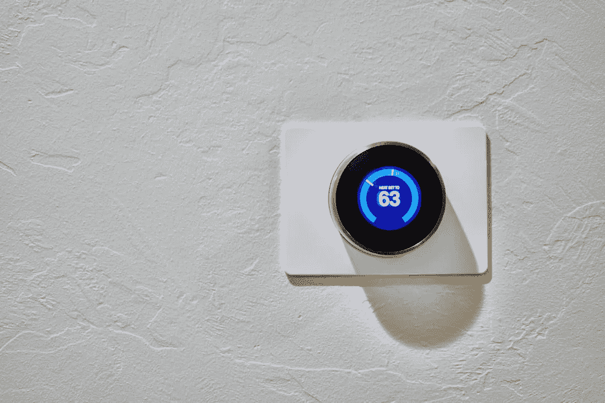
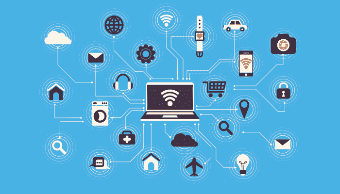

# 将物联网与区块链技术相结合，意味着什么？

> 原文：<https://medium.com/coinmonks/combining-iot-with-blockchain-technology-what-does-it-mean-4285494f2ab3?source=collection_archive---------14----------------------->

尽管区块链技术仍处于早期阶段，但它并非不可能与其他众所周知的创新相结合。在这篇文章中，你会发现 ***物联网和区块链科技*** 如何共存。

[***物联网&区块链***](#56e0)

[***物联网概述***](#5b6d)

[***物联网会是什么样子***](#4ec5)

[***为什么说物联网和区块链？***](#a6f2)

# **物联网&区块链**

IoT 是“物联网”的简称它描述了现实世界/物理设备和对象(事物)如何在没有人类参与的情况下通过网络(互联网)相互连接。有了物联网，设备对人类输入的依赖更少，可以自己思考。

Image by Dan LeFebvre on [Unsplash](http://unsplash.com)

物联网设备上生成的数据存储在[云](https://www.arm.com/glossary/iot-cloud#:~:text=An%20IoT%20cloud%20is%20a,real%2Dtime%20operations%20and%20processing.)中，在那里进行维护，并可以根据需要快速访问。

另一方面，区块链是一种基于分布式账本的技术，促进去中心化、不变性和透明性。

物联网和区块链科技都使用了*自动化*的概念。

自动化旨在通过将原本需要人工参与的任务委托给计算机和其他相关技术来减少人工劳动。

物联网允许您将常规设备连接到互联网，并自动执行原本需要手动干预的任务。在一个全数字化的世界里，物联网将成为主流。

# **物联网概述**

在一个强大的物联网操作中，你可以建立一个智能家居，其中的设备可以相互通信，并且仍然可以在最少的人工干预下保持家居完整。

Image by Kirill Tonkikh on [Unsplash](http://unsplash.com)

可能有[闭路电视摄像头](https://en.m.wikipedia.org/wiki/Closed-circuit_television_camera)被战略性地放置在这个家的各处，而[指纹扫描仪](https://en.m.wikipedia.org/wiki/Fingerprint_scanner)可能被用来确保入口的安全。在检测到可能的强行进入的情况下，CCTV 摄像机还可以结合传感器，该传感器可以在家中快速发出警报或者通过安全服务自动发出求救呼叫。此外，指纹扫描仪是用房子里授权成员的指纹编程的。试图开门的未经授权的人将被阻止这样做，因为门没有他们的指纹记录。

这样，即使你不在家，也能保证你家的安全。

> 交易新手？试试[密码交易机器人](/coinmonks/crypto-trading-bot-c2ffce8acb2a)或[复制交易](/coinmonks/top-10-crypto-copy-trading-platforms-for-beginners-d0c37c7d698c)

# **物联网会是什么样子**

嘿，范姆，让我们来玩一个假设的场景吧！

考虑偶遇老朋友。因为你没有时间“叙旧”，所以你决定在周末邀请他们过来吃饭。“哦是的！我很乐意来，”你的老朋友说。“这是一个日期，”你回答说。

当你期待着招待一位老朋友吃晚餐，并请他们吃一顿美味佳肴时，你也有许多最后期限要满足，你不知何故忘记了去杂货店购物。

现在，你的周末计划可能会被打乱，因为你不会像你预期的那样，拥有准备美味佳肴所需的一切。

*如果你的冰箱里的食物用完了，它可以自己补充食物，那会怎么样？听起来很酷吗？如果是这样的话，这将是物联网如何工作的一个例子。*

Image from [RBMI](http://rbmigroupofinstitutions.wordpress.com/)

既然你不会随便找一个冰箱来做这件事，那我们就来看看这个假设的冰箱是如何工作的。

假设冰箱的制造商在生产过程中会安装某种类型的软件，并确保冰箱完全配备了与互联网交互的必要技术。购买后，制造商可能需要派安装人员到你家安装冰箱，并确保它连接到互联网。此设置可能包括添加您的银行卡、选择网络提供商，以及可能提供一些维护信息。

现在你的冰箱都准备好了，你通常会把你所有的食物都放进去。

使用这种假设的冰箱几周后，冰箱可以根据安装期间输入的数据检测到它现在已经达到极限，并且没有食物了。冰箱将搜索您喜欢的杂货店，并在线订购食品。因为您的银行卡与冰箱关联，您可能会自动为该交易付费，根据设置，您可能需要确认支付才能进行处理

商店会把订单送到你家。在这一点上，你只需要在冰箱里装满新的货物。

这意味着冰箱承担了自己储存食物的职责，你可以继续你的生活，而不必担心在不方便的时候用完食物。

根据它的编程方式，这台冰箱可以为自己安排一次维护预约，或者通知你需要一次维护预约。

你不仅永远不必担心杂货耗尽，而且你的冰箱还配备了一种技术，允许它检测何时需要维护，并可以在制造商发布升级时通过访问云数据自动升级。

# **为什么选择物联网和区块链？**

*既然您已经了解了什么是物联网，那么区块链技术如何惠及物联网呢？*

Image by Shubham Dhage on [Unsplash](http://unsplash.com)

物联网设备通常有一个集中的机构来管理数据、启动维护和分发更新(通常是制造商)。另一方面，区块链技术大多是去中心化的、开源的，并且没有任何中央权威。

使区块链与众不同的一点是 ***分权*** *。*

分权是指在多方之间分配权力，而不是将决策权集中在一个权力机构。根据具体情况，权力下放可以采取各种形式。然而，其主要目标是消除对单一政党的依赖；不会导致单点故障。

你应该知道，物联网和区块链可以共享他们的大部分技术，因为他们共享某些特征。

## [*智能合约*](/coinmonks/smart-contracts-moving-towards-decentralization-8f1d079f6755) *可用于自动化区块链活动，无需手动或人工输入来执行操作。*

当与物联网结合时，这种类型的技术无疑将为更大的成功铺平道路。当物联网和区块链技术相结合时，“智能超市”可以以最高效率运行。这个超市只需最少的人力就能完美运作。这种技术可以跟踪超市的库存，并根据需要自动下新订单。

在自动区块链上，可以记录超市中产品的信息(如制造商和有效期)，从而可以跟踪哪些商品不适合展示，应该丢弃。超市购买的商品将被妥善保存在区块链上，在那里它们将保持不变性和透明性。以这种方式，商店将需要更少的人力，节省雇用人员的费用，并避免不断寻找替代人员的需要。此外，超市的财务记录将被妥善存储在区块链上，消除了欺诈或人为错误的可能性。

## 物联网和区块链技术的集成可以提高输入物联网设备的真实世界数据的质量。

物联网设备通常使用人工智能(AI)技术来识别和解释数据。人工智能是写入物联网设备的程序集合，可帮助设备执行其功能。

物联网和区块链技术的结合确保了物联网设备的反应更加准确，并且只向用户发出真实信息的警报。区块链科技将利用能够向物联网设备提供准确的链外数据的甲骨文来提高准确性，而不是仅仅依赖人工智能。甲骨文是一个发展中的区块链系统，有很大的发展空间。

使用区块链神谕的另一种方式是请求苹果的虚拟助手 [Siri](https://en.wikipedia.org/wiki/Siri) 帮助解决问题。Siri 不是在集中的网络上进行搜索，而是向*甲骨文*询问信息，并能提供未经过滤的内容。

## 区块链技术没有单点故障

如果物联网存储和访问其数据的云被破坏，它可能会影响设备的工作方式。在区块链上建造物联网设备可以防止这种事件，确保设备始终保持其完整性和预期功能。

## 互用性

借助[区块链互操作性的概念，](https://blog.chain.link/blockchain-interoperability/#:~:text=Blockchain%20interoperability%20refers%20to%20the,write%20data%20to%20other%20blockchains.)物联网设备可以与多个数据点而不是一个数据点进行交互，确保系统尽可能高效地运行。

## 供应链

查看其在供应链中的使用将有助于我们了解区块链可以在多大程度上推动物联网，以及 oracle 可以如何使用。区块链可用于跟踪供应链上的活动，识别可能扰乱供应链的不良行为者，并跟踪订单在每个阶段的处理情况。

通过合作，物联网和区块链技术无疑可以确保完全安全、透明和无许可的活动执行。

[IBM](https://www.ibm.com/) 是一个成功构建物联网支持区块链的平台。

# **结论**

物联网是一个包含许多方面的宽泛概念。为了让这篇文章简单易懂，我只触及了基本细节，以展示如何将物联网和区块链技术结合起来(这一直是我的目标)。

我希望你喜欢阅读这篇文章，并且现在对区块链技术的许多与加密货币无关的应用有了更好的理解。

estoy agotada!