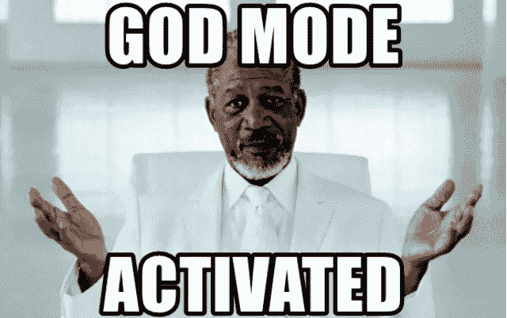

# 为钱而来，为钱而留

> 原文：<https://medium.com/coinmonks/come-for-the-money-and-stay-for-the-money-ddfd4234fb13?source=collection_archive---------18----------------------->

在我做审计的日子里，我们被教导按照欺诈三角理论生活。欺诈三角理论解释了个人决定实施欺诈背后的原因。个人实施欺诈的原因有三个组成部分:

1.机会—是否存在实施欺诈的机会？

2.动机还是压力——欺诈的动机高吗？是否有实施诈骗的压力？

3.合理化——人类大脑是如何证明任何事情都是合理的

生活实际上非常类似于欺诈三角理论，因为我们经常根据机会、激励和合理化来行动。

问题:如果给你一张免罪卡，你会怎么做？

抢银行可能是大多数人都会做的事情。

在加密上下文中，一个地毯拉。

预测未来的最好方法是回顾过去，因为历史经常会重演。人性本来就是自私的，这解释了为什么世界总是处于混乱状态。

以下是我的观点，我希望它能给你一些启示和鼓励，让你开始探索 crypto 和 DeFi，它可能什么都不是。

区块链旨在确保没有人能够在端到端的过程中扮演上帝的角色，而当前的做法是，大多数集中式服务提供商和政府能够进入“上帝模式”，根据情况做他们认为合适的事情。干预需要高度的信任，因为决策可能是不透明的。因此，它重申需要一个更透明、更自主、更安全的系统。

最近，我参加了一些网络活动，并意识到许多活动与区块链的核心原则不一致，即不信任和不允许。许多项目只强调良好的用户界面/UX，仅仅是为了将无银行市场移植到 Web 3.0 上。这些项目很少或根本没有强调自我监管或主权。如果公共区块链仍然是基于信任和许可的，那么使用它有什么意义呢？

老实说，我离开时感到有点失望，但我也理解资本主义。在资本主义的经济制度下，我们应该迅速抓住新经济中的任何机会。一位成功的加密投资者曾经告诉我，去中心化并不重要。这句话没用多长时间就说完了。看看 CeDeFi 平台与稳定的蓝筹股 DeFi 协议的内爆。

DeFi 和大多数加密项目都是一个实验。未经认证的投资者有机会与风投一起投资。投资加密就像投资一个早期的初创企业，风险投资级别的投资，高风险高回报。也就是说，这可能是我们一生中最不对称的投资机会。玩起来风险自担。

好的 DeFi 项目为其用户提供高价值，要么提供比 TradFi 更好的服务，便宜 10 倍、快 10 倍、透明 10 倍，要么提供相应的激励措施。然而，每个企业最终都必须赚钱，即使中短期目标是以牺牲利润为代价来获得市场份额。因此，理解项目的盈利路线图至关重要。

> 交易新手？试试[加密交易机器人](/coinmonks/crypto-trading-bot-c2ffce8acb2a)或者[复制交易](/coinmonks/top-10-crypto-copy-trading-platforms-for-beginners-d0c37c7d698c)

最重要的是，尽管危机迫在眉睫，我仍然认为密码行业仍处于萌芽状态。虽然听起来老生常谈，但每个危机都蕴含着机遇。人们对非托管资产的兴趣越来越大。此外，加密经济与现有经济之间存在融合，这都要归功于加密人慷慨地将其收益用于创建基础设施和业务，以进一步采用加密，从而使加密越来越多地融入我们的日常生活。

随着我们拥抱熊市，我将把我的精力集中在增加知识收益上，因为这种“投资自己”显然是大多数大师推荐的最佳熊市策略。随着市场继续受到美联储的影响，我将继续参与大甩卖，因为我无法抗拒大甩卖。

互联网货币和区块链技术所能做的事情是惊人的。此外，我们怎么能相信这个因为他们的政策错误而想让我们变得更穷的组织来确保我们个人财务的稳定性呢？

我不怕承认我来是为了钱，但我留下来是为了钱和革命。

感谢阅读，敬请关注更多 DeFi 内容！

作为我的新年决心的一部分，我将分享我在 crypto 的经历，以讲述由我工作中的朋友& crypto OGs 激发的更好的故事。

*免费加密&股票连同推荐启动你的旅程:*[*https://docs . Google . com/spreadsheets/d/1 f2bx-xkvmezorxdzqavgckina 1 PME _ uI9pa _ c4l 4-DM/edit？usp =分享*](https://docs.google.com/spreadsheets/d/1f2bX-xKvmEzOrxDZqAvgCkIna1pmE_uI9pa_C4l4-DM/edit?usp=sharing)