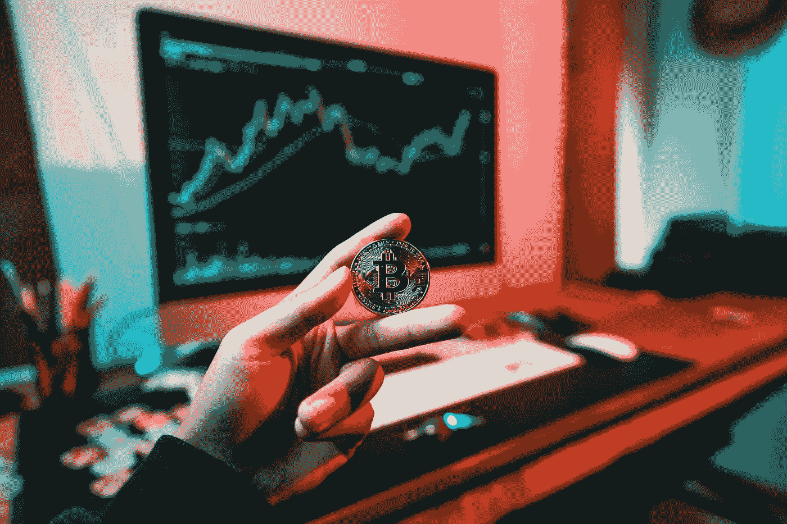

# 成为一名比特币制造者

> 原文：<https://medium.com/coinmonks/coming-out-as-a-bitcoiner-554e96e2cd43?source=collection_archive---------38----------------------->

如果你可能觉得有用，这是我的橙色药丸之旅我的脸书平民，我的意思是朋友和家人。

*第一天*

2020 年，我在看到一个朋友的帖子后，以 1 万美元的价格购买了比特币，帖子简单地说，现在是购买的好时机。我已经错过了从 3k 美元的底部向上移动的机会，但我从 2017 年开始就知道还有很多天然气，这被证明是正确的。

Photo by [Art Rachen](https://unsplash.com/@artrachen?utm_source=unsplash&utm_medium=referral&utm_content=creditCopyText) on [Unsplash](https://unsplash.com/s/photos/bitcoin?utm_source=unsplash&utm_medium=referral&utm_content=creditCopyText)

人们说密码是未来，诸如此类；此外，当时是一级防范禁闭，我有很多时间，所以我决定这次真的自学一下。所以接下来的两年，我完全沉浸在这个新世界里。我的目标很简单:生存下来，尽可能多地学习，并为下一个周期的繁荣。

长话短说，比特币的价值再次从历史高点下跌了 80%，目前处于历史上代表最佳进入机会的区间。换句话说，这是我的版本“嘿，如果你对学习加密感兴趣，现在是购买比特币的好时机，是的，只是持有它”的帖子。

太好了，任务完成。不，真的。在我学习和经历了一切之后，我回到了我开始的地方:crypto 中唯一的免费午餐就是持有比特币。这是我告诉任何问我密码的人的。如果你像我一样，需要理解为什么会这样，那么这是一个独立的旅程。你看，比特币的价格，虽然很吸引人，却是它最没意思的地方。

我发现比特币在智力上令人难以置信地充实。比特币挑战了我对世界的每一个想法，迫使我重新审视每一个想法。在这个过程中，我重新发现了很多东西，关于这个世界，也关于我自己，它深刻地影响了我选择如何生活——变得更好。

哇，这是一个很深的狗屎。我知道。这是边缘作为他妈的。我知道。这种范式转变会让人感到非常孤独。我知道。我不想让人们独自经历我做过的事。

所以我正在创建一个社区，让人们一起发现比特币。虽然我怀疑它会吸引金钱书呆子、政治书呆子和历史书呆子，但这是一个对任何想深入思考比特币的人开放的社区。我们将一起聆听播客并对其做出反应；我们会时不时一起看书；我们会模仿一些东西，甚至可能创造一些很酷的东西；但最重要的是，我们将通过比特币影响我们的方式找到彼此之间的联系。

无论如何，如果你想加入，它是完全免费的，我们将一起做很多有趣的事情！给我发个信息，或者如果你想匿名，你可以通过这个链接加入:【https://discord.gg/XvxYuS2WF6。我们的第一次虚拟聚会将在 8 月 12 日星期五晚上 9 点举行。

哦，即使这不是你的事情，但不知何故你看到了这篇文章的结尾，你知道有人不停地谈论比特币吗？好吧，那么，把他们这样送过来，因为我会很乐意听他们的，所以你就不必听了！否则，一个喜欢和分享将永远是赞赏:D

拉斐尔·米拉富恩特

原帖:[https://www . Facebook . com/Rafael . mirafuente/posts/pfbid 02 f 4 nb 5 BWA 4n 33 dtbhsfwrurklewp 3 zuu 49 oscenzseigybntdhej 7 sruwuo 4 fl](https://www.facebook.com/rafael.mirafuente/posts/pfbid02f4nb5Bwa4N33dTbHSfwrURkLewp3ZUU49osCeNmzseiGYBNtrdHEJ2B7SruWUo4Fl)