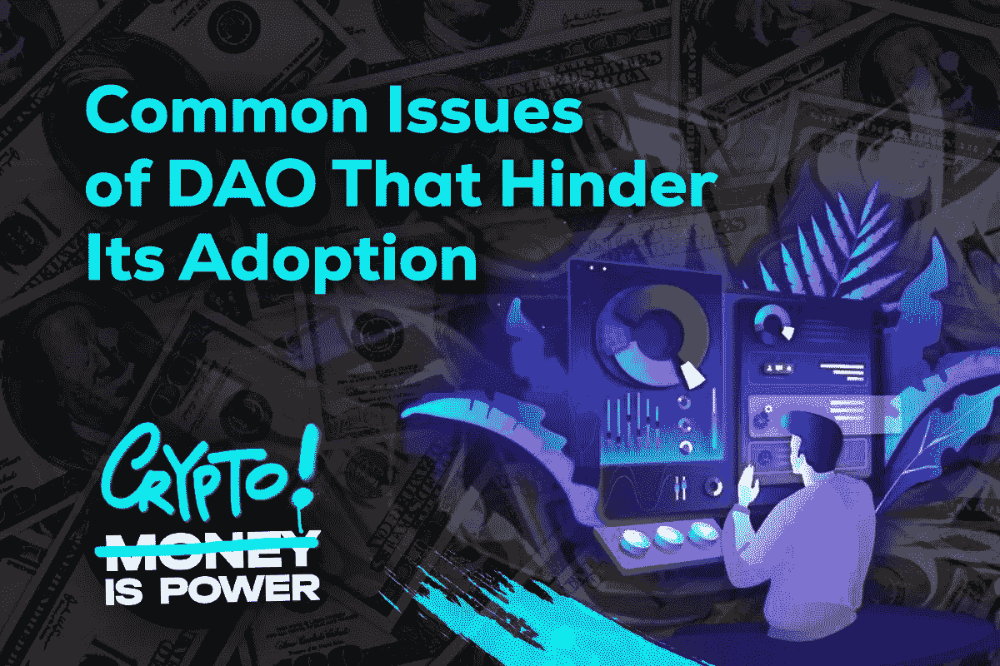

# 阻碍采用 DAO 的常见问题

> 原文：<https://medium.com/coinmonks/common-issues-of-dao-that-hinder-its-adoption-5fbf3ab33876?source=collection_archive---------12----------------------->

正如本系列文章的前一部分所指出的，Dao 是多才多艺的，这使得它们几乎可以与全球经济中的任何行业兼容。然而，尽管 DAO 是密码领域的主导治理模式，但它似乎未能超越其本土的边界。传统的公司并不急于挖掘分散化组织的潜力，这是由于它们固有的一些问题。

**技术缺陷**

自 2016 年 DAO 被黑以来，智能合同安全性和对攻击的防御已经取得了显著进步。尽管如此，由于 Dao 直接控制所有资产，漏洞继续带来遭受毁灭性损失的危险。此外，由于基础设施的原因，Dao 面临着与区块链相同的限制和安全问题。

**信息不对称**

Dao 就像区块链的底层技术一样，基本上是匿名的。因此，用户可以在不暴露真实身份的情况下加入这样的组织。但是，在 DAO 社区中广泛使用假名身份可能会导致信息不平衡，这对与他们互动的人是有害的。网上匿名可以让有不良记录的人隐瞒他们的身份，继续进行商业交易。

**法律障碍**

DAO 概念不符合现有的业务模型，这引发了许多问题。如今，Dao 试图通过采用混合集权-分权战略，将传统监管框架与分权组织相结合，来应对这一挑战。但是这种方法还没有得到法律系统的认可和检验。这就是为什么看起来 Dao 需要他们自己的定制规则，而目前大多数国家都没有。

**参与率低**

大多数"一体行动"参与者避免在社区中扮演积极的角色，只是从治理责任中抽身。解决这个问题的方案包括乐观投票和加权投票，但它们使组织远离了普遍参与的最初概念。此外，向活跃成员传递更多权力会造成过度集权，将丰富的资源掌握在一小撮人手中。

**结论**

Dao 的实现仍然是一件具有挑战性的事情，但是成功的关键是一个强大的社区。在 SergisDAO，我们营造一种环境，让每个成员都能影响组织的发展方向。SergisDAO 还为每个人提供了平等的权利来建立关系网、创造和为他们的努力赚取真金白银。加入 SergisDAO，感受我们社区的力量:[https://discord.gg/sergis](https://discord.gg/sergis)

[不和](https://discord.com/invite/Sergis) │ [推特](https://twitter.com/SergisDAO) │ [Reddit](https://www.reddit.com/user/SergisDAO/) │ [电报频道](https://t.me/sergisDAO) │ [Linkedin](https://www.linkedin.com/company/sergis/) │ [官网](https://sergis.io/) │ [Opensea](https://opensea.io/collection/sergisdao-nft-pass)

> 交易新手？尝试[加密交易机器人](/coinmonks/crypto-trading-bot-c2ffce8acb2a)或[复制交易](/coinmonks/top-10-crypto-copy-trading-platforms-for-beginners-d0c37c7d698c)