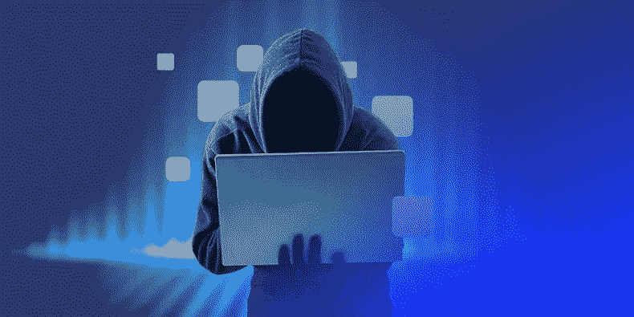

# 常见的 NFT 骗局和 8 种避免它们的方法

> 原文：<https://medium.com/coinmonks/common-nft-scams-and-8-ways-to-avoid-them-e03acc16b2aa?source=collection_archive---------42----------------------->

已经有几起加密货币骗局被报道，并且每天都在继续增长，加密资产 NFT 也没有被排除在丑闻之外。

自从 2021 年前几个月进行了几次高调的销售和艺术拍卖后，NFT 开始受到欢迎，人们对它产生了浓厚的兴趣。但是随着增长，诈骗的数量也在增加。

NFT 使人们有可能从交易数字资产中赚钱，如独特的数字艺术品、数字收藏品、域名，甚至一篇文章。这些骗子的目的是欺骗人们和企业的钱和他们的收藏。

根据移动游戏网站 Gamingonphone 上的这篇文章，2022 年 3 月，黑客从 Axie Infinity 游戏玩家区块链窃取了约 6.25 亿美元。如果你问我，我会说这是一大笔钱。犯罪分子使用私人钥匙从人们的钱包中提取了 17.36 万以太币和 2550 万 USDC。这被称为第二大密码盗窃案。

NFT 骗局的另一个例子是 2022 年 1 月导致超过 120 万美元被盗的 Frosties 骗局。幸运的是，3 月份据报道，肇事者已经被捕。

除了在市场上交易和创造它们之外，NFT 还有各种各样的用途。企业将 NFT 用于:

*   房地产交易
*   身份和文件
*   域名所有权
*   忠诚度计划
*   代表资产的所有权

随着 NFT 空间中诈骗的增长，了解这些诈骗的不同类型以及避免它们的方法是至关重要的。对于那些不熟悉 NFTs 概念的人，我将在下面给出它是什么的简单定义。

# 简单来说，什么是 NFT？

NFT 是代表不可替换令牌的首字母缩写词。简而言之，NFT 是区块链上的数字资产，它将所有权链接到实物或数字项目，如艺术品、音乐、房地产合同等。所有的交易通过出现在数字分类账中来记录所有权。

NFT 的价值来自于它的独特性，因此不能被替代或重新创造。把它想象成一场数字拍卖，人们去买一件稀有的艺术品或物品(有点像你在电影里看到的)。

NFT 太贵了，很多都卖到几百万美元。这是最贵的非功能性食物清单。

2022 年十大最昂贵的非功能性食物

*   合并——9180 万美元
*   前 5000 天——6930 万美元
*   时钟——5270 万美元
*   人类——2890 万美元
*   CryptoPunk # 5822——2370 万美元
*   外星密码朋克——1175 万美元
*   TPunk # 3442——1050 万美元
*   CryptoPunk # 4156——1026 万美元
*   CryptoPunk # 5577——770 万美元
*   CryptoPunk # 3100——760 万美元

2021 年，NFT 销售额高达 177 亿美元。根据 earthweb 的数据，[每天售出 3200 辆 NFTs】。](https://earthweb.com/how-many-nfts-are-sold-per-day/#:~:text=3%2C200%20NFTs%20are%20sold%20per,%2C%20Word%20documents%2C%20and%20PDFs.)

抱歉，我有点偏离主题了。让我现在与你分享你应该知道的 6 种不同类型的 NFT 骗局。

# 你应该知道的 NFT 骗局的常见类型

我之前说过，NFT 骗局的目的要么是直接骗走你的钱，要么是获得你的数字钱包的凭证，这里有 5 种不同的方式。

## 网络钓鱼

网络钓鱼是通过社交媒体和其他平台上共享的广告或链接来引诱人们进入假冒的 NFT 网站或市场。这些网站中的大多数都是一个原始和真实平台的克隆或复制品。相似的程度令人印象深刻，你可能不会注意到。

然后，这些网站要求用户输入他们的私人钱包密钥，以访问他们的数字钱包。这种方法可能已经过时了，但是相信我，它仍然非常流行。一旦你向他们提供了这些信息，他们就可以打开你的钱包，偷走你所有的 NFT 收藏。

## 社交媒体模仿

骗子创建虚假的社交媒体账户，引诱或说服人们购买一些虚假的非功能性食物。他们经常在自己的网站上添加这些社交媒体链接，让网站看起来合法。

## 投资骗局

这也是最常见的诈骗形式之一，不仅是在 NFT 中，在整个加密货币中也是如此。匿名使得骗子更容易进行投资诈骗，因为 NFT 的买卖是匿名进行的。

他们创造一个有趣的项目，让人们投资，然后无影无踪，带着人们的钱消失。这种投资骗局的一个最近的例子是邪恶猿项目，其中他们带走了超过 300 万美元的投资。

## 哄抬股价

一个骗子或一群骗子大量购买 NFT 或加密货币，这使得需求增加，从而抬高了价格。价格飙升后，他们会抛售所持股份或抛售资产以兑现利润，让其他投资者蒙受损失。

## 空投骗局

这一案例涉及骗子利用社交媒体渠道宣传赠品资产。在推广中，他们提供 NFT 作为回报，让人们传播这个项目并在他们的网站上注册。

在 NFT 空间和其他加密货币中已经有一些著名的空投骗局。注册后，他们会提示您将钱包凭证链接到他们的网站，以便您领取奖品。如果你已经猜到当他们有了你的证书后，他们会怎么处理你的证书，那么你猜对了。

## 拉地毯骗局

前面提到的 Frosties 骗局就是拉地毯骗局的一个例子。这些骗子推销一个假的 NFT 项目，并以赚钱的承诺吸引大量买家。促销在几个人购买后停止，承诺无一兑现。此外，骗子在人们离开后取消了他们出售这些 NFT 的能力。

# 避免 NFT 骗局的 8 种方法

如果您已经阅读了这篇文章，我很肯定您已经熟悉了 NFTs 的概念以及与它们相关的各种类型的骗局。我现在给你一些建议，告诉你如何避免这些骗局，进一步保护你的资产。

1.  永远研究 NFT 卖家:这是你应该展示你的“联邦调查局技能”的地方你应该适当地查找卖家，检查他们的 [NFT 市场](https://36crypto.com/top-nft-marketplaces-to-trade-nfts/)账户，以避免常见的骗局，同时检查他们的社交媒体。寻找任何在线评论，也从卖家以前的任何物品。此外，检查他们的 NFT 市场帐户上是否有蓝色勾号验证徽章。
2.  **不要点击可疑链接**:由于大多数此类诈骗都是通过将人们引向某个网站或市场开始的，所以通常都会附带一个链接。永远相信你的胆量，如果它看起来不对，不要点击它。总是直接访问网站，而不是点击链接，即使它看起来像是去一个真实的网站。
3.  保持你的私人钥匙:你的私人钥匙是你的[加密钱包](https://36crypto.com/top-5-crypto-wallets/)的安全保障。永远不要和任何人分享你的钱包信息，即使他们承诺给你世界上所有的非功能性钱包。此外，您还应该保持您的恢复代码的私密性。
4.  **查看 NFT 的交易历史**:注意有单日交易历史的非交易账户。他们通常是可疑的。
5.  **利用知名的 NFT 市场**:有[知名的知名市场](https://36crypto.com/top-nft-marketplaces-to-trade-nfts/)可以买卖 NFT，比如 OpenSea、Rarible、Mintable、Foundation、MakersPlace、Axie Marketplace。永远不要相信好得难以置信的提议。坚持你所知道的。
6.  **创建强密码**:你的 NFT 钱包应该拥有非常强且不可猜测的密码。始终确保对您的钱包使用双因素身份验证，这样当您的钱包出现可疑登录尝试时，您就可以保持警惕和警觉。
7.  **交叉核对 NFT 价格**:当你看到一辆 NFT 并想买下它时，一定要做些调查，核对其他平台的价格，以确保它是一样的。如果价格低于或高于一般市场价格，远离它，因为它很可能是一个骗局。
8.  **观察出价**:在你接受出价之前，一定要仔细检查货币。如果他们低于预期，就不要接受。

**我希望你在这篇内容中发现了价值。**

最初发布于 [36crypto](https://36crypto.com/common-nft-scams-and-8-ways-to-avoid-them/)

> 加入 Coinmonks [电报频道](https://t.me/coincodecap)和 [Youtube 频道](https://www.youtube.com/c/coinmonks/videos)了解加密交易和投资

# 另外，阅读

*   [CryptoHopper 替代品](/coinmonks/cryptohopper-alternatives-d67287b16d27) | [HitBTC 审查](/coinmonks/hitbtc-review-c5143c5d53c2)
*   [CBET 评论](https://coincodecap.com/cbet-casino-review) | [库科恩 vs 比特币基地](https://coincodecap.com/kucoin-vs-coinbase)
*   [折 App 回顾](https://coincodecap.com/fold-app-review) | [库币交易机器人](/coinmonks/kucoin-trading-bot-automate-your-trades-8cf0ca2138e0)
*   [如何匿名购买比特币](https://coincodecap.com/buy-bitcoin-anonymously) | [比特币现金钱包](https://coincodecap.com/bitcoin-cash-wallets)
*   [币安 vs FTX](https://coincodecap.com/binance-vs-ftx) | [最佳(SOL)索拉纳钱包](https://coincodecap.com/solana-wallets)