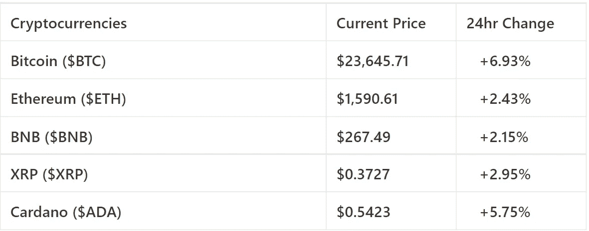

# 关于分散融资的常见问题

> 原文：<https://medium.com/coinmonks/common-questions-asked-about-decentralized-finance-ee32256032b5?source=collection_archive---------53----------------------->

欢迎来到最新一期的 CapitalRollup Digest！今天的文摘是 7 月 20 日的，大约需要 5 分钟。我们马上开始。

*   今天的市场看起来怎么样？(前 5/10 大流行加密货币)

Price Market Update

# 关于分散融资的常见问题

由于加密货币的日益普及，分散式金融已经变得很受欢迎，但是，对于许多人来说，分散式金融(DeFi)的概念仍然感觉模糊不清，难以驾驭。

分散金融通常被描述为没有任何中央权力机构(如银行或政府)的金融活动，在这种金融活动中，个人控制并负责所有的金融活动。

在今天的新闻简报中，我们将尝试通过人们就 DeFi 提出的一些常见问题，将 DeFi 的概念分解成简单的结构，以便于理解。

准备好了解 **DeFi** 了吗？让我们开始吧。

# 问题 1:什么是分权金融？

去中心化金融(Decentralized finance，简称 DeFi)是指一种新的去中心化金融体系，它建立在比特币和以太坊等公共区块链之上。该系统取消了银行和机构对货币、金融产品和金融服务的控制。

分散金融通过允许个人、商人和企业利用新兴技术进行金融交易，消除了中介。

总之，DeFi 一词可能指的是一场旨在创建开源、无许可、透明的金融服务生态系统的运动。

# 问题 2:是什么使 DeFi 不同于集中式/传统金融。

DeFi 与传统金融活动的不同之处有很多，包括:

*   **无许可**:有了 DeFi，世界上任何地方的任何人都可以连接到网络，独自完成金融活动，不需要任何中央机关或交易所。
*   **分散**:有了 DeFi，就没人管了。由于所有的活动都存在于并发生在区块链上，记录被同时保存在分布在网络上的成千上万台计算机上。
*   **透明**:所有的交易都存在于区块链上，任何人都可以在任何时候核实。
*   **不可信**:DeFi 产品中不需要中心方。
*   **抵制审查**:没有人能够控制改变和废除任何发生在链上的金融活动。
*   **可编程**:开发者可以将应用编程为低成本的金融服务。在产品上处理的资产具有分散网络上传统令牌的所有固有属性。

# 问题 DeFi 是如何工作的？

分散金融使用加密货币使用的区块链技术。区块链是一个分布式的安全数据库或分类帐。称为 dApps 的应用程序用于处理交易和运行区块链。7

在区块链，交易被分块记录，然后由其他用户验证。如果这些验证者同意交易，则该块被关闭并加密；创建另一个块，该块中具有关于前一个块的信息。

分散融资的大多数现有和潜在应用都涉及创建和执行智能合同。通常的合同使用法律术语来规定签订合同的实体之间的关系条款，而智能合同使用计算机代码。

# 问题 DeFi 的风险有哪些？

虽然控制自己的财务听起来很吸引人，也很有趣，但重要的是要注意，这也有风险。在您深入了解 DeFi 世界之前，您应该了解以下几个风险:

1.**交易对手风险:**由于不总是能够识别交易另一端的人，因此在任何交易中很容易遭受损失。

2.**代币风险:**您持有的资产具有不同的风险级别，受其流动性、可信赖性、代币智能合约安全性以及相关项目和团队的影响。

3.**软件风险:**代码漏洞会破坏你投资的智能合约的安全性。由于连接到 DeFi DApps 并授予他们某些权限，您的钱包也可能受到威胁。

4.**诈骗:**与中央金融类似，DeFi 中也有坏人，他们总是在提防诈骗用户的资金。这些骗局以安全漏洞、欺诈性令牌、盗窃和许多其他形式存在。

# 问题 DeFi 有哪些应用？

尽管 DeFi 还很年轻，但已经有了类似于传统金融的分散金融的有用应用。

今天，有许多 DeFi 贷款平台(或者 DeFi 银行，如果你必须这样做的话)，以及允许人们交换和转移代币的分散交易所。我们也看到了产量农业、分散保险以及更多已经存在和将要存在的应用形式的投资的增加。

未来，随着越来越多的人成为采用者，以及空间的增长以适应可能出现的不同需求，DeFi 将会有更多的应用。

# 琐事🤔

Web3 是否由一个中央机构控制？

A.是

B.不

在下一期的 CapitalRollup Digest 中找到答案。😉

# 每日一词！

💡**链上**

链上交易是发生在以太坊区块链上的加密交易。这些都要交煤气费。

**句子中使用的术语:** *—根据使用的方法，链外交易最终可能不得不记录***。**

# *社区更新📢*

*我们与 3 位行业领袖组织了一次 Twitter 空间会议，我们在会上讨论了“分享您的熊市经验& CeDeFi 内爆”，您可以在这里[收听](https://twitter.com/i/spaces/1YpKkZzakbNxj?s=20)*

# *我们今天在读什么📰*

***什么是 DeFi？基于密码的分散金融解释。** [***阅读更多***](https://www.cnbc.com/2021/06/18/whats-defi-crypto-based-decentralized-finance-explained.html)*

***分权财政(DeFi)的意思。** [***阅读更多***](https://www.wallstreetmojo.com/decentralized-finance/)*

## *与朋友一起学习和投资加密💰*

*当您邀请您的朋友开始使用 CapitalRollup 进行有利可图的投资时，您将获得独特的奖励。*

*💬对 CapitalRollup Digest 有什么反馈吗？ [**告诉我们！**](mailto:hi@capitalrollup.com)*

> *交易新手？尝试[加密交易机器人](/coinmonks/crypto-trading-bot-c2ffce8acb2a)或[复制交易](/coinmonks/top-10-crypto-copy-trading-platforms-for-beginners-d0c37c7d698c)*