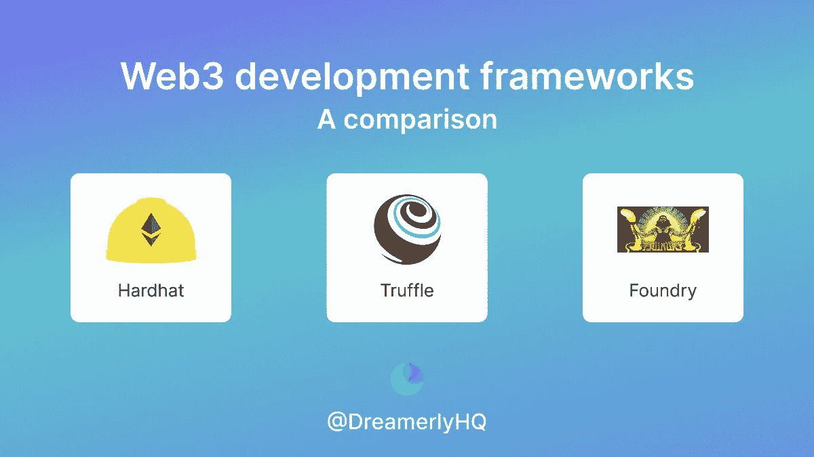

# 比较 2022 年 web3 项目的三大智能合同框架:HardHat、Truffle 和 Foundry

> 原文：<https://medium.com/coinmonks/compare-the-top-3-smart-contract-frameworks-for-web3-projects-in-2022-hardhat-truffle-and-ca26c638c597?source=collection_archive---------12----------------------->

说到 web3 开发框架，前三名是 Hardhat、Truffle 和 Foundry。下面是他们之间的比较。

但首先，让我自我介绍一下:

**大家好，我是 Linh，Dreamerly(Twitter:**[**@ DreamerlyHQ**](https://twitter.com/DreamerlyHQ)**)的业务拓展。关注我们的 Twitter，了解关于 crypto 最新故事的有趣见解。**

或者，你可以在我们的 Twitter 上阅读这篇文章:

注:原内容属于 Emily，松露的 devrel。她在 Reddit 上写了这篇颇有见地的文章来比较这三个框架。

**基础知识**

CLI/dev 环境用于构建、部署和测试智能合约，前三名是:HardHat、Truffle 和 Foundry

——Truffle 是第一个智能合同框架

—后来建了 HardHat，成了顶级玩家

— Foundry 是测试速度超快的后起之秀

**松露 vs 安全帽**

— HardHat 具有内置的类型脚本支持。块菌你得用“tsc”来编译自己。

—乙醚比松露更容易与安全帽接触。

Truffle 具有内置的契约抽象，使 web3.js 更易于使用

—两者都提供 console.log，但 Truffle 有一个带有单步执行/退出、断点等功能的本机调试器。

—您可以使用 Truffle 来调试 mainnet 上的事务。使用 HardHat，您只能获得部署合同中包含的任何 console.log 语句

—与 Hardhat 和 Truffle 相比，有一个更强大的插件生态系统。

—您可以使用 Truffle Dashboard 使用元掩码来部署 dotenv 和密钥内容

——Truffle for VS 代码扩展专注于开发 UX(即通过用户界面管理开发工作流，可视化地表示重要信息，在一个地方组织)

— Hardhat VS 代码扩展更侧重于可靠性开发编译错误等。

**松露的路线图**

-松露正在将重点转向多链和安全

—松露的方向是竞合，所以可以用 Hardhat 和 Foundry 搭配松露

—简而言之，Truffle 为企业级 Dapps 提供了更全面的端到端体验

**铸造厂 vs 安全帽/松露**

一些背景:人们从松露转向安全帽，因为安全帽不那么固执己见。然而，随着以太坊生态系统的发展壮大，哈德哈特变得更加固执己见。出于同样的原因，开发人员似乎正从代工转向代工

Foundry 与 Hardhat/Truffle 之间的主要区别似乎是快速可靠性测试和模糊测试。还有一些很酷的代码和强制转换调用。

**在 Twitter 上关注我们**[**@ DreamerlyHQ**](https://twitter.com/DreamerlyHQ)**】获取关于加密的有趣见解！**

> 交易新手？尝试[加密交易机器人](/coinmonks/crypto-trading-bot-c2ffce8acb2a)或[复制交易](/coinmonks/top-10-crypto-copy-trading-platforms-for-beginners-d0c37c7d698c)