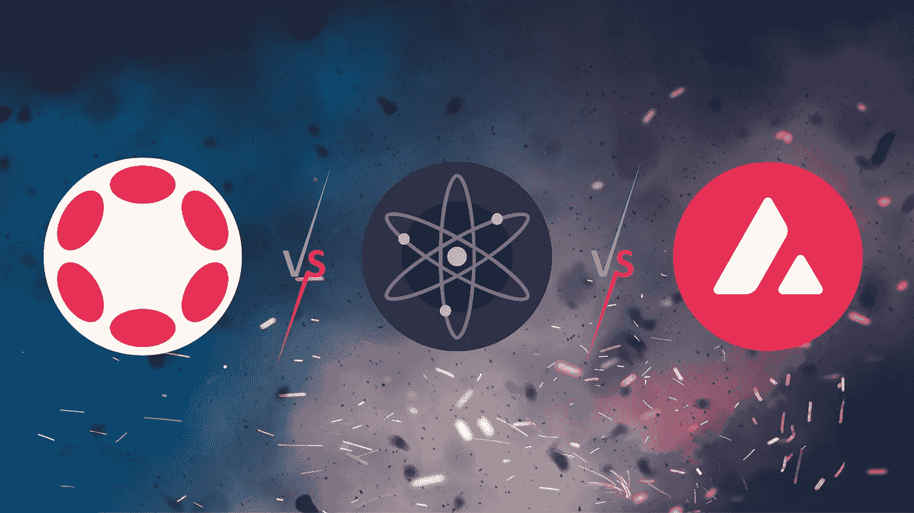
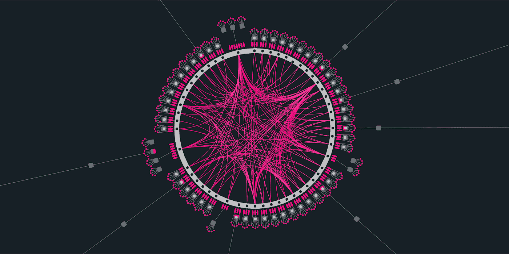
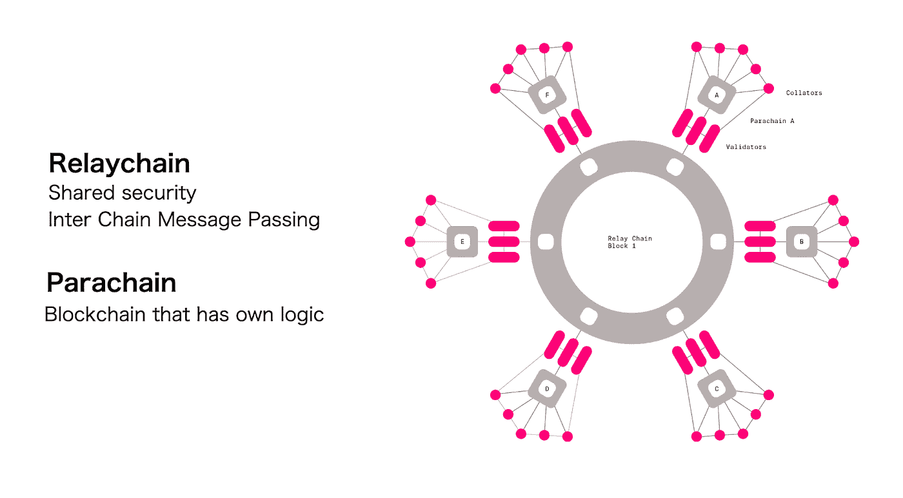
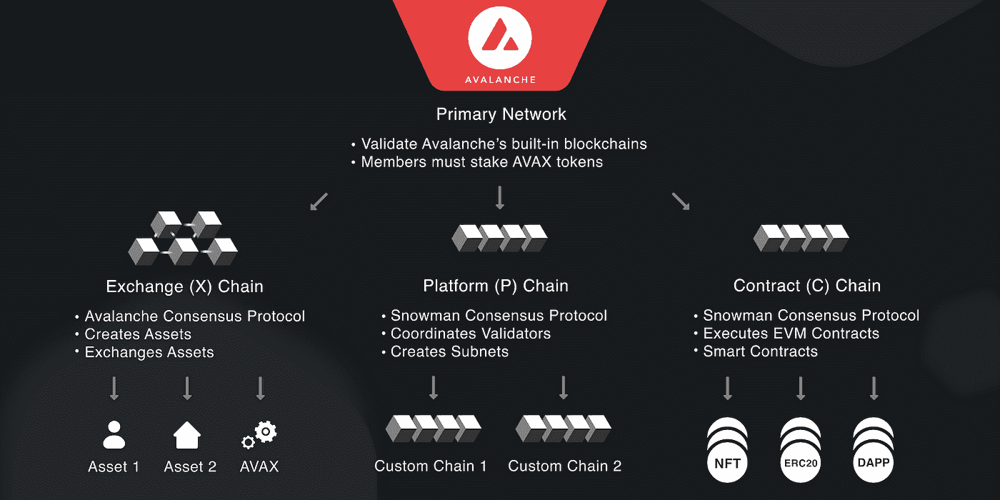
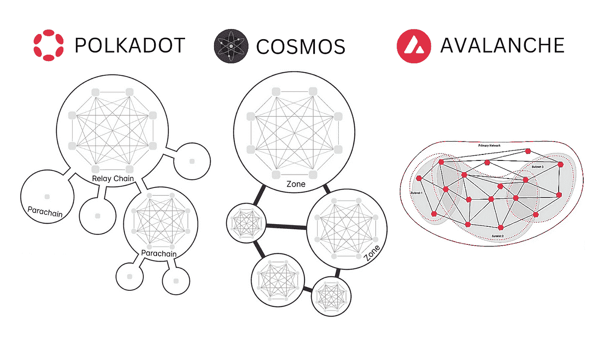
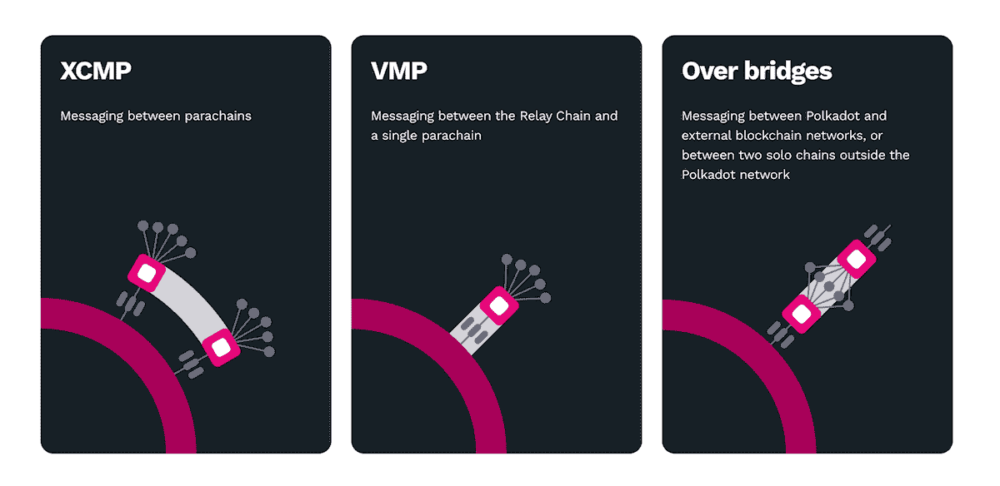
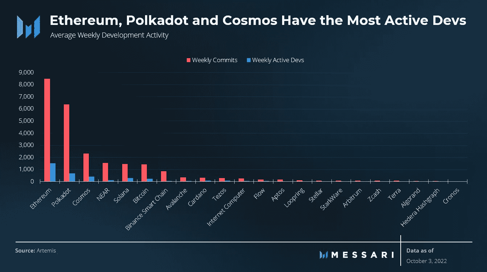

# 推进区块链互操作性——Polkadot、Cosmos 和 Avalanche

> 原文：<https://medium.com/coinmonks/comparing-advancing-blockchain-interoperability-polkadot-cosmos-and-avalanche-a42e548b5bf?source=collection_archive---------4----------------------->

*区块链平台正在快速涌现。然而，对互操作性的需求正在削弱这些平台之间可能存在的网络效应。*

排他性的力量和价值使单个平台能够吸引用户，但阻止了行业释放其全部潜力。对于日益数字化和数据驱动的全球经济，各个区块链必须能够相互通信，以确保基于区块链的应用程序被大规模接受。

简单来说，**互操作性**是指不同生态系统之间无缝交换数据和传输相关信息的能力，无需任何中央实体/中介。这对于消除抑制潜在增长的障碍至关重要。

本文将第 0 层多链协议 Polkadot 与第 1 层区块链 Cosmos 和 Avalanche 进行了比较。

# 概观

Polkadot、Avalanche 和 Cosmos 的出现是为了解决困扰以太坊的低延迟和可扩展性问题，以太坊是最大的智能合同区块链，拥有最安全、最久经考验的架构之一。然而，这些区块链做的还不止这些。随着他们对互操作性的押注，焦点转向了更大的图景——***一个多链的未来*** 。

# 波尔卡多特

Polkadot 是一种异构多链框架，它通过中继链将特定应用的第 1 层区块链(称为副链)连接到一个统一的网络中。中继链负责整个网络的安全性、一致性和跨链互操作性。

尽管公共、无许可网络、私有联盟链和其他 Web3 技术之间存在技术差异，但 Polkadot 使互联网能够在共同的安全保证下提供不同网络之间的无缝通信和价值转移。

该网络运行在一个分片模型上，其特点是多个区块链并行运行，并通过中继链连接。中继链允许 Polkadot 同时处理网络中所有链的事务，消除了传统网络的瓶颈，并显著提高了可扩展性。同时事务处理也称为并行处理，这就是 Polkadot 上的区块链被称为 parachains(并行链的简称)的原因。

副链是主权区块链，提供特定的用例，并具有自己的令牌和治理机制。只要一个 Parachain 的逻辑能编译成 WebAssembly (WASM)并附着在中继链上，就能连接到 Polkadot 网络。

基底是支撑波尔卡多特生态系统的技术。使用该工具包制作的所有链都与 Polkadot 兼容，因此可以获得其速度、安全性以及副链和应用程序的互操作生态系统。然而，在波尔卡多特上用基板建造是可选的，两者互不依赖。带有备用软件的区块链也可以作为碎片(副链)集成到 Polkadot 网络中。类似地，用基板制造的区块链不会被强制加入网络，并且可以独立发射。

中继链构成了波尔卡多特生态系统的基础，通常被称为网络的基础层。它负责保护、管理、连接和确保副链的无缝运行。中继链不支持应用程序功能。它的主要任务是验证所有连接链的状态转换，并在整个网络中提供共享状态“状态的状态”。除了在网络上创建和转移资产之外，连接到中继链的 Parachains 还可以执行智能合同并支持 dApps。

在副链之间传输数据时，安全性至关重要。Polkadot 通过中继链确保这种安全性。此外，中继链为副链之间的相互通信提供了一种安全的方式。

Polkadot 的跨链消息传递方案(XCM)促进了数据交换，实现了真正的互操作性，并创造了链间服务、社区和经济的新范式。开发者可以利用和构建多个区块链的功能/产品，而不是局限于单个区块链的功能。此外，parachains 可以在它们之上集成第 2 层解决方案，以增强可伸缩性和效率。

此外，Polkadot 的设计实现了区块链科技对 Web3 未来的承诺，即从中央政府和互联网垄断企业手中夺回个人对其身份和资产的控制权。它使区块链能够规模化、专业化和协同工作。该网络拥有一套先进的治理工具，并使用 Wasm 标准，可以自主部署网络升级。本质上，网络是面向未来的，因为它可以适应不断增长的需求，而没有分叉的风险。

接下来是 Avalanche，这是一个采用不同于 Polkadot 的方法的网络，但都有改进区块链技术的目标，特别是互操作性、可伸缩性和可用性。

# 雪崩

Avalanche 由艾娃实验室(一个开源平台)开发，致力于提供高性能、超强的扩展能力、快速的确认时间和经济实惠的价格。他们声称自己是“区块链行业中最快的智能合约平台，以结束时间来衡量。”

Avalanche 拥有独特的三区块链基础设施，可帮助加密开发人员降低智能合约的成本，提高其速度和可扩展性。C 链(合同链)允许与以太坊的功能和工具兼容，X 链(交换链)允许数字资产，如包装令牌、NFT 和 stablecoins，最后，P 链(平台链)协调 Avalanche 的验证器以及子网的创建和管理。

P-Chain 和 C-Chain 利用雪人共识来实现高吞吐量的安全智能合约，X-Chain 使用 DAG 优化的雪崩共识，这是一种可扩展的协议，可实现低延迟和快速终结。Avalanche 号称每秒 4500 个事务的事务吞吐量。

Avalanche 上的验证器需要保护和验证一起形成主网络的所有三个链。这一要求使得子网之间的连接和实施变得容易。

Avalanche 的核心价值主张是它能够创建高度可扩展和可定制的区块链，称为子网(子网的缩写)。需要注意的是，子网是一组动态的验证器，其任务是在自己的区块链上达成共识。

雪崩验证器创建后，子网可以概述其验证器的规则集，并使用定制的虚拟机启动自己的区块链(WASM EVM)。此外，它们可以有自己的令牌和费用结构。因此，Avalanche 具有灵活性和可定制性。

Avalanche 旨在服务于金融市场，为创建和交易数字智能资产提供本地支持。DeFi(2021 年 12 月 120 亿美元)中锁定的总价值(TVL)可以证实这一点。该网络旨在实现 dApps 的快速构建和部署。此外，它允许以太坊开发者利用一个具有增强的可伸缩性和互操作性的网络，同时仍然是兼容的(以太坊虚拟机)。

此外，在子网内以及子网之间实现了互操作性。最后，类似于波尔卡多特和宇宙，雪崩可以通过桥梁连接到其他区块链。

# 宇宙

Cosmos 被称为区块链互联网，旨在促进独立的分布式分类账之间的通信，而无需集中的中介。

Cosmos 可交付成果超越了不同区块链之间的无缝交互，包括简化开发可互操作区块链的工具。

利用集线器、区块链间通信协议(IBC)、Tendermint [Byzantine 容错](https://academy.binance.com/en/articles/byzantine-fault-tolerance-explained) (BFT)引擎和 Cosmos 软件开发工具包(用于构建特定应用区块链的框架)使 Cosmos 能够为创建可互操作的区块链提供必要的基础设施。

Cosmos 的方法不同于使用智能合约的互操作性解决方案。相反，它为开发独立的区块链提供开源工具，称为 zones。

这些区域连接到主区块链，称为集线器(网络的所有验证器都在这里)。区域通过使用 IBC 经由集线器进行通信。与 Polkadot 不同，Cosmos 上的验证器是独立的(要在任何 parachain 节点上进行验证，Polkadot 上的操作符需要是中继链上的验证器)。区域自主运行，并有自己的验证器来验证事务。中枢和区域模型使 Cosmos 成为一个低延迟网络。

宇宙枢纽是主枢纽，也是网络上的第一个区块链。它是由原子硬币驱动的。网络上的每个新区域都与宇宙中心相连，宇宙中心存储每个区域的状态记录，反之亦然。

由于一个名为 Peg Zone 的特殊代理链，Cosmos interoperability 扩展到了没有快速终结(工作证明区块链，如比特币)的区块链。钉住汇率区可以跟踪另一个区块链的状态，并且与 IBC 兼容，因为它们本身具有快速终结性。Peg 区域充当桥梁，通过链接区域和集线器网络与其他链进行通信。

Cosmos Hub 旨在生成数千个互连的区块链系统，是一个赌注证明平台，参与者可以在这里下注他们的 ATOM 硬币来获得奖励。

虽然三个区块链之间有相似之处，但关键的差异会影响网络的扩展和运行方式。在下一节中，我们将讨论 Polkadot、Avalanche 和 Cosmos 采用的链间通信，以及它们之间的比较。

# 比较

Polkadot 通过跨链消息格式(XCM)实现了其互操作性的承诺。它是一种应该如何执行消息传输的格式，被定义用于链和智能合约、托盘、桥、甚至像 [SPREE](https://wiki.polkadot.network/docs/learn-spree) 这样的分片飞地之间。

XCM 不仅可以适应生态系统中的大多数通信场景，而且是面向未来和向前兼容的，使其版本能够经得起时间的考验。

在模块级别，Polkadot 有不同类型的消息格式，允许其组成链之间的通信。

1.  垂直消息传递(VMP) —包括 UMP(副链向中继链发送消息的向上消息传递)和 DMP(中继链向下向其中一个副链传递消息的向下消息传递)
2.  用于副链与其他副链交换消息的跨链消息传递(XCMP)。

副链利用 XCM 相互发送任意信息。它们打开连接，通过已建立的通道发送消息。Polkadot parachains 从中继链租用安全性，因为它们没有自己的验证器。称为排序器的副链的完整节点没有安全责任，可以在没有信任的情况下交互。它们收集块的状态，并将它们提交给中继链验证器。波尔卡多特副链之间的共享状态创造了一个没有信任的环境，在这个环境中，安全是合作的，而不是竞争的。

此外，Polkadot 有一个为跨链消息提供共享逻辑的协议(SPREE)。对消息使用 SPREE 带来了关于来源和接收链解释的额外保证。

继续看宇宙。Cosmos 的架构与 Polkadot 不同，它没有一个中心枢纽(中继链),而是有几个。与 Polkadot 不同，在 Polkadot 中，每个 parachain 都由相同的池化安全性支持，连接到 Cosmos Hub 的区域没有统一的安全性。相反，它们维护自己的验证器，并利用跨链协议 IBC，通过集线器路由来促进数据(主要是令牌)到其他区域的传输。

虽然 IBC 使 Cosmos 更接近其成为真正可互操作的生态系统的目标，但重要的是要注意，网络的安全性与其最不安全的链一样。正在努力确保该协议变得更加健壮和安全。链间安全(共享安全)的实现正在进行中，这是 Cosmos 对安全引导问题的解决方案。

然而，目前，Cosmos 的多中心架构以独立的安全保证连接链，这意味着接收链必须信任发送链(消息的来源)的安全性，以便进行链间通信。

**接下来是雪崩。** Avalanche 和 Polkadot 在架构上有一些相似之处，因为它们都允许设计特定应用的区块链并连接到主网络。在 Avalanche 中，有 3 个主链——P 链、X 链和 C 链，而在 Polkadot 中，主要网络是中继链。

然而，Avalanche 上的子网不能共享主链的安全性。它也没有本地的不可信消息传递机制。它依靠桥来实现互操作性。但是，它的 EVM 兼容特性使它能够在令牌级别进行互操作。在 Polkadot 上，parachains 除了利用中继链的块终结性和安全性之外，还将 XCM 和 XCMP 消息协议用于本机和无信任的消息传递方案，而不是依赖于多个桥接解决方案。

Avalanche 的安全模型与 Polkadot 的不同，因此不能直接比较。尽管人们普遍认为 Avalanche 为互操作性提供了一个安全的环境，但实际上，它类似于 Cosmos 的集中版本，其验证器组的自选和重叠子集充当子网上的安全性。

这种重叠的网络拓扑导致链上不同的安全级别，使得碎片间攻击可行，因为来自最不安全的子网的消息可能会影响另一个子集上的转换。因此，与 Cosmos 类似，雪崩网络的安全性取决于其最不安全的子网。

Avalanche 有共享安全性、互操作性、可组合性和链上治理的计划。所有这些都已经由 Polkadot 提供了。

# 结论

互操作性和可伸缩性对于区块链技术的蓬勃发展和封装采用至关重要。一个真正可伸缩的系统的安全保证必须是相同的，不管逻辑在哪里执行，同时仍然是分散的。让多链应用程序跨不同的链运行，而不考虑潜在的一致安全影响，将会使安全性成为瓶颈(如果在高安全性链中运行)或危及安全性(链间应用程序在安全性最低的链中运行)。例如，对于 Avalanche 或 Cosmos，虽然可以添加链的数量，但连接的链远不如中心链安全。

在 Polkadot parachain 插槽的情况下，安全性来自整个网络的力量。Polkadot 状态转换是图灵完成的，并以本机速度执行。

虽然所有三个网络(Polkadot、Cosmos 和 Avalanche)都引入了一种架构来支持区块链的互联网，但 Polkadot 除了具有真正的互操作性之外，还专注于安全性，拥有大量开发人员。

如果您觉得这很有帮助，请通过订阅和关注来支持。

**万物区块链**🧐——自由思想家、作家✍、区块链探险家🔭
为了简化元宇宙链条的不同环节

**社交**

[Twitter](https://twitter.com/EverythingB0x) ， [Medium](/@everythingblockchain) ， [Youtube](https://www.youtube.com/channel/UCkcc6EceEAu1sMoi2dKczCQ) ， [Reddit](https://www.reddit.com/user/cyekmyster) ， [Substack](https://everythingblockchain.substack.com/account?utm%5Fsource=menu-dropdown)

**下线**

[智囊团](https://app.usebraintrust.com/r/everything1/)、[预研](https://www.presearch.org/signup?rid=2491437)、[币安](https://accounts.binance.com/en/register?ref=12626399)、[酷币](https://www.kucoin.com/ucenter/signup?rcode=rJCLFS2)

本文提供的信息仅用于教育目的，不得视为投资建议。在正确呈现任何信息方面的任何失误都是我们的责任。我们否认与使用此内容相关的任何责任。

> 交易新手？尝试[加密交易机器人](/coinmonks/crypto-trading-bot-c2ffce8acb2a)或[复制交易](/coinmonks/top-10-crypto-copy-trading-platforms-for-beginners-d0c37c7d698c)