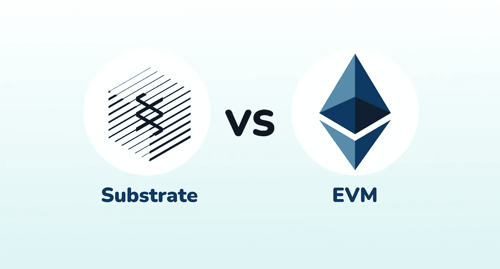
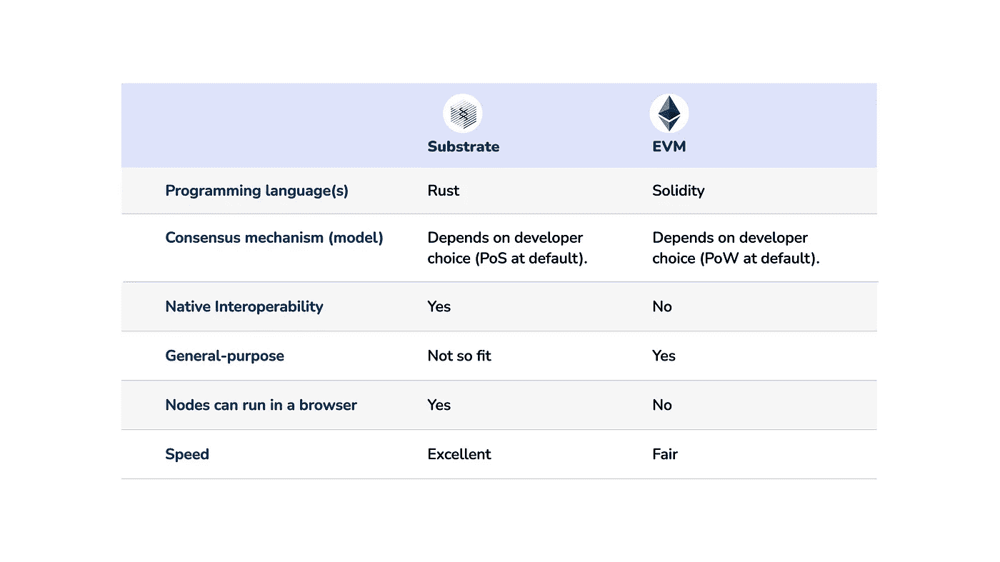
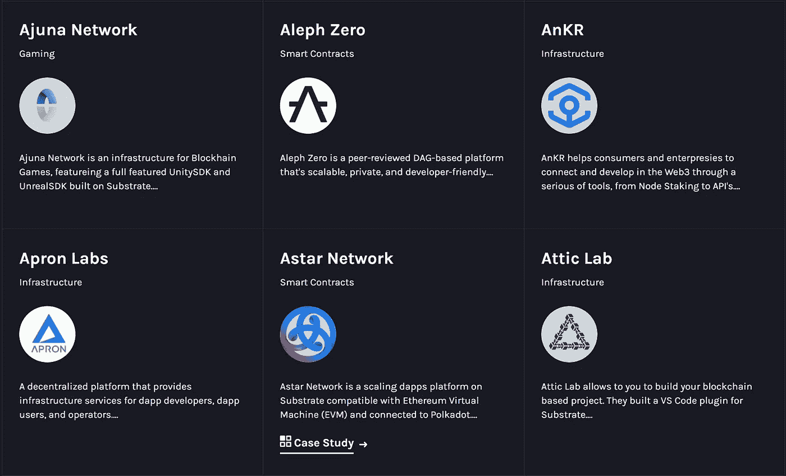

# 比较平价的墨迹！坚实:EVM 与衬底编程

> 原文：<https://medium.com/coinmonks/comparing-paritys-ink-with-solidity-evm-vs-substrate-programming-14379a79d7fc?source=collection_archive---------1----------------------->

在这个系列中，我将对比 EVM 链和基于基底的链，以澄清与这个主题相关的潜在误解和误会。

本文的核心焦点是这两个链的技术(编程)方面，但是我将阐明与它们相关的其他一些基本概念。



Substrate VS EVM

由 [Parity technologies](https://www.parity.io/) 开发的 Substrate 是一个开源框架，它提供了一种可用于构建定制区块链的“SDK”。

> 好玩的事实:Polkadot 是使用底层框架在核心开发的最突出的区块链；被称为“Polkadot 运行时环境”。

在底层开发智能合约的核心语言是 Rust。

使用底物开发的一些著名链是 Polkadot、Aleph Zero、围裙实验室、Aventus 等。

另一方面，最初由 Vitalik Buterin 创建的**以太坊虚拟机**或 EVM 是一个程序(或软件),它运行智能合同，并在每次有新块添加到链中时计算以太坊网络的状态。EVM 位于以太坊的硬件和节点网络层。

EVM 的智能合约是使用 Solidity 开发的。兼容或能够运行 EVM 的一些区块链有币安智能链(BSC)、Polygon、Avalanche 等

首先，我将以列表的形式概述两种链类型之间的核心区别。



Comparing Substrate framework to EVM

在我看来，基质框架是奇偶技术的一个惊人创新，是现代、理想和未来区块链网络的关键。

发现了这两种基础架构之间的核心差异后，我将开始比较[墨水！](https://paritytech.github.io/ink/)(锈)和[坚实度](https://docs.soliditylang.org/)。

> 请注意，基板和 EVM 不是区块链。

# 固态

Solidity 是一种面向对象的高级语言，用于开发智能合约。被设计成一种[花括号](https://en.wikipedia.org/wiki/List_of_programming_languages_by_type#Curly-bracket_languages)语言类型，它的目标是以太坊虚拟机(EVM)。它的语法和设计模式受到 C++、Python 和 JavaScript 的影响。

典型的 Solidity smart 合同看起来是这样的(来自 [Solidity 文档](https://docs.soliditylang.org/en/v0.8.17/solidity-by-example.html)):

```
// SPDX-License-Identifier: GPL-3.0
pragma solidity ^0.8.4;
contract SimpleAuction {
    // Parameters of the auction. Times are either
    // absolute unix timestamps (seconds since 1970-01-01)
    // or time periods in seconds.
    address payable public beneficiary;
    uint public auctionEndTime;

    // Current state of the auction.
    address public highestBidder;
    uint public highestBid;

    // Allowed withdrawals of previous bids
    mapping(address => uint) pendingReturns;

    // Set to true at the end, disallows any change.
    // By default initialized to `false`.
    bool ended;

    // Events that will be emitted on changes.
    event HighestBidIncreased(address bidder, uint amount);
    event AuctionEnded(address winner, uint amount);

    // Errors that describe failures.

    // The triple-slash comments are so-called natspec
    // comments. They will be shown when the user
    // is asked to confirm a transaction or
    // when an error is displayed.

    /// The auction has already ended.
    error AuctionAlreadyEnded();
    /// There is already a higher or equal bid.
    error BidNotHighEnough(uint highestBid);
    /// The auction has not ended yet.
    error AuctionNotYetEnded();
    /// The function auctionEnd has already been called.
    error AuctionEndAlreadyCalled();

    /// Create a simple auction with `biddingTime`
    /// seconds bidding time on behalf of the
    /// beneficiary address `beneficiaryAddress`.
    constructor(
        uint biddingTime,
        address payable beneficiaryAddress
    ) {
        beneficiary = beneficiaryAddress;
        auctionEndTime = block.timestamp + biddingTime;
    }

    /// Bid on the auction with the value sent
    /// together with this transaction.
    /// The value will only be refunded if the
    /// auction is not won.
    function bid() external payable {
        // No arguments are necessary, all
        // information is already part of
        // the transaction. The keyword payable
        // is required for the function to
        // be able to receive Ether.

        // Revert the call if the bidding
        // period is over.
        if (block.timestamp > auctionEndTime)
            revert AuctionAlreadyEnded();

        // If the bid is not higher, send the
        // money back (the revert statement
        // will revert all changes in this
        // function execution including
        // it having received the money).
        if (msg.value <= highestBid)
            revert BidNotHighEnough(highestBid);

        if (highestBid != 0) {
            // Sending back the money by simply using
            // highestBidder.send(highestBid) is a security risk
            // because it could execute an untrusted contract.
            // It is always safer to let the recipients
            // withdraw their money themselves.
            pendingReturns[highestBidder] += highestBid;
        }
        highestBidder = msg.sender;
        highestBid = msg.value;
        emit HighestBidIncreased(msg.sender, msg.value);
    }

    /// Withdraw a bid that was overbid.
    function withdraw() external returns (bool) {
        uint amount = pendingReturns[msg.sender];
        if (amount > 0) {
            // It is important to set this to zero because the recipient
            // can call this function again as part of the receiving call
            // before `send` returns.
            pendingReturns[msg.sender] = 0;

            // msg.sender is not of type `address payable` and must be
            // explicitly converted using `payable(msg.sender)` in order
            // use the member function `send()`.
            if (!payable(msg.sender).send(amount)) {
                // No need to call throw here, just reset the amount owing
                pendingReturns[msg.sender] = amount;
                return false;
            }
        }
        return true;
    }

    /// End the auction and send the highest bid
    /// to the beneficiary.
    function auctionEnd() external {
        // It is a good guideline to structure functions that interact
        // with other contracts (i.e. they call functions or send Ether)
        // into three phases:
        // 1\. checking conditions
        // 2\. performing actions (potentially changing conditions)
        // 3\. interacting with other contracts
        // If these phases are mixed up, the other contract could call
        // back into the current contract and modify the state or cause
        // effects (ether payout) to be performed multiple times.
        // If functions called internally include interaction with external
        // contracts, they also have to be considered interaction with
        // external contracts.

        // 1\. Conditions
        if (block.timestamp < auctionEndTime)
            revert AuctionNotYetEnded();
        if (ended)
            revert AuctionEndAlreadyCalled();

        // 2\. Effects
        ended = true;
        emit AuctionEnded(highestBidder, highestBid);

        // 3\. Interaction
        beneficiary.transfer(highestBid);
    }
}
```

# 墨水！

墨水！是一种嵌入式领域特定语言( [eDSL](https://wiki.haskell.org/Embedded_domain_specific_language) )，由奇偶技术公司开发，用于为区块链编写基于[底层](https://github.com/paritytech/substrate)框架的 Rust 智能合同。墨水！契约被编译到 WebAssembly 中，并可以部署到任何基于底层的链中。

来自[油墨的智能合同示例！文档](https://paritytech.github.io/ink/#hello-world--the-flipper)如下图所示:

```
#[ink::contract]
mod flipper {
    /// The storage of the flipper contract.
    #[ink(storage)]
    pub struct Flipper {
        /// The single `bool` value.
        value: bool,
    }

    impl Flipper {
        /// Instantiates a new Flipper contract and initializes
        /// `value` to `init_value`.
        #[ink(constructor)]
        pub fn new(init_value: bool) -> Self {
            Self {
                value: init_value,
            }
        }

        /// Flips `value` from `true` to `false` or vice versa.
        #[ink(message)]
        pub fn flip(&mut self) {
            self.value = !self.value;
        }

        /// Returns the current state of `value`.
        #[ink(message)]
        pub fn get(&self) -> bool {
            self.value
        }
    }

    /// Simply execute `cargo test` in order to test your contract
    /// using the below unit tests.
    #[cfg(test)]
    mod tests {
        use super::*;

        #[ink::test]
        fn it_works() {
            let mut flipper = Flipper::new(false);
            assert_eq!(flipper.get(), false);
            flipper.flip();
            assert_eq!(flipper.get(), true);
        }
    }
}
```

已经看到了两种编程语言之间的语法差异，也应该知道行为和执行方面的差异。

# 对比墨迹！和坚固性

*   墨水！能够在任何 WASM (WebAssembly)虚拟机上运行，而 Solidity 是专门为 EVM 兼容网络设计的。
*   用墨水写的程序！在 WebAssembly 中编码，而在 Solidity 中编码为 EVM 字节码。
*   可以用墨水写多个构造函数！，而只有简单的构造函数必须用 Solidity 编写。
*   墨水！默认情况下，智能合约具有溢出保护，而 Solidity 在其核心并不考虑溢出(人们必须手动考虑会导致溢出的情况)。
*   墨水！程序可以用支持 Rust 的工具编写，而 Solidity 有一个定制的工具包。
*   这两种编程语言都设计有语义版本。
*   两种编程语言都有元数据；即应用二进制接口(ABI)。
*   墨水的存储大小是动态的(可变的)!，而 Solidity 定义了 256 位的存储。

> Rust 是一种理想的智能合同语言；从我这里拿走这个。

平价科技公司开发了一个革命性的框架，值得称赞！

查看下面运行在 Substrate 上的一些最大的网络(这不是一个完整的列表):



Image credits: [https://substrate.io/ecosystem/projects/](https://substrate.io/ecosystem/projects/)

我坚信您已经看到了这两种编程语言之间的差异，并且您愿意开始使用 ink 进行开发！今天(Solidity 也很酷，但是墨迹！，由于 Rust 拥有的力量，与 Solidity 相比，是你下一个区块链项目的更好选择)。

在其他条件相同的情况下，我希望你喜欢阅读这篇文章。

请在 Twitter 上查看我，并关注我💚

谢谢你一直读到这篇文章，法国人！

> 交易新手？尝试[加密交易机器人](/coinmonks/crypto-trading-bot-c2ffce8acb2a)或[复制交易](/coinmonks/top-10-crypto-copy-trading-platforms-for-beginners-d0c37c7d698c)