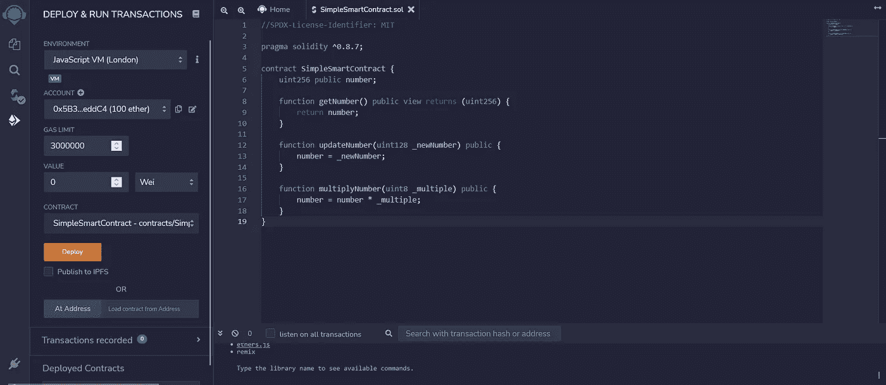

# 编译智能合同

> 原文：<https://medium.com/coinmonks/compiling-the-smart-contracts-8dcda8071638?source=collection_archive---------19----------------------->


有许多方法可以将智能合约转换成 ABI 或字节码。我们将通过使用其中一个框架和使用 IDE 来了解。

> 你可以在这里阅读更多关于 ABI 和字节码的内容👇
> 
> [https://medium . com/coin monks/understanding-smart-contract-bytecode-ABI-4747 b 1616450](/coinmonks/understanding-smart-contract-bytecode-abi-4747b1616450)

# 让我们开始…..

💜**重述**

*   在前一篇文章中，我们了解到 EVM 需要 ABI 和字节码来理解任何智能合约。
*   ABI 赋予了使用 JavaScript 与智能合约交互的能力
*   字节码为 EVM 提供了如何执行智能合同的命令。

如果你想更深入地了解，请阅读我的上一篇文章。

> 交易新手？尝试[加密交易机器人](/coinmonks/crypto-trading-bot-c2ffce8acb2a)或[复制交易](/coinmonks/top-10-crypto-copy-trading-platforms-for-beginners-d0c37c7d698c)

💜**转换成 ABI 和字节码**

*   我们可以通过许多框架将智能合约转换成 ABI 和字节码。其中，我们将研究其中的几个。
*   在此之前，我们将需要智能合同转换。因此，将下面的代码复制到 VS 代码或者任何你喜欢的 IDE 中，然后跟着做。

# 智能合同

*   创建一个名为“**simplesmartcontract . sol**”的文件。
*   。sol 是用于实体文件的扩展。
*   这个智能合约非常简单，它更新一个数字，得到这个数字，然后乘以一个数字。

```
**//SPDX-License-Identifier: MIT****pragma solidity ^0.8.7;****contract SimpleSmartContract {
    uint256 public number;** **function getNumber() public view returns (uint256) {
        return number;
    }** **function updateNumber(uint128 _newNumber) public {
        number = _newNumber;
    }** **function multiplyNumber(uint8 _multiple) public {
        number = number * _multiple;
    }
}**
```

👉请记住，在 VS 代码中，Solidity 有许多扩展。你可以使用任何人进行适当的智能感知和林挺。只需在扩展市场中搜索 **solidity** 。

💜 **SOLCJS**

*   它是一个用 typescript 编写的框架，可以用一个命令提供 ABI 和字节码。
*   我们必须使用 **npm 或 yarn** 来安装它，对于 npm，我们需要[‘node . js’](https://nodejs.org)。因此，如果没有安装 Node.js，首先安装它。
*   打开任何终端，将目录更改为存储智能合同的位置。
*   使用 **NPM**

```
**npm install solc**
```

*   或者我们也可以用**纱**

```
**yarn add solc**
```

*   要检查是否安装了 solc，请编写

```
**solcjs --help**
```

如果没有错误，那么 solc 已经安装，否则我们需要重新安装。检查终端指向的位置。

为了编译，我们使用以下命令:

```
**solcjs --bin --abi --include-path node_modules/ --base-path . SimpleSmartContract.sol**
```

👉SimpleSmartContract.sol 是智能协定的名称。将其替换为您自己的智能合约的名称。

👉 **— bin** 和 **— abi** 告诉 solcjs 创建。斌以及。abi 文件。如果您需要任何人，那么只需从命令中删除另一个。

💜字节码

```
**608060405234801561001057600080fd5b506102dd806100206000396000f3fe608060405234801561001057600080fd5b506004361061004c5760003560e01c8063297c8d7a1461005157806347a9ee3f1461006d5780638381f58a14610089578063f2c9ecd8146100a7575b600080fd5b61006b60048036038101906100669190610161565b6100c5565b005b61008760048036038101906100829190610134565b6100df565b005b6100916100fb565b60405161009e919061019d565b60405180910390f35b6100af610101565b6040516100bc919061019d565b60405180910390f35b8060ff166000546100d691906101b8565b60008190555050565b806fffffffffffffffffffffffffffffffff1660008190555050565b60005481565b60008054905090565b60008135905061011981610279565b92915050565b60008135905061012e81610290565b92915050565b60006020828403121561014a57610149610274565b5b60006101588482850161010a565b91505092915050565b60006020828403121561017757610176610274565b5b60006101858482850161011f565b91505092915050565b6101978161022e565b82525050565b60006020820190506101b2600083018461018e565b92915050565b60006101c38261022e565b91506101ce8361022e565b9250817fffffffffffffffffffffffffffffffffffffffffffffffffffffffffffffffff048311821515161561020757610206610245565b5b828202905092915050565b60006fffffffffffffffffffffffffffffffff82169050919050565b6000819050919050565b600060ff82169050919050565b7f4e487b7100000000000000000000000000000000000000000000000000000000600052601160045260246000fd5b600080fd5b61028281610212565b811461028d57600080fd5b50565b61029981610238565b81146102a457600080fd5b5056fea26469706673582212206ce7a9ae1c7536d9fe3d885a363d9f98f3dc8defb9d937459835ecac88104ca664736f6c63430008070033**
```

💜ABI

```
**[{"inputs":[],"name":"getNumber","outputs":[{"internalType":"uint256","name":"","type":"uint256"}],"stateMutability":"view","type":"function"},{"inputs":[{"internalType":"uint8","name":"_multiple","type":"uint8"}],"name":"multiplyNumber","outputs":[],"stateMutability":"nonpayable","type":"function"},{"inputs":[],"name":"number","outputs":[{"internalType":"uint256","name":"","type":"uint256"}],"stateMutability":"view","type":"function"},{"inputs":[{"internalType":"uint128","name":"_newNumber","type":"uint128"}],"name":"updateNumber","outputs":[],"stateMutability":"nonpayable","type":"function"}]**
```

👉记住，如果你想读 ABI，只要把分机从。阿比托。json，文件会更新然后改回。又是 abi。

*   你可以在这里阅读更多关于 solcjs 的内容👉[‘solc js’](https://github.com/ethereum/solc-js)

💜**混音 IDE**

*   Remix IDE 允许为以太坊(如区块链)开发、部署和管理智能合约。
*   你可以在这里参观👉[混音 IDE](https://remix.ethereum.org)
*   创建一个新文件，将其命名为“SimpleSmartContract.sol ”,然后粘贴智能合同，如图所示。


👉确保编译器版本设置为^0.8.7.你可以通过点击最左边面板的 Solidity 编译器按钮来设置它。从下拉列表中选择编译器为 0 . 8 . 7+提交..在智能合约中，我们定义了编译器版本，最好选择与智能合约中相同的编译器版本。


*   粘贴代码后，我们可以点击编译按钮，检查是否有错误。如果有任何错误，请检查编译器版本是否正确。
*   在 Solidity 编译器下面，我们部署并运行事务。选择它。保持选项不变。



*   我们按下部署按钮。
*   我们可以看到智能合约部署如下所示。


*   现在在编译器选项卡中，我们可以看到 ABI &字节码按钮。从那里，人们可以复制 ABI/字节码并查看它。


这些是将智能合约转换成 ABI 和字节码的方法。

👉记住，对于同一个智能合约，字节码和 ABI 是相同的。无论采用何种转换方法，都不会有什么不同。只有智能合约改变了才会改变。

在下一篇文章中，我们将看到 solidity 的基础知识，以及如何编写和部署智能契约。

> **大家好，我是 Tanisk Annpurna**
> 
> **我发布关于**的帖子
> 
> **🚀web3、区块链、以太坊**
> 
> **🐦智能合同，可靠性**
> 
> **🎉JavaScript，ReactJS，NodeJS**
> 
> **关注并为更多此类帖子点赞。！！✌️!！**