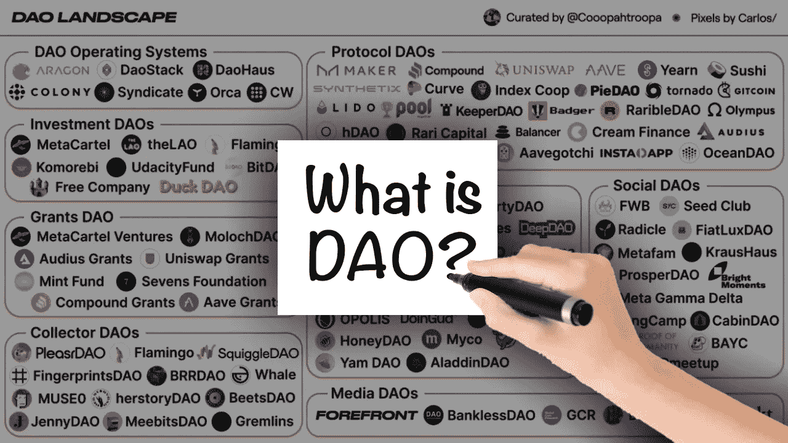
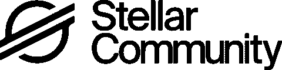
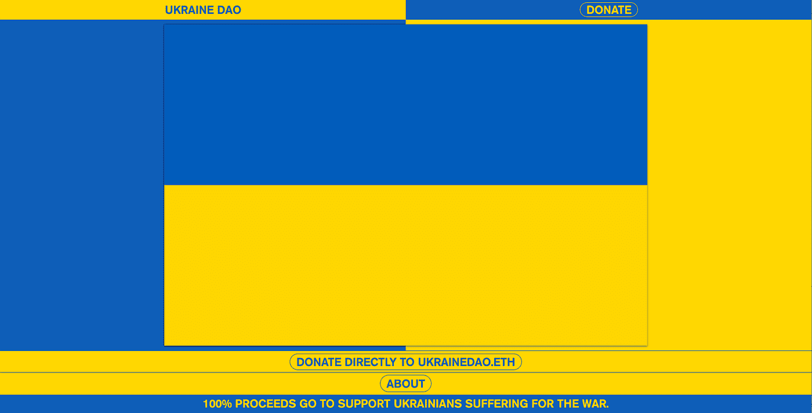
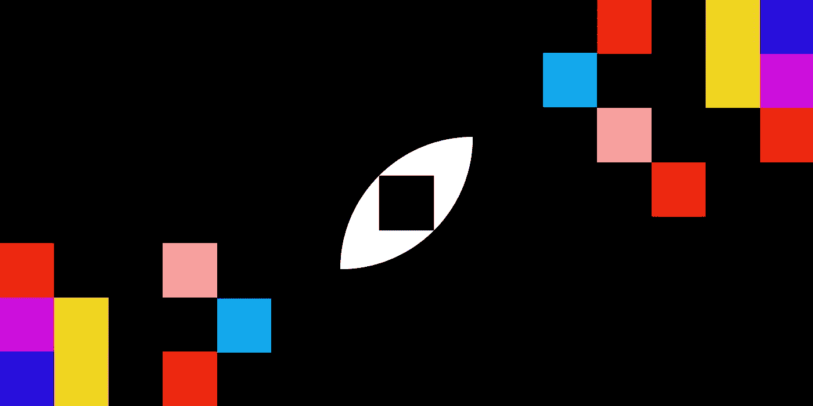
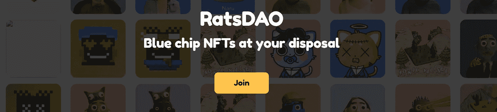
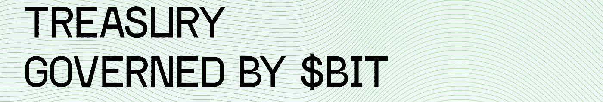
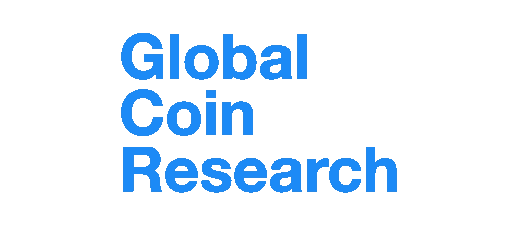
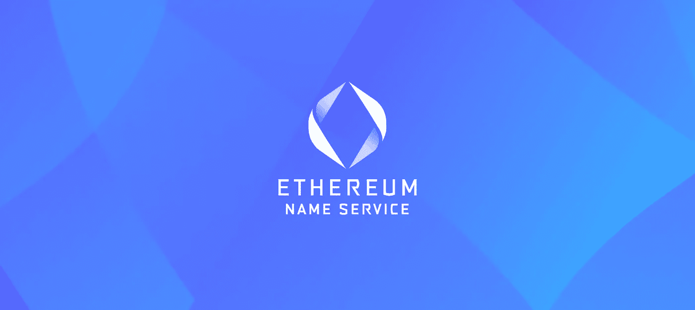

# 九种刀法；完整的 2022 指南！

> 原文：<https://medium.com/coinmonks/complete-2022-guide-to-dao-types-a3c85d6ef4f0?source=collection_archive---------6----------------------->

## 9 种不同类型的 Dao 解释。

# 介绍

随着加密空间慢慢成熟，运行区块链空间的分散自治组织(Dao)也逐渐成熟。目前估计有 2000 个 DAO，推出一个 DAO 比以往任何时候都受欢迎！

Dao 是以分散的方式发展社区和企业的完美方式。这种新的组织形式通过将计算机代码放在组织结构的中心，在计算机“石头”中设定组织的规则来工作。

一个 DAO 和一个专门的社区可以实现的目标是无限的。DAO 的成员朝着一个共同的目标努力，这个目标可以是管理现存最大的去中心化交易所；UniSwap 建立了一个社区金库，花了将近 4200 万美元购买美国宪法。可能性是无限的。

# 什么是刀？

要了解不同类型的道，首先必须了解什么是道。“道”是“分散自治组织”的缩写。Dao 完全托管在区块链上，使用 web3 技术进行管理。该组织管理着一个社区金库，他们用这个金库来激励帮助他们实现目标的任务和工作。这样，利用分散的区块链的力量，社区可以完成以前认为不可能的新事情！

可以将 DOA 与现实世界的机构相比较的最接近的机构可能是 LCC，但最大的区别是社区而不是董事会决定 DAO 的路线。DAO 的创始人通常仍然对这条路线有很大的影响，但是随着时间的推移，社区可以慢慢地承担这些角色。

# 道简史

第一个道被称为“分散自治组织”，简称“道”。它试图成为一个 Kickstarter，任何人都可以提出一个想法，并从 DAO 那里获得资金。这是一个巨大的成功，当以太坊的交易价格仅为 20 美元时，它的资金达到了近 2.5 亿美元。可悲的是，所使用的智能合同包含多个缺陷，其中一个被黑客利用，他在最终停止之前在以太网中提取了近 7000 万美元。

这一黑客攻击的影响如此之大，以至于该连锁店决定采取分叉方式，恢复黑客攻击，并将资金返还给所有投资者。不是每个人都同意这种分叉，因为一些人坚持认为区块链应该是不可变的，即使在如此大的黑客攻击之后。其结果是以太坊经典链的创建，它仍然携带着黑客的资金。虽然可以理解的是，刀本身在被黑客攻击后死亡了，但是这个想法仍然存在，并且成为了现在每一把刀存在的基础！

# Dao 的类型

为了更好地理解目前存在的 Dao，我们将它们分为 9 种不同的类型。

1 —协议 DAOs

2 —授予 DAOs

3 —慈善道

4 —社交 Dao

5 —收集器 DAOs

6-风险 Dao

7 —媒体 Dao

8 —软件 DAOs

9-子 DAOs

## 协议 DAOs

协议 DAO 是管理区块链协议的 DAO 构建，例如分散式交换、借贷平台或任何其他类型的 Dapp。您将在 DeFi 领域最常看到这些协议 Dao，因为几乎每个著名的平台都使用其本机令牌进行治理。任何持有这些令牌的人都可以创建并投票表决改进上述协议的提案。

协议 DAO 的一个例子是 [AAVE](https://www.daohq.co/daos/aave) 借贷协议。在高产农业热潮中，该平台的用户能够获得治理令牌来参与 DAO。持有 [Aavesome](https://medium.com/u/13bfa9f22920?source=post_page-----a3c85d6ef4f0--------------------------------) 令牌，你就有能力改进协议，为平台增值。

## 格兰特·道斯

Grant DAOs 是 Web3 空间的慈善组织。这些 Dao 创建了一个社区空间，供捐助者从事某些项目的慈善扩展工作，尽管其中一些项目以完全远程和分散的方式运行，但通常是更大组织的扩展。最常见的是，这些 Dao 是围绕一个非盈利的捐赠机构建立的

一个盛大的 DAO 的例子是[恒星社区基金](https://communityfund.stellar.org/)，恒星发展基金会[网络的社区成员可以投票表决将获得补助金以发展他们的想法的项目。项目可以参加这种淘汰赛，最终一组参与者可以选择获胜者。这些项目将获得高达 2400 万英镑的资助，以支持其未来的发展。](https://medium.com/u/99518a49d085?source=post_page-----a3c85d6ef4f0--------------------------------)

## 慈善道

慈善 Dao 承担了作为 Web3 的社会道德指南针的工作。他们是专注于一个共同目标的组织，这个目标就是让世界变得更美好。运行这些 Dao 的社区关注(全球)问题，如气候变化、战争救济基金、支持抗议、拯救野生动物、教育等等！

Philiantrophy DAO 的一个惊人的例子是最近的 [UkraineDAO](https://www.daohq.co/daos/ukrainedao) ，它筹集了 300 多万美元来支持乌克兰军队。乌克兰岛救助基金由投资集团 PleasrDAO、NFT 工作室 trippy labs 和俄罗斯艺术团体 Pussy Riot 组织。

## 社会道德

社交道是为了把志同道合的人聚集在一起而创建的道。这些社区由拥有相同兴趣的人组成，虽然他们最常见的是区块链特有的话题，如 NFT 艺术家、开发者或创作者，但任何人都可以发起关于任何话题的社交 DAO！

[光明时刻道](https://www.daohq.co/daos/bright-moments-gallery)就是这些所谓的社交道之一。明亮的时刻侧重于现实生活中的 NFT 铸造经验，特别是他们的社区 NFT。举办这次 NFT，你就可以进入社交平台，参加由 Bright Moments 团队组织的真实现场活动。

## 收藏家道

收藏家 Dao 是对同样的收藏品有共同兴趣的社区。这些 Dao 的主要目的是将资金整合到一个集体管理的国库中，并以分散和民主的方式购买和出售资产。这些收藏品可以从像 NFTs 这样的在线收藏品到像美国宪法这样的离线收藏品。

收藏刀的一个例子是卡达诺链上的[老鼠刀](https://www.daohq.co/daos/ratdao-art)。这个社区管理着一个 Cardano 蓝筹股 NFT 画廊，并可以投票出售或购买 NFT。财政部的资金来自其 NFT 的初始铸造，这使得持有者能够参与管理 [RatsDAO](https://medium.com/u/a9644e0e7c40?source=post_page-----a3c85d6ef4f0--------------------------------) 。

## 创业道

就像传统的风险资本家一样，风险 Dao 汇集资金投资于 web3、加密投资组合、区块链初创公司，有时甚至是线下投资，希望将投资转化为利润。一些战略的高盈利性，加上 DAOs 的高度包容性，使得风险 DAOs 非常受欢迎。在这些 Dao 中，代币反映了 Dao 投资组合的价值，也是对新的或现有投资进行投票的一种方式。

BitDAO 是最大的投资道，拥有大约 22 亿美元的资金。道利用这些资金资助道的生态系统，或者比特道喜欢称之为“自治实体”。从游戏到教育机构，总共有超过 6 亿美元投资于这些实体。它们的本机$BIT 令牌用于治理，其值代表了 BitDAO 的国库和投资。

## 媒体 Dao

媒体 Dao 试图重新设计媒体平台的构建和运行方式。不是由中央集权的政党来引导媒体及其利润，而是由制作内容的社区来控制。为平台做贡献的人得到平台产生的利润的一部分！

globalcoiresearch(GCR)是这些分散化和符号化的媒体平台之一。平台的内容创建者可以根据文章的受欢迎程度获得$GCR 代币，这些代币可以用于平台的治理。除了媒体挖掘，[全球硬币研究](https://medium.com/u/ad00598aecd4?source=post_page-----a3c85d6ef4f0--------------------------------)也被用于他们的投资基金和启动新项目。

## 软件 DAOs

一种较新的 DAO 类型是所谓的软件 DAO。这些 Dao 提供去中心化的软件即服务(DSaaS ),允许人们购买或使用他们的产品。软件 Dao 被驱动向他们的用户提供去中心化的软件，并促进该软件的创建和使用。

几个众所周知的例子是[以太坊名称服务(ENS)](https://www.daohq.co/daos/ens) ，它允许你创建一个人类可读的钱包地址。Aragon 是另一个很好的例子，他们提供创建 DAO 基础设施的服务。[辛迪加](https://www.daohq.co/daos/syndicate)也是 DSaaS 的一个很好的例子，因为他们提供软件来创建分散化的投资俱乐部。

## 子 DAOs

大而复杂的 DAO 通常不是由单个 DAO 实体管理的，而是可以由主 DAO 和子 DAO 组成。治理持有者可以访问主 DAO，而子 DAO 可以由更复杂或封闭的圈组成。这些机构可以包括由 Dao 的治理持有人选择的董事会，以解决纠纷、管理财政部或充当安全屏障。

ApeCoin DAO 就是拥有这些子 DAO 的一个很好的例子。APE 硬币的持有者投票选举董事会并提出改进建议。理事会的目的是管理"一体行动"建议，并为机构群体的愿景服务。这样就不会有恶意的提议被通过，社区和 DAO 的健康得到了保证。

# 贡献你选择的刀！

Dao 正在成为 DeFi 和 Web3 社区中越来越大的一部分。虽然他们仍然需要证明他们的长期相关性，但是他们对区块链和加密空间的贡献是非常受欢迎的。

Dao 的去中心化和开放的本质允许任何人在任何地方对它们做出贡献。要改进您最喜欢的道，您只需要持有他们的治理令牌，并且您准备好提交改进建议并对其他人的想法进行投票。

*注；这首曲子最初是为道 HQ 写的。*

# 链接>

*   *想阅读* *媒体上的每一篇文章，甚至是优质文章？使用我的链接在 medium 上注册，每月 5 美元！*[medium.com/@Igor.MD/membership](/plans?subscribeToUserId=211ebdfa9e24&susiEntry=entity_driven_subscription_lp&source=entity_driven_subscription-211ebdfa9e24------------------------------------)
*   为了让我的故事对每个人都免费，请给我买杯咖啡吧！[ko-fi.com/igormd](https://ko-fi.com/igormd)
*   如果你想开始交易，可以考虑用我推荐的库币！[www.kucoin.com/r/rf/1de5d](https://www.kucoin.com/r/rf/1de5d)
*   想成为页面上的特色吗？给我发邮件！

> 交易新手？尝试[加密交易机器人](/coinmonks/crypto-trading-bot-c2ffce8acb2a)或[复制交易](/coinmonks/top-10-crypto-copy-trading-platforms-for-beginners-d0c37c7d698c)