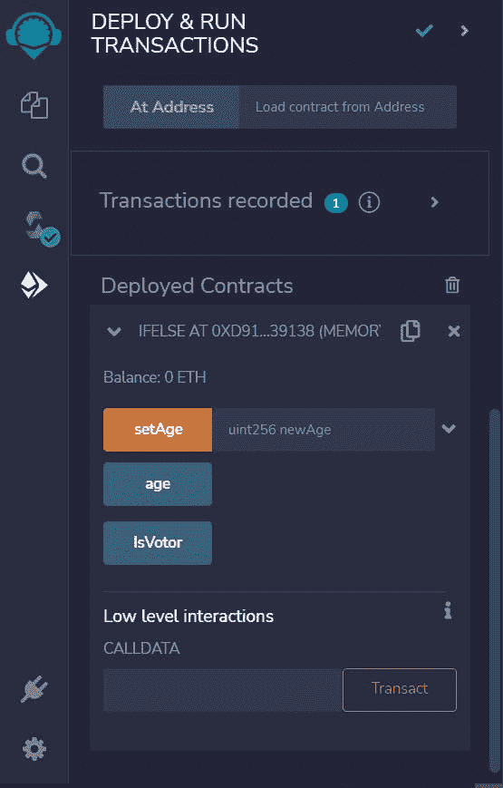

# 完整的 Solidity 代码部署流程

> 原文：<https://medium.com/coinmonks/complete-solidity-code-deployment-process-f88be7913990?source=collection_archive---------14----------------------->


# 扎实！

我猜你们很多人都知道，Solidity 是以太坊智能合约开发的编程语言。如果你是 solidity 的新手，不要担心，今天我们将有一个完整的 solidity 代码开发过程，以及我们将看到如何在 solidity 中部署智能合同！

*伟大的萨罗吉:)*

# 什么是稳固

Solidity 是一种高级静态类型编程语言。在此帮助下，我们可以为投票、众筹、盲目拍卖和多签名钱包等用途创建智能合同。多用于以太坊智能合约开发。Solidity 不同于任何其他编程语言，如 Java、Javascript、C++等。在本文中，我们将看到 solidity 智能合同是如何编写的以及部署过程。

*但是 Saroj，在哪里写这个 solidity smart contract 就像你说的，它的行为与其他编程语言不同？像其他 IDE 一样吗？*

很棒的问题！最好的部分是，编写 solidity 智能合同，我们不需要在我们的本地系统中的任何应用程序或软件。我们可以直接在浏览器里写。只需点击%[【remix.ethereum.org/ ]网址，就能成功！您将会看到如下所示的工作区。


在此窗口中，您可以看到一些智能合约的示例。要创建新文件，只需点击新文件图标。


现在，让我们写一个可靠性合同来检查特定年龄是否可以投票。

```
//SPDX-License-Identifier: GPL-3.0//we have to mention a version no the solidity
pragma solidity >= 0.5.0 < 0.9.0;
contract IfElse{
    uint public age; //function to set a new age
    function setAge(uint newAge) public{
        age = newAge;
    } //function to check whether the age is able to vote or not
    function IsVotor() public view returns(string memory){
        string memory voter;
        if(age >= 18){
            voter = "Can Vote";
        }else{
            voter = "Can't Vote";
        }
        return voter;
    }
}
```

写完代码后，它会检查编译过程。要了解更多关于编译过程的信息，请点击这里查看我以前的文章

在编译过程中，我们必须选择一个 solidity 编译器版本。此外，请确保该版本包含在您的合同代码中。


让我们有一个错误，并检查它是什么样子的。


正如你在上面看到的，我删除了第 12 行的分号。Solidity 编译器给出一个错误，说，嘿老弟，请加个分号。一旦我们解决了所有的错误，那么我们必须再次编译。我们也可以设置自动编译。


一旦编译成功，它会在左侧显示一个绿色的勾号。

**然后，只有我们可以进入部署流程**

**让我们部署智能合约吧！**

要部署智能合约，我们必须选择一个混合虚拟机。这是一个简单的测试智能合同，所以我们可以选择伦敦或柏林。


下一步是我们必须分配一个以太坊帐户地址来运行部署。


如你所见，我们在每个地址中有 100 个醚，这些不是真正的醚，它们只是用于测试，没有实际价值。一旦我们选择了一个地址，我们必须设置 Gas 限制，它用于在以太坊虚拟机上部署智能合约。完成所有设置后，我们可以单击“部署”按钮。我们的合同将会成功部署。您可以在下面看到已部署的合同。



现在是测试我们智能合约的时候了！

一旦成功部署，我们就可以测试智能合约。如果你点击按钮，它将显示默认值。


正如你在上面的图片中看到的，当我点击年龄时，它显示的是 *0* 。它显示*不能为该功能投票*。现在让我们在*设置*中输入一些值，然后再次测试。


现在我们在*年龄*中插入 18，如果我们点击*年龄*，现在它将显示 18。现在我们还可以看到*点击功能后可以投票*。

这是智能合约部署过程的一个小概述。我知道如果你是第一次接触 solidity，这有点令人困惑。但是相信我，一旦你进入其中，它会更有趣:)我希望你们都喜欢这篇文章，并享受阅读。不要忘记尝试一下。

*谢谢，Saroj，这是一个很棒的演示。等待你的下一个。*

一会儿见，有个很棒的话题。

> 交易新手？尝试[加密交易机器人](/coinmonks/crypto-trading-bot-c2ffce8acb2a)或[复制交易](/coinmonks/top-10-crypto-copy-trading-platforms-for-beginners-d0c37c7d698c)