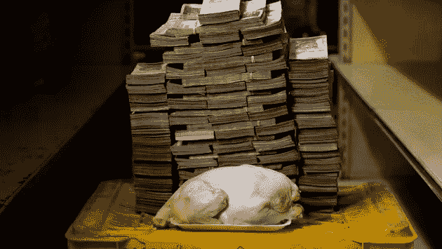

# 复利无用，因为恶性通货膨胀？

> 原文：<https://medium.com/coinmonks/compound-interest-useless-because-hyper-inflation-5d0a94d9cb74?source=collection_archive---------51----------------------->

C 复利就是复利。复利是一种基于本金加上之前赚取的总利息计算利息回报的系统。这意味着利息的数额是根据前一时期的利息总额计算出来的。

> 从顶级交易者那里复制交易机器人。免费试用。

复利对年轻投资者来说是一个优势，因为坚持这样做，你会得到一直增长的利息

Venezuela minimum Wages

**委内瑞拉**最低工资自 2018 年以来大幅提高。如果一个来自委内瑞拉的投资者从 2005 年开始以复利计算利息，他的投资目标是 15 年，每年持续储蓄 1800 玻利瓦尔

10 年产生的复利可能值 32，694 玻利瓦尔。与此同时，自 2018 年以来的恶性通货膨胀导致奶酪、肉类、意大利面、鸡肉等基本商品的价格涨幅超过最低工资

**1kg cheese for 7,500,000 bolívares**

**1 chicken worth 14,600,000 bolívares**

**1 kg of meat worth 9,500,000 bolívares**

恶性通货膨胀会破坏一个国家货币价值的稳定性。除了主食价格的疯狂上涨之外，恶性通货膨胀的影响还有:

1.超市和其他市场的食物抢劫

2.银行客户不能提款/银行挤兑

3.商业部门应该在高工资的基础上提高最低工资

> 这并不总是一种投资，忘记它，然后把利润当成一件好事。我们仍然需要关注全球和各国的经济发展

> 加入 Coinmonks [电报频道](https://t.me/coincodecap)和 [Youtube 频道](https://www.youtube.com/c/coinmonks/videos)了解加密交易和投资

# 另外，阅读

*   [OKEx vs KuCoin](https://coincodecap.com/okex-kucoin) | [摄氏替代品](https://coincodecap.com/celsius-alternatives) | [如何购买 VeChain](https://coincodecap.com/buy-vechain)
*   [币安期货交易](https://coincodecap.com/binance-futures-trading)|[3 commas vs Mudrex vs eToro](https://coincodecap.com/mudrex-3commas-etoro)
*   [如何购买 Monero](https://coincodecap.com/buy-monero) | [IDEX 评论](https://coincodecap.com/idex-review) | [BitKan 交易机器人](https://coincodecap.com/bitkan-trading-bot)
*   [CoinDCX 评论](/coinmonks/coindcx-review-8444db3621a2) | [加密保证金交易交易所](https://coincodecap.com/crypto-margin-trading-exchanges)
*   [红狗赌场评论](https://coincodecap.com/red-dog-casino-review) | [Swyftx 评论](https://coincodecap.com/swyftx-review) | [CoinGate 评论](https://coincodecap.com/coingate-review)