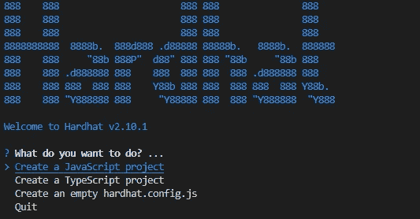
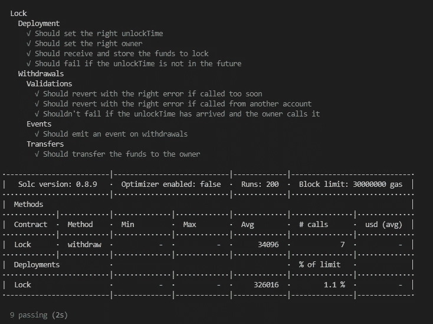
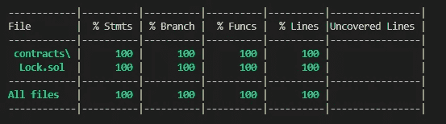
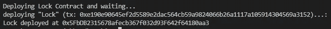

# 面向初学者的全面的 Hardhat Solidity 环境设置

> 原文：<https://medium.com/coinmonks/comprehensive-hardhat-solidity-environment-setup-for-beginners-2a284706beaa?source=collection_archive---------9----------------------->

*对于大多数刚开始学习 Web3 & Solidity 的开发人员来说，选择最好的开发环境可能会很困难，并可能成为学习进度的障碍。在本文中，我们将学习如何使用* [*【安全帽】*](https://hardhat.org/) *来设置您的开发环境。*


Hardhat image from [Hardhat Image](https://hardhat.org/card.jpg)

# 什么是安全帽？

[Hardhat](https://hardhat.org/) 是 dApps 的开发环境。它由不同的组件组成，用于编辑、编译、调试、测试和部署您的智能合约和 dApps，所有这些组件共同创建一个完整的开发环境。

就您最终使用的工具而言，Hardhat 并不流行，但它确实带有一些内置的默认设置。我们将使用内置的默认值和一些额外的插件。大多数情况下你需要的插件都包含在这个设置中。

## **系统要求**

因为 [Hardhat](https://hardhat.org/) 库和工具都是用 JavaScript 写的。你必须在你的系统中安装 [Node.js](https://nodejs.org/en/) 和 [npm](https://www.npmjs.com/) 。任何代码编辑器都应该工作，但我个人更喜欢 [Visual Studio 代码](https://code.visualstudio.com/)编辑器，因为它有 [Solidity + Hardhat](https://marketplace.visualstudio.com/items?itemName=NomicFoundation.hardhat-solidity) 扩展，提供 Solidity 语言支持和 Hardhat 集成。

# **建立安全帽项目**

创建新的空目录，然后进入。首先，我们使用 [npm](https://www.npmjs.com/) 初始化 fresh [Node.js](https://nodejs.org/en/) 项目:

```
npm init -y
```

然后你需要安装[安全帽](https://hardhat.org/):

```
npm install --save-dev hardhat
```

现在运行`npx hardhat`，然后你会看到一些选项:



options to facilitate project creation

选择*创建 Javascript 项目*选项，然后选择 *(y)* 添加`.gitignore`。然后，您将使用以下结构初始化项目:

```
contracts/ 
scripts/ 
test/ 
hardhat.config.js
```

这些是安全帽项目的默认路径。

*   `contracts/`是您的合同的源文件所在的位置。
*   `test/`是你的测试应该去的地方。
*   `scripts/`是简单自动化脚本的去处。

# **依赖项和插件安装**

现在我们将安装必要的依赖项和一些有用的插件。

[**安全帽工具箱**](https://hardhat.org/hardhat-runner/plugins/nomicfoundation-hardhat-toolbox)

这些依赖项中最重要的是 [Hardhat Toolbox](https://hardhat.org/hardhat-runner/plugins/nomicfoundation-hardhat-toolbox) ，这个插件捆绑了几乎所有你开始开发 dApps 所需的东西。运行以下命令:

```
npm install --save-dev "hardhat@^2.10.1" "@nomicfoundation/hardhat-toolbox@^1.0.2"
```

这个插件非常重要，因为它捆绑了所有常用的包，以前我们必须单独安装这些包才能开始使用 [Hardhat](https://hardhat.org/) 进行开发，比如:

*   `hardhat-ethers`使用 [ethers.js](https://docs.ethers.io/) 与合同交互的插件。
*   [柴](https://www.chaijs.com/)和[摩卡](https://mochajs.org/)测试你的智能合约。
*   `hardhat-etherscan`验证智能合约源代码的插件。
*   `hardhat-gas-reporter`智能合同使用的天然气指标插件。
*   用`solidity-coverage`测量测试覆盖率。

我们将在后面讨论这些插件的用法和功能。

**注意:**请安装版本高于`1.0.2`的`@hardhat-toolbox`以避免安装问题。

[**美观结实**](https://github.com/prettier-solidity/prettier-plugin-solidity)

虽然你可以说这个插件可能不是必要的，但是使用 prettier 尽早自动格式化你的代码是代码可读性的一个很好的实践，并且遵循最佳实践来编写你的 Solidity 代码。

运行以下命令安装`prettier`和`prettier-plugin-solidity`:

```
npm install --save-dev prettier prettier-plugin-solidity
```

**(可选)**您可以根据自己的偏好覆盖更漂亮的默认配置，在根项目目录中创建`.prettierrc`文件，并将配置放在那里:

```
{ "tabWidth": 4,  
  "useTabs": false,  
  "semi": false,  
  "singleQuote": false}
```

这些行只是基于我的偏好的例子，你可以在[更漂亮的文档](https://prettier.io/docs/en/configuration.html)中阅读更多关于你可以配置的内容。

[**安全帽部署**](https://github.com/wighawag/hardhat-deploy)

这个 [Hardhat](https://hardhat.org/) 插件增加了一个将合同部署到任何网络的机制，跟踪它们并复制相同的测试环境，以及许多改善开发人员部署智能合同体验的功能。

`hardhat-deploy`允许您在`deploy`文件夹中编写部署脚本。然后用`deploy`命令执行，而不是默认的`run`脚本。

要安装`hardhat-deploy`，运行以下命令:

```
npm install -D hardhat-deploy// then run this command to install hardhat-deploy-ethersnpm install --save-dev  [@nomiclabs/hardhat-ethers](http://twitter.com/nomiclabs/hardhat-ethers)@npm:hardhat-deploy-ethers ethers
```

Dotenv

`dotenv` 是一个零依赖模块，将环境变量从`.env`文件加载到`[process.env](https://nodejs.org/docs/latest/api/process.html#process_process_env)`中。因为在开发 dApps 时，我们将大量使用外部 API 和 wallet。最佳实践是将您的 wallet 私有密钥和 API 密钥存储在位于您的根项目目录中的`.env`上，然后以编程方式将其加载到您的代码中。

```
npm install dotenv --save --force
```

**注意:**请把你的`.env`放入你的`.gitignore`档，为了你的发展，永远使用单独的“不那么重要”的钱包。千万不要分享和暴露自己的钱包私钥！

这应该会完成依赖项和插件的安装。

# 安全帽配置

[安全帽](https://hardhat.org/)项目设置管理集中在`hardhat.config.js`中。前面初始化项目时生成的一个`.js`文件。当配置开发环境时，我们将主要在这个文件中工作。

**导入插件**

你可以简单地导入所有在`hardhat.config.js`顶部有`require`行的插件

**配置编译器**

如果您需要定制 Solidity 编译器选项，您可以通过`hardhat.config.js`中的`solidity`字段进行更改:

你可以简单地定义单个编译器，或者如果你需要多个编译器，你可以把它放在`compilers`数组中，如代码示例所示。

**网络配置**

[安全帽](https://hardhat.org/)内置一个叫做`hardhat`的特殊网络。使用此网络时，当您运行任务、部署或测试智能合约时，将会创建一个 Hardhat 网络实例。

虽然内置网络有助于快速部署和测试，但在实际场景中，您希望智能合约可在实际网络中访问， [Hardhat](https://hardhat.org/) 支持您连接基于 JSON-PRC 的网络，以满足该场景。

`hardhat.config.js`中的`networks`配置字段是放置网络配置的地方。

通过设置配置的`defaultNetwork`字段，您可以自定义运行 Hardhat 时默认使用的网络。如果省略这个配置，它的默认值是`"hardhat"`。但我更喜欢明确定义为`"hardhat"`。

然后，在`networks`字段中，您定义您想要使用的所有网络，在本例中为 Rinkeby。放置`url` JSON-RPC、`accounts`私钥和`chainId`。你可以在[文档](https://hardhat.org/hardhat-runner/docs/config#networks-configuration)中阅读更多关于网络配置的信息。

**气体报告器**

`hardhat-gas-reporter`提供关于单位测试气体使用量、方法调用和部署指标以及自定义国家货币成本的报告。这些信息对于您创建优化的智能合同至关重要且非常有用。

至少，您只需要将带有`enabled : true`的`gasReporter`字段放在`hardhat.config.js`中，但是您也可以自定义`gasReporter`来使用您自己的货币，或者将输出写在项目目录中。

如果您想使用自定义货币，如“USD ”,您需要创建 [CoinMarketCap](https://coinmarketcap.com/api/documentation/v1/) 帐户并获取 API 密钥，在`coinmarketcap`字段中提供密钥，然后就可以开始了。

[**以太扫描**](https://etherscan.io/) **验证**

`hardhat-etherscan`插件帮助您在 [Etherscan](https://etherscan.io/) 上验证您的 Solidity 合同的源代码。感谢[安全帽](https://hardhat.org/)和[安全帽工具箱](https://hardhat.org/hardhat-runner/plugins/nomicfoundation-hardhat-toolbox)，我们只需要在配置文件的`etherscan`字段中提供`apiKey`。

你只需创建 [Etherscan](https://etherscan.io/) 账户就可以获得 API 密匙。

**设置调配账户**

为了让`hardhat-deploy`工作，我们需要为部署者定义`namedAccounts`字段。它基本上说明了我们在钱包中使用哪个地址作为智能合同部署者，在本例中，我选择第一个帐户。

这应该会完成依赖项和插件的安装。

# 开发流程设置

Hardhat 的开发周期通常从开发 Solidity smart 契约开始，然后定义测试单元，创建部署脚本，最后运行管道。

虽然在 [Hardhat 文档](https://hardhat.org/hardhat-runner/docs/getting-started#overview)中已经明确定义了开发和定义测试单元，但是部署脚本过程是不同的，因此我们需要创建一些调整来设置我们的管道。

**验证脚本**

首先，我们在您需要在根项目目录中创建的新的`utils`文件夹中创建验证脚本，以便轻松地将其导入并放入我们的部署管道中。

**创建部署脚本**

在项目根目录下创建一个名为`deploy`的新目录，并在该目录下创建一个名为`01-deploy-sample.js`的新文件。

`01-deploy-sample.js`基本上是我们初始化项目时生成的`scripts/deploy.js`文件的`hardhat-deploy`版本。部署将按字母数字顺序运行，因此命名惯例至关重要，为此我们在`.js`文件的开头使用编号。

**注意:**由于最初我们没有在测试或实际网络上部署智能合约，我们应该注释`verify`行。

**运行测试**

使用生成的`Lock.sol`合同，并在`test`文件夹中生成测试单元。我们现在可以运行:

```
npx hardhat test
```

并且结果还应该包括**气体报告:**



Test result with Gas Report

**检查测试覆盖率**

检查测试覆盖范围以确保单元测试覆盖所有智能合约功能:

```
npx hardhat coverage
```



Coverage output

**运行部署**

现在您可以使用以下命令运行`deploy`脚本:

```
npx hardhat deploy
```

部署应该运行，输出如下(基于您的`deploy`脚本)



Deploy Output

# 后续步骤

恭喜你！现在，您可以专注于编写您的智能合同和测试单元，并使用 [Hardhat](https://hardhat.org/) 遵循开发、测试和部署的周期。从这里，你可以提高你对发展的可靠性的认识。[柴](https://www.chaijs.com/)和[摩卡](https://mochajs.org/)测试你的智能合约。

你可以在这个 [**github repo**](https://github.com/said017/hardhat-kit) 里查看完整的项目代码。

> 交易新手？尝试[加密交易机器人](/coinmonks/crypto-trading-bot-c2ffce8acb2a)或[复制交易](/coinmonks/top-10-crypto-copy-trading-platforms-for-beginners-d0c37c7d698c)