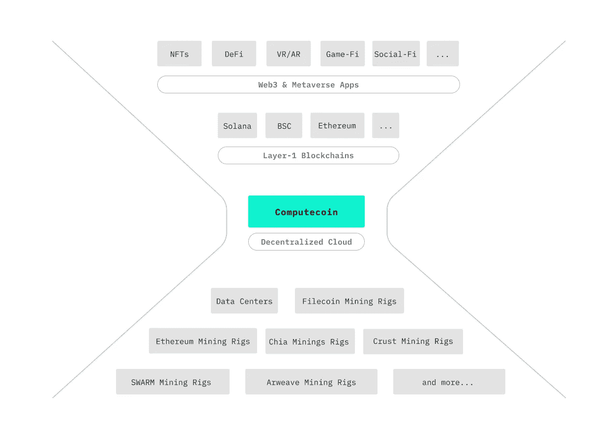

# Computecoin 在区块链结构上的新颖设计

> 原文：<https://medium.com/coinmonks/computecoins-novel-design-in-blockchain-structure-f3aaa7a05e64?source=collection_archive---------47----------------------->

## Computecoin 黄皮书细目分类第 1/3 部分

## 最初的疑问是，“为什么？”

为什么 Computecoin 要设计这个名为 MCP:元宇宙计算协议的第 1 层区块链解决方案？



The **Metaverse Computing Protocol** is a DAG-based layer-0.5 and layer-1 blockchain that features high concurrency, high throughput, and low transaction fees.

Computecoin 计划创建一个 AWS 的分散版本，提供各种各样的 web 2 服务，包括计算和存储，它有一个非常广阔的前景。以及众多的 web 3 解决方案，如 NFT 存储，但以分散的方式。

为了帮助开发人员创建具有低延迟、低成本和高可靠性等优势的 web 3 应用程序，Computecoin 正在构建 AWS 的 Web 3 版本。然而，要实现这一点，必须涉及许多不同的生态系统组件，例如矿工贡献机器和计算能力，官员和法官为 POH:Proof of honest Computecoin 的新颖共识算法验证计算结果的真实性，等等。

## EVM 兼容性和无缝开发人员采用

毫无疑问，有必要建立一个非常特别的区块链层。与以太坊或比特币相反，区块链计算机用于各种不同的目的，需要包含许多额外的功能来满足其目标。例如，除了具有非常优越的性能之外，它必须非常快并且具有非常短的确认时间。对于支持大量 Web 3 应用程序的第 1 层解决方案，必须消除开发人员社区的学习曲线。这将允许开发者社区在 Mainnet 首次亮相后更快地创建其应用程序。

这通过两种方式实现。首先，Computecoin 致力于建立一个与以太坊或 EVM 完全兼容的区块链。因此，之前掌握了 Solidity 等编程语言的开发人员可能会迅速转移。其次，Computecoin 计划在未来发布的计算和存储 API 将兼容 web 2。例如，AWS S3 存储将与 Computecoin 目前正在开发的存储接口兼容。这很简单，因为所有使用 Computecoin 的 web 2 开发人员只需要更改他们的地址——访问他们的区块链网络的地址、URL 的地址和访问 Computecoin 的存储的地址——开发人员不需要更改任何与他们的应用程序相关的内容。由于这些微小的网络变化，客户将能够像以前一样运行他们的应用程序，但主机和存储成本更低。

## POH:诚实证明共识算法

考虑到连接到计算中心网络的计算和存储系统的数量，迫切需要一种机制来验证这些资源和计算输出。出于这个原因，Computecoin 已经实现了一个 POH:Proof of honest consensus 算法，以确认网络和那些资源可以在不参与恶意活动的情况下做出贡献。


## 共识层和交易层的分离

有许多需求，因此 Computecoin 开发了极具创意的区块链来满足这些需求。除了这个新的区块链框架，Computecoin 还开发了一个独特的共识算法。因此，顶层被称为共识层，底层被称为事务层。然而，事务层和共识层是分离的，以允许共识独立运行。DAG 用于执行共识层，这将加快流程并降低交易成本。

## 计算内核挖掘器和验证器

由于 Computecoin 的事务和块结构的设计，区块链完全兼容 EVM，这使得它对开发人员非常友好。见证人将根据其标桩活动从 Computecoin 社区中选出。Computecoin 还将推出奖励计划和证人选拔计划。目前，Computecoin 的网络包含如此多的矿工，以至于有超过 20 万台采矿机器。见证人将根据他们的网络贡献和赌注$CCN 的数量从这些矿工中选出；你押的 CCN 越多，你被选中的可能性就越大。

然而，计算中心网络仍然不同于传统的利害关系证明网络。例如，BSC、Avalanche Harmony 或 Eth 2.0。这是由于 Computecoin 在 mainnet 上的诚实证明工作，这实际上意味着仅仅因为你有很多赌注并不总是使你有资格当选。因为你需要拥有强大的、可验证的计算资源，无论是 CPU、GPU 还是存储。Computecoin 必须确认定位是合理的。POH 算法会在您下注之前验证您贡献的资源。

# 关于电脑展(CCN)

Computecoin Network (CCN)旨在构建一个低成本、低延迟的分散式云基础设施，通过聚合数据中心和加密挖掘机器来支持通用的 Web2/Web3 和元宇宙应用。

⬇️用什么计算机

```
**A decentralized cloud infrastructure bridging Web2 and Web3 by escorting developers and end-users's transit seamlessly into the Web3 economy**

**🌟 For Developers**: in-house Web2 compatible APIs and tools for easy deployment of Web3 applications on decentralized infrastructure
**🌟 For Users:** an Expedia-like one-stop-shop user experience with zero learning curve to transition seamlessly into Web3
```

> *相关* [*白皮书*](https://computecoin-network.s3.ap-southeast-1.amazonaws.com/static/ComputeCoin_Whitepaper.pdf) *|* [*网站*](http://computecoin.com/) *|* [*推特*](https://twitter.com/computecoinnet) *|* [*电报*](https://t.me/computecoin) *|* [*不和*](https://discord.com/invite/Uv8khzfZqd)*|*[*insta gram*](https://www.instagram.com/computecoin/)

> 交易新手？尝试[加密交易机器人](/coinmonks/crypto-trading-bot-c2ffce8acb2a)或[复制交易](/coinmonks/top-10-crypto-copy-trading-platforms-for-beginners-d0c37c7d698c)