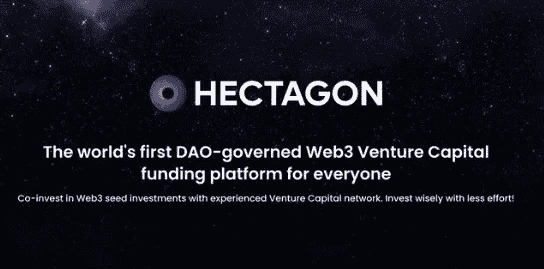

# 赫克塔贡金融的概念(简介)

> 原文：<https://medium.com/coinmonks/concept-of-hectagon-finance-introduction-dfc6cb18ce67?source=collection_archive---------31----------------------->

世界上最广阔的可能性宇宙是加密的，许多人从加密世界周围的不确定性中赚了很多钱，同样，许多人也损失了很多钱。这不应该把你从这个前所未有的充满可能性的世界中吓倒。

随着赫克塔贡的出现；全球第一个面向所有 Dao 的 Web3 风险投资筹资平台，不用担心会亏钱。

# 如何加入 Hectagon？

您可以通过购买 HECTA token 作为投资者加入 Hectagon，开始在具有高 APY 的 Web3 企业的种子和私人投资中扮演被动角色，而更积极的投资者可以用他们的专业知识和努力做出更多贡献，以建立这些投资并从中获利。

**有何特别之处** 有人可能会好奇问，为什么要试一试，Hectagon 项目有何特别之处？Hectagon 模型开始使用起来很简单，如果需要，退出时也很灵活。同时，Hectagon 是 fresh Web3 计划的可靠合作伙伴。

**解决的问题** 首先要提出的问题是大多数 Web3 项目目前正在经历的“牛熊”问题，这使得项目没有足够的资金继续运营，并导致定价失衡。

这也被称为智能合同投资，即“泵送和倾倒”

**解决方案** 但是这个问题在我们的投资策略剧本中没有涉及。我们投资项目是因为我们相信它们的长期可行性和远景。

这是创建智能合同投资背后的基本原理，它使我们能够坚持反倾销政策，并通过在财政部锁定其长期令牌来完全专注于我们对项目长期可行性和显著增长的完全信心。

**hect agon 社区网络的优势** 毫无疑问，如果对用户没有任何优势或好处，任何事情都不值得尝试。

有趣的是，通过与我们合作开展奖励活动，任何投资组合项目都可以利用我们庞大的用户群和影响者网络来鼓励人们加入您的社区，并为您的计划带来一定的价值。

**进入广泛的业务网络** 通过与交易所、DeFi 协议和托管提供商合作，包括 launchpads、交易所和上市、AMM、钱包和支付网络，我们将积极构建最大的有效业务网络。特别是，高质量的交易渠道和合作伙伴双赢的奖励机制将是我们的独特优势。

Hectagon 可以帮助企业节省时间，提高达成交易的可能性，而不是打陌生电话或经历典型的冗长申请程序。

在这个世界上最具竞争力和最有前途的领域之一，Hectagon 将向您介绍一种全新的投资理念，以及针对个人投资者和新的 Web3 企业的特殊解决方案..

够头晕吗？我们还为你准备了很多！请继续关注我们成为顶级加密协议的进程。相信程序就不会让你失望！

# 请通过我们的官方渠道了解 Hectagon 的最新消息:

**Linktree:**【https://linktr.ee/hectagonfinance】
**Twitter:**[https://mobile.twitter.com/hectagonfinance](https://mobile.twitter.com/hectagonfinance)

> 交易新手？尝试[加密交易机器人](/coinmonks/crypto-trading-bot-c2ffce8acb2a)或[复制交易](/coinmonks/top-10-crypto-copy-trading-platforms-for-beginners-d0c37c7d698c)