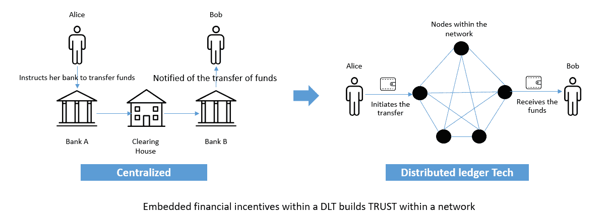
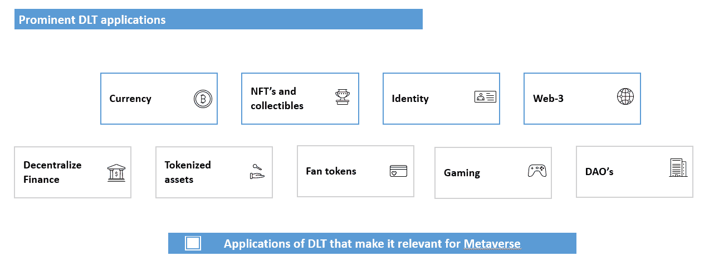
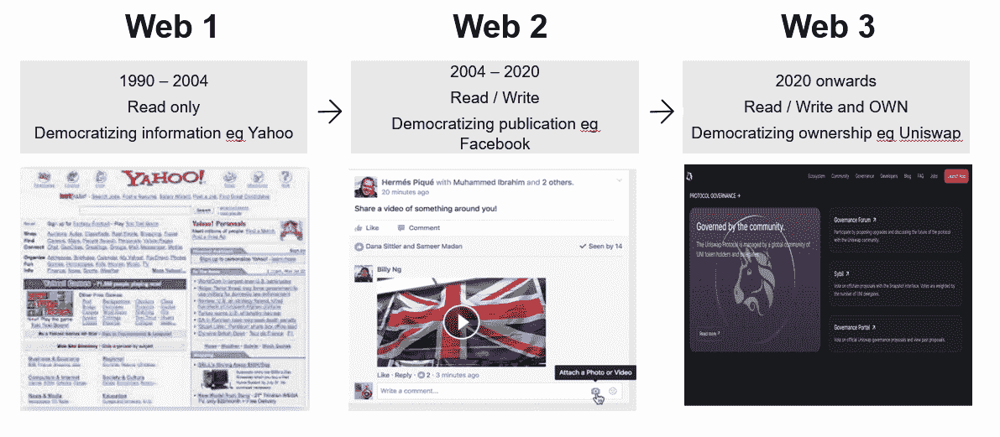
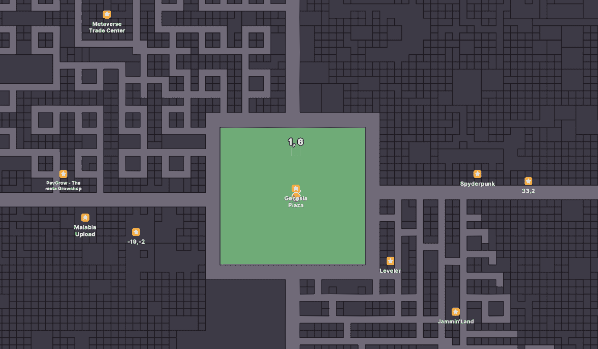

# 分布式账本技术(DLT)和元宇宙的融合

> 原文：<https://medium.com/coinmonks/confluence-of-distributed-ledger-tech-dlt-and-metaverse-7b27bf37cff7?source=collection_archive---------8----------------------->

元宇宙作为一个概念已经存在很多年了。我觉得现在人们对它有了新的兴趣，因为 DLT 解决了元宇宙一些长期存在的问题。在这篇博客中，我试图展示它们之间的协同作用。

首先是对 DLT 的基本介绍，然后是在元宇宙找到应用程序的 DLT 的功能，最后是元宇宙使用 DLT 的使用案例。解释基本的 Web-3 概念需要走一段弯路。比我平时的帖子长一点..但希望它能像元宇宙一样让人身临其境；)

**DLT 的承诺——设计画布**

在比特币出现之前，如果爱丽丝想把钱转给鲍勃，那么她必须依靠像银行和清算和结算机构这样的中央机构来完成。比特币现在使得爱丽丝可以在不使用中央机构的情况下向鲍勃转移价值。她通过创建交易并将其广播到节点网络来从她的钱包发起转账。这些节点网络将验证交易；这将验证 Alice 是否确实拥有她转移给 Bob 的比特币。任何个人/实体都可以成为节点，成为网络的参与者。网络中的财务激励将奖励根据网络规则行事的诚实节点，并将惩罚不诚实的节点。在这种情况下，比特币网络能够在网络内建立信任。

网络中的财务激励被用来在网络中建立信任。上面的例子说明了在网络中使用 DLT 来建立对价值转移(比特币)的信任。从某种意义上说，DLT 是一块设计画布，可以用来在其上构建不同的应用程序。这些应用可以是支付、令牌化、NFT、自动令牌、身份、Web-3 等。

**元宇宙与 DLT 的交汇**

顾名思义，元宇宙不需要 DLT。例如，最大的元宇宙，第二生命，不使用 DLT。然而，DLT 为元宇宙增添了不可忽视的价值。在下一节，我们来看看 DLT 给元宇宙带来的特色。

**1。付款**

在元宇宙使用 cryptos 进行支付与使用 cryptos 进行支付具有相同的好处。除了诸如安全、不腐败等常规特征之外..从元宇宙的角度来看，以下两点值得一提

到目前为止，可编程性是它贡献给元宇宙的最重要的特性。例如，它可以实现支付流。用户可以同意为在 NFT 画廊度过的每分钟支付 1 美分。加密货币非常低的交易费用(想想多边形这样的 L2 解决方案)使得这种模式成为可能。它可以实现身临其境的“元宇宙本地”支付方式。此外，可编程性让支付成为更广阔的元宇宙的一块乐高积木。

不可逆—加密支付不使用任何第三方中介，本质上是不可逆的。这使得它非常适合在不可信的环境中使用。例如，个人可以使用信用卡购买 NFT，然后通过给银行打电话来撤销交易。这是不可能通过加密支付实现的。

**2。NFT 的**

NFT 让数字所有权在元宇宙成为可能。一个普通人一天大约有 8 个小时的屏幕时间。在这个虚拟世界中，用户现在可以拥有无法复制和粘贴的数字资产。例如，用户现在可以在元宇宙购买土地，并确信它是真实的，不能被复制。

NFT 是使用预定义的开源合同创建的。该合同限制了合同产生的 NFT 的数量。从而为 NFT 的产生提供可审计性。在元宇宙，这使得发放独特的通行证非常理想。这些通行证可以给予持有者独特的特权。例如，从银行休息室发放的出入证将使持证人有更短的等待时间使用元宇宙休息室的服务。

**3。身份**

DLT 使得以安全的方式识别自己成为可能。零知识证明等新技术使安全共享身份信息成为可能，而不必担心被滥用。例如，假设一个场景，其中元宇宙的银行休息室想要在个人进入休息室之前检查他们的年龄。由于担心护照被滥用，个人会非常犹豫是否要在元宇宙分享护照的详细信息。但是有了零知识证明，不需要实际共享信息本身(出生日期)就可以验证年龄。自我主权身份等技术有助于个人以分散的方式管理自己的数字身份。

**4。Web-3**

到目前为止，DLT 对元宇宙最重要的应用是 Web-3 理念。为了理解 Web-3，我们必须理解 Web-3 的发展。

we b-1–1990 年至 2004 年——使信息民主化。

想到 Web-1 时代的互联网，最好的方法是用 90 年代的雅虎主页来形象化它。Web-1 是建立在开放协议之上的。它让创新者有信心在互联网上进行建设，而不用担心被淘汰。在互联网上获得的价值是由建设者积累的。像谷歌、亚马逊、脸书等平台都是在 Web-1 时代建立的。

we b-2–2004 年至 2020 年——使出版民主化。

Web-2 时代建立在集中式平台上。谷歌、脸书、Instagram、亚马逊是 Web-2 时代的最好例子。它给创作者/创新者带来了更广泛的受众，但他们的影响力依赖于算法，并通过广告实现了货币化。这些平台上积累的大部分价值都被平台拿走了。例如，视频在 Youtube 上每赚 1 美元，平台从中抽取 45 美分。此外，创建者总是有被中央实体去平台化的风险。例如，twitter 在 2011 年改变了支持 API 的政策。这一变化影响了那些商业模式基于这些 twitter API 的初创企业。最近，苹果改变了他们的隐私设置，这将影响 Meta 等平台上的广告商。从长远来看，这些集中决策会影响创新。

we b-3–2020 年以后——所有权民主化。

Web-3 在分散的平台上构建互联网服务。平台的所有权被令牌化，用户自己的平台令牌基于他们对平台的贡献。例如，Uniswap，一个去中心化的交换机，将其令牌供应总量的 15%分发给该协议的过去用户。此外，60%的代币将在平台成立后的四年内分配给平台的用户(其余分配给团队、投资者和顾问)。平台积累的价值归平台的实际用户所有。用户将从平台的发展中获益。此外，令牌的所有者在平台的治理中拥有投票权。这种模式从根本上改变了用户与平台的关系。这让他们感觉自己是一个更大的社会运动的一部分，并创造了一种用户基于他们的技能做出贡献的文化。

将这一点与元宇宙联系起来——元宇宙各地的建筑商将更愿意建设一个去中心化的世界，他们将在这个平台上拥有发言权，并能够从其增长中积累价值。它结合了两个世界的优点 Web 1 的开放协议和 Web 2 的范围。

**元宇宙的例子——分权**

到底是什么？

资料来源:地方分权

解释元宇宙的最好方式是用一个例子。分散的土地是一个虚拟世界，被分割成陆地块(大约 90，000 个)。每个地块都是一个 NFT，其所有权在以太坊 DLT 中确立。用户可以购买一块土地，并使用分散土地提供的工具对其进行定制，并在其上构建内容。例如，摩根大通在分散地购买了土地，并在里面建了一个休息室。其他人建立了游戏、音乐、NFT 画廊、虚拟音乐会、会议等场所。

用户可以在元宇宙创建他们自己的数字化身，并用可穿戴的数字衣服装饰它(顺便说一下，也可以是 NFT)。用户可以遍历分散的虚拟地图，并访问其中的位置。用户可以与元宇宙中的内容进行交互，例如玩游戏、听音乐，或者他们可以与元宇宙中的其他人进行交互。

元宇宙的货币和治理

法力是分散土地的货币。用户可以用法力令牌购买土地。土地和法力令牌的所有者一起形成道(分散的自治组织)。DAO 将决定与分散土地相关的所有事务——从内容审核到确定建筑物的允许长度，再到令牌分配等。

**结论**

按照 DLT 的原则建造的元宇宙将给企业家一个创新的平台，而不用担心被淘汰。DLT 也将全面改善使用元宇宙的体验。从长远来看，这将有助于建立一个可互操作的元宇宙。然而，这项工作仍在进行中..道对元宇宙的统治还没有经过战争的考验，他们的决策能力还没有得到证明。尽管如此，它肯定有成功的正确因素..:)

**参考文献**

Chris Dixon，为什么 Web3 如此重要[通过 https://cdixon.org/,[在线](https://cdixon.org/,)于 2022 年 7 月 31 日访问]

克里斯·迪克森，瑞安·肖恩·亚当斯，大卫·霍夫曼，网络 3 的 5 个心智模型[通过[https://shows.banklesshq.com/,](https://shows.banklesshq.com/,)在线访问于 2022 年 7 月 31 日]

Andrew Singer，元宇宙需要区块链来确保广泛采用吗？[通过 https://cointelegraph.com/,[在线](https://cointelegraph.com/,)于 2022 年 7 月 31 日访问]

《分散土地评论》:最佳 NFT 加密游戏？？，[通过[www.youtube.com 在线，](http://www.youtube.com,)2022 年 7 月 31 日访问]

分散之地(法力) :一个建立在以太坊上的虚拟世界[在线经由[https://www.gemini.com/,](https://www.gemini.com/,)于 2022 年 7 月 31 日进入]

> 交易新手？尝试[加密交易机器人](/coinmonks/crypto-trading-bot-c2ffce8acb2a)或[复制交易](/coinmonks/top-10-crypto-copy-trading-platforms-for-beginners-d0c37c7d698c)