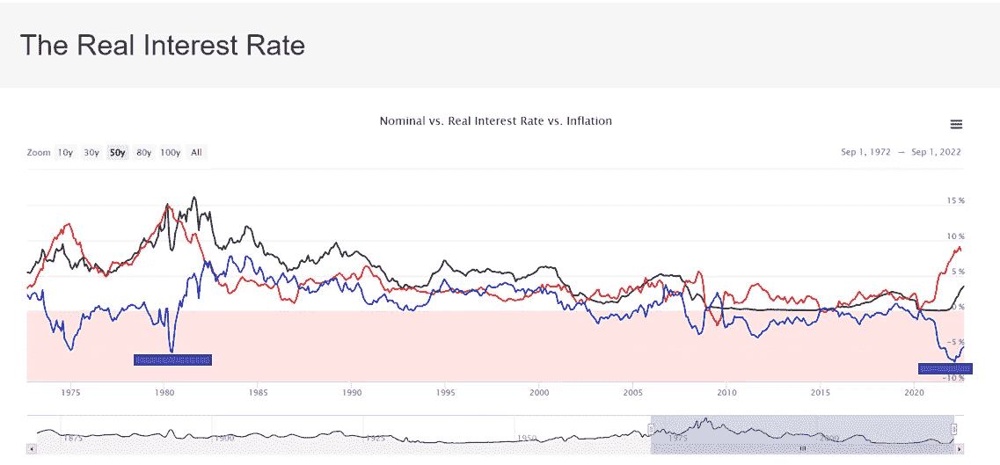
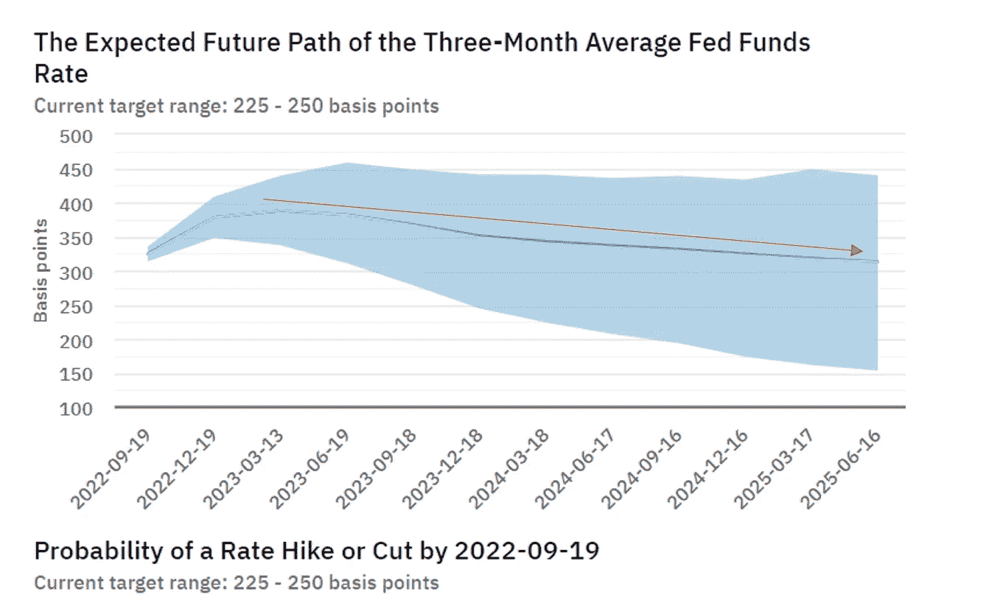
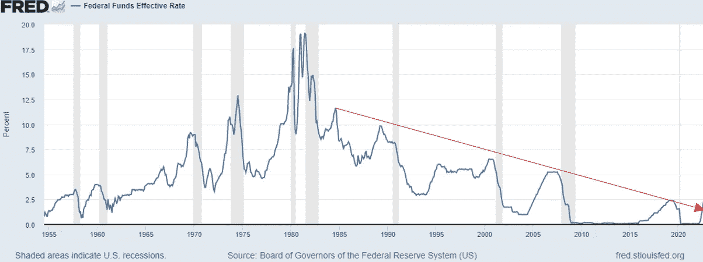
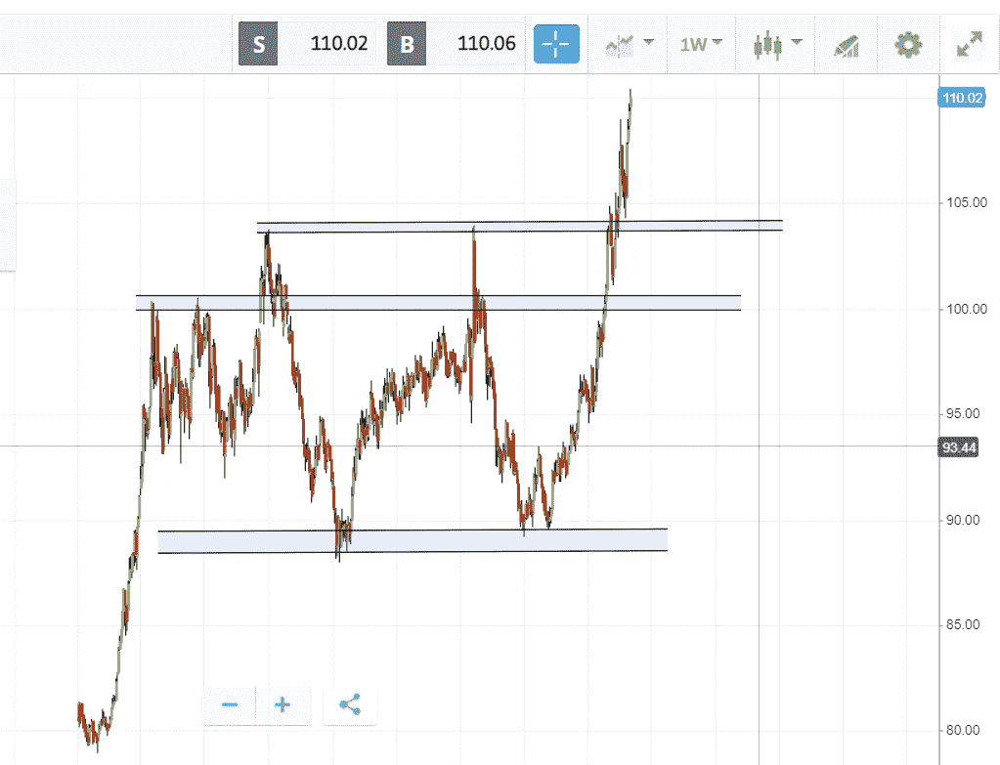

# 混乱的信号、宏观不确定性和加密的方向。

> 原文：<https://medium.com/coinmonks/confusing-signals-macro-uncertainty-and-direction-of-crypto-9f20af945704?source=collection_archive---------25----------------------->

不幸的是，由于加密市场仍然跟随股票市场，相关性仍然很高，在杰罗姆·鲍威尔·杰克逊·霍尔(Jerome Powell Jackson hole)发表极端鹰派的讲话后，风险资产受到了严重打击，抗击通货膨胀仍然是美联储的首要任务，旋转(降息)不是一个选项。

尽管实际利率仍远低于这一水平，但最重要的问题如下。1-加息幅度会有多高？2-利率将在这些高水平上停留多久？我们是在谈论几个月，还是几年？第三，在不利的货币条件下，通货膨胀下降并稳定在什么水平？

就实际利率而言，回报率在-5%左右，这是自 20 世纪 80 年代以来从未出现过的负水平，与美国通胀水平达到两位数的时期相吻合。对于那些不知道的人来说，[实际利率](https://www.investopedia.com/terms/r/realinterestrate.asp)是经过通胀调整的利率，反映了借款人的实际资金成本和贷款人的实际收益率。

Nominal vs Real interest rate vs Inflation line chart

**让我们检查一些数据，看看会有什么影响。**

**1** - **对抗通货膨胀，直到我们打破一些东西。**

尽管最近市场下跌，包括由于高层承诺打击通胀而导致的 crypto 市场仍然不完全相信杰罗姆·鲍威尔的话，并且根据[亚特兰大联邦储备银行](https://www.atlantafed.org/cenfis/market-probability-tracker)的消息，市场预测利率将在 2023 年初(2023 年 3 月)达到峰值，从那时起，美联储不仅会暂停加息，相反，他们将开始降息。考虑到当前的通胀水平和 2%的目标，考虑到中国城市明确关注供应链的持续封锁可能进一步加剧美国和欧洲的压力，以及俄罗斯-乌克兰的地缘政治风险，这是一个勇敢的观点。

我认为，2%的通胀目标将很快成为美联储的一个童话般的梦想，目标通胀率将稳定在更高的水平。可能是 3%，4%，甚至 5%。因此，与下降后的新通胀水平相关，**中性**利率将高出 50 个基点(0.50 %)，因此最低利率将保持在 3.5%、4.5%或 5.5%。这就是事情变得棘手的地方，公司估值可能会大幅下降。

下方的[图显示了三个月平均联邦基金的预期路径。如红色箭头所示，利率从明年开始下降。如图所示，预期利率峰值将在 2023 年 3 月略低于 400 个基点，并将在 2023 年继续下降。到 2023 年 12 月，市场预测两次降息 25 个基点，使利率回到 350 个基点，并在 2024 年和 2025 年进一步下降。如果估计是准确的，我们可以假设，资产、科技股和加密的风险总体上还将有 3-6 个月的下行压力和动荡，这可能在 2023 年初美联储做出关键举措(停止加息)时结束。](https://www.atlantafed.org/cenfis/market-probability-tracker)

Interest rates will hit a peak in March 2023 and slowly starts coming down as the red arrow illustrates

**2** - **联邦基金利率打破 42 年来的跌势。**

一个非常重要的图表值得注意，它是 70 年来的联邦基金利率。自 20 世纪 80 年代以来，利率一直向下倾斜至零，这意味着货币政策有利于股票和其他风险较高的资产类别。扩张性金融条件的结果是鼓励借贷，当 20 世纪 80 年代、90 年代、2000 年和 2008 年大金融危机以及 2020 年 3 月的最近一次金融危机给经济带来麻烦时，美联储每次都来拯救市场并将利率设定得越来越低。你可以在下图中注意到，自 20 世纪 80 年代以来的每次衰退之后(图中灰色区域显示的是**衰退)，联邦基金利率从未回到之前的高点。随着经济开始复苏，利率出现小幅飙升，低于之前的高点，一旦市场再次出现小麻烦，利率就被大幅下调至更低水平。**

我们可以假设，在过去的 40 年里，市场总体上是人为维持的，并且不允许以更加中性/自然的方式发展。

向下倾斜的趋势线即将结束，利率开始爆发，这可能意味着我们将迎来一个持续更长时间的高利率时期，可能是几年或几十年。我们可以帮助一个类似于 1955 年至 1980 年的时期，当时利率明显处于上升趋势，而今天的私人和公共债务要高得多，因此利率增长的节奏将明显放缓，但由于通货膨胀的结构性变化，供应不足，需求高度缺乏弹性。(我指的是某些大宗商品，尤其是能源——天然气和石油)

最终结果将是风险资产的不利条件，成长型股票的估值下降，以及整体货币环境收紧，资产配置更加谨慎。现有公司和硬资产公司的表现可能优于许多受青睐的科技股，这总体上意味着一种新的经济范式正在向前发展。

将美元走强与上述观察结果相加，你会得到加密成长型股票的最糟糕环境。自 2021 年 6 月以来，美元指数一直呈抛物线状，几乎是垂直走势。对于加密货币来说，呼吸美元的气息应该会明显回来。美元的进一步走强可能意味着比特币的疲软，因此总体而言，加密市场可能会受到影响。一旦我们的监管变得清晰，唯一的出路以及与风险更高的资产类别(成长型股票)的脱钩可能就会到来。当大投资者最终有了一个稳定的资本、证券与商品、KYC 的框架，以及政府对数字资产的立场，他们就可以决定是进是出。考虑到这是第一次有机构投资者参与的熊市，并且 crypto 第一次受到流动性撤出和收紧货币条件的挑战，如果没有清晰的监管和明确的框架，crypto 的表现不太可能与普通科技股有任何不同。

US dollar index vertical move since June 2021

总而言之，我的结论是，所有市场都面临着挑战性的条件，不确定性仍然存在，潜在的新经济范式即将到来，这有利于不太受欢迎的现有公司和实物硬资产。

我们不知道美联储明年到底会做什么，我们不知道通货膨胀多快会降到可接受的水平，以及会稳定在什么水平。我们必须密切关注美联储的行动，并在考虑货币政策的情况下做出投资决定。

很明显，风险回报偏爱加密，那些有长远眼光的人在当前价格下有好的设置。如果我被问及底部是否在？我会说没有，还没有。但没人能准确预测我们能跌到多低。基于比特币突破的标志底部的历史关键水平，在当前价格下，毫无疑问值得一试，投资你准备遗忘几年并在以后收获回报的现金。

我强烈推荐阅读[银河研究比特币](https://www.galaxy.com/research/insights/bitcoin-outlook-key-levels-breached/)展望，以深入了解达到的关键水平。不会超过 10-15 分钟。

祝大家有愉快的一天，感谢您的阅读！

免责声明:我必须警告你，有些观点可能是我个人的偏见，但是，我会尽我所能为你提供关于特定主题的客观观点。我不是理财顾问，所有文章只会有严格的教育目的。

> 交易新手？试试[密码交易机器人](/coinmonks/crypto-trading-bot-c2ffce8acb2a)或者[复制交易](/coinmonks/top-10-crypto-copy-trading-platforms-for-beginners-d0c37c7d698c)