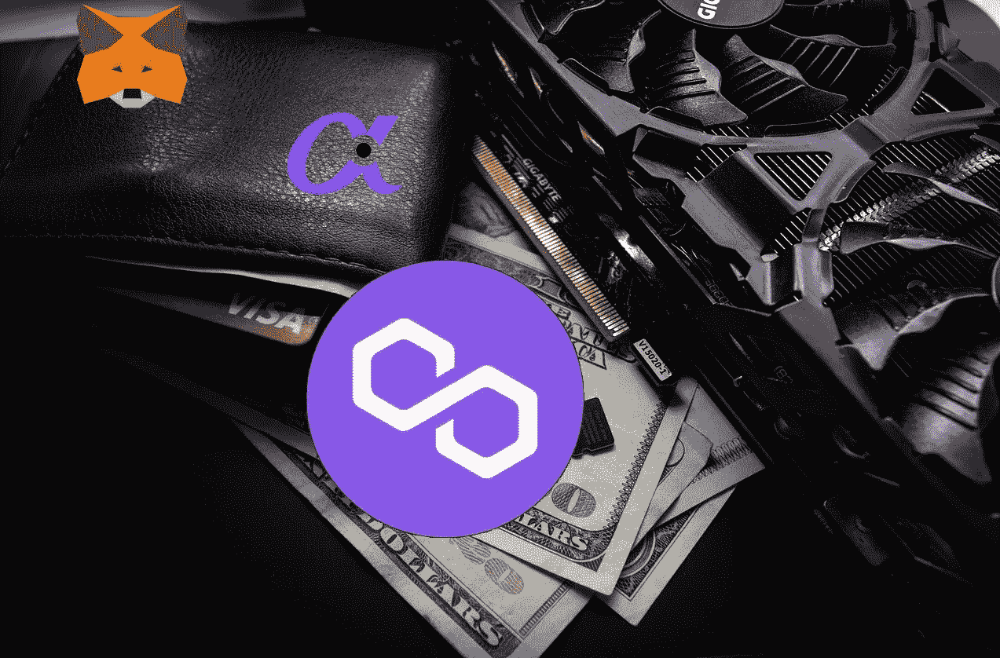

# 将以太坊钱包连接到 Polygon Mumbai 测试网络(Metamask，AlphaWallet)

> 原文：<https://medium.com/coinmonks/connecting-ethereum-wallet-to-polygon-mumbai-test-network-metamask-alphawallet-733787e5f997?source=collection_archive---------20----------------------->

以太坊钱包是让你与你的以太坊账户互动的应用程序。这是一个工具，使您能够检查您的余额和调用交易。但另一方面，钱包不像传统钱包那样保存资金。其实现在，钱包只是一个管理账户的工具。这就是为什么您可以连接多个钱包…