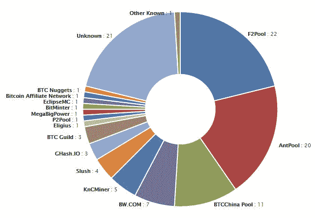

# 工作证明网络的共识和问题

> 原文：<https://medium.com/coinmonks/consensus-and-problems-with-proof-of-work-networks-d57dc821cccd?source=collection_archive---------32----------------------->

**拜占庭将军**

我写了很多关于加入区块链的区块。但是，我没有真正提到这是如何发生的。它始于网络同意哪些交易是有效的。这是通过共识来实现的。共识是一组算法的名称，我们可以用它来创建网络投票过程。这个投票过程有助于对区块链的信息做出决策。

现在，我们将从被称为拜占庭将军问题的共识的核心问题开始，仔细研究共识。让我们花点时间，回顾一下 100 年代早期战争中拜占庭帝国的统治时期。在这一点上和我站在一起。最终，与区块链的关系会变得非常清楚。

九个将军，每个指挥拜占庭军队的一部分，包围一个城市，他们必须形成一个攻击它的计划。将军们只能决定，进攻还是撤退。问题是，要么九个人都同意进攻，要么九个人都同意撤退。如果只有一部分人进攻，而其他人退缩，那么他们将会不知所措而失败。此外，还有一些其他的并发症。

在九名将军中，可能有一些是叛徒。他们可能会试图扰乱该团体的投票。举个例子，如果九个中有四个支持进攻，另一个支持撤退，最后的将军可能会居心不良，毁了一切。要做到这一点，他们可以向那些赞成撤退的人发出撤退的投票，并向那些想进攻的人发出进攻的投票。将军们实际上是分开的，他们必须通过信使来发送他们的选票。这些信使可能会在途中被抓住，不传递选票，或者制造假选票。我们刚刚看到的在计算机科学中被称为拜占庭将军的问题。

这个问题类似于区块链网络。用我们取代将军，而不是战争，想想我们的区块链网络。同样的想法适用于这两种情况。在分布式系统中，当用户无法有效通信时，您需要一种方法来确保用户之间的信任。该解决方案有助于我们了解如何在无法有效沟通、无法相互信任的用户之间达成共识。意识到建立信任的问题真的很酷，分布式网络已经存在了几个世纪。比特币最初提出了一种使用工作证明算法来解决这个问题的方法。这是一种在没有中央权威的情况下达成共识的方式，也是比特币解决重复支出问题的原因。接下来我们将看到这个工作证明算法的细节。

**工作证明的问题**

共识算法对于确保区块链仍然是真相的可信版本至关重要。它还防止任何潜在的对手破坏系统。虽然这种达成共识的方法迄今为止是成功的，但它存在一些问题。工作证明有两个经常讨论的问题。高能耗和小垄断问题。

第一，证明工作导致极高的能量消耗。工作验证计算需要大量的计算能力，所有这些计算都需要财务和环境成本。为了开采比特币，矿工们建立了采矿设备，这是一种处理新区块的高性能计算机。钻机可以是专门为采矿设计和建造的专用计算机，也可以是为游戏系统等其他东西建造的计算机，但它具有足够的内存和处理能力来执行采矿所需的计算。人们可以在家里安装采矿钻机，但也有大型企业经营的采矿农场，里面有数百甚至数千个专用于开采比特币的钻机。

2017 年，世界上最大的比特币矿场之一，位于内蒙古，有 25000 台机器 24 小时工作，开采比特币。世界各地的所有这些采矿钻机都需要大量的处理能力。有报道称，比特币挖矿的耗电量超过全球 159 个国家，包括爱尔兰和非洲大多数国家。2017 年底，比特币挖矿全球消费消耗的能源相当于两百万美国家庭的总和。而且，用比特币挖矿机给你家供暖真的是有可能的。

第二个问题是次要的垄断问题。由于比特币挖矿需要大量的计算能力和能源，那些有资源访问更多设备的人拥有不公平的优势。在快速搜索中，您可以看到世界上最大的采矿池的分布。

distribution of the largest mining pools around the world…src: [https://cryptomining-blog.com/](https://cryptomining-blog.com/)

如你所见，有点失真。我们之前提到的采矿农场确实加剧了这个问题，它们导致了比特币矿工的垄断，这些矿工控制了网络的大部分。随着这些节点将更多的资源用于网络，它们在哪些块被认为是有效的方面有更多的发言权。这导致网络倾向于集中化，而不是像最初设想的那样保持分布式。

这就解决了工作证明算法的问题。考虑到这些验证工作的挑战，已经开发了其他共识算法来尝试修复其中的一些问题。

**工作证明演示**

猜测和人工随机检查正是矿用计算机在做的事情。这种重复的假设可能极其繁琐，但这是解决这个问题的唯一方法。我们需要的前导零越多，找到答案的时间就越长。这是因为想要更多零的散列是一个更具体的请求。这使得你不太可能找到解决方案，并导致更多的猜测。所要求的前导零的数量就是我们所说的块的难度。通过更新算法来要求更多或更少的零，可以改变这种阻塞难度。你可以改变难度，只要你想让计算机能够解决更慢或更快的算法。

在比特币中，他们会自动调整难度，以帮助确保每 10 分钟创建一个新块。如果块创建得太快，会增加减慢进程的难度。但是，如果让他们放慢速度，他们就会减少难度，使进程加快。你可能会问自己，为什么 10 分钟很重要？每 10 分钟锁一次是开发人员的决定。这 10 分钟的时间被认为是在拥有安全网络和能够实际跟上新数据块创建的网络之间的良好平衡。

例如，如果每小时创建一个块，等待验证的事务数量将急剧增加，网络将非常缓慢。但另一方面，如果每秒钟都可以锁定，那么黑客就有机会在网络捕捉到攻击之前更改数据并解除锁定。这只是一个为什么 10 被认为是重要的快速总结，这个决定可能会因不同的网络而改变，这取决于开发人员认为什么是重要的。这就结束了这个快速的工作证明演示。我希望你现在对它的工作原理有了更好的理解。接下来，我将尝试搜索这个系统的一些问题，然后看看我们是否可以讨论一些其他可以提供解决方案的算法。

> 交易新手？试试[加密交易机器人](/coinmonks/crypto-trading-bot-c2ffce8acb2a)或者[复制交易](/coinmonks/top-10-crypto-copy-trading-platforms-for-beginners-d0c37c7d698c)