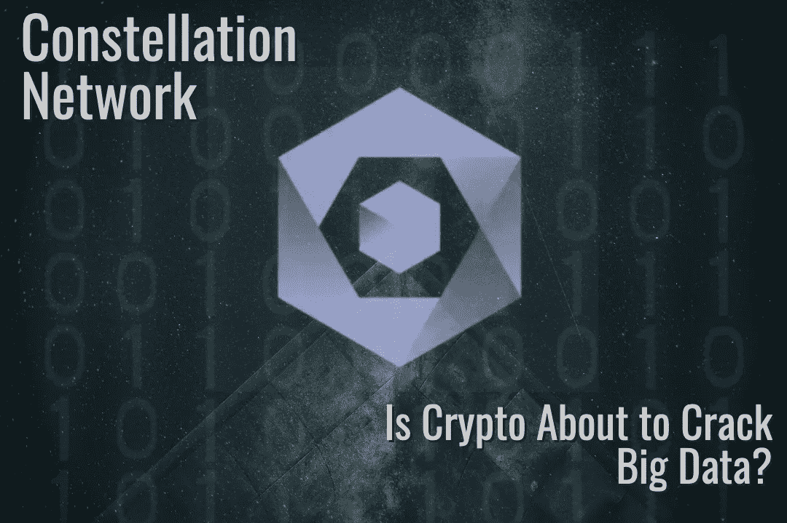

# 星座网:以太坊黑仔还是大数据惊悚片？

> 原文：<https://medium.com/coinmonks/constellation-network-ethereum-killer-or-big-data-thriller-9900c30b767e?source=collection_archive---------2----------------------->

为什么星座网络超越了典型的加密 VC 的叙事，并可能是革命的一部分，加密一直在等待。

Image: PixTeller

# 什么是星座网？

根据 CoinMarketCap 的数据，有超过 20，000 个加密项目。考虑到这一点，如果几百个有趣的人错过了也不奇怪…