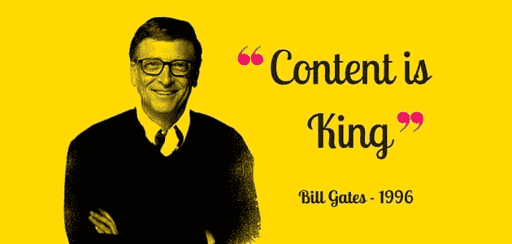
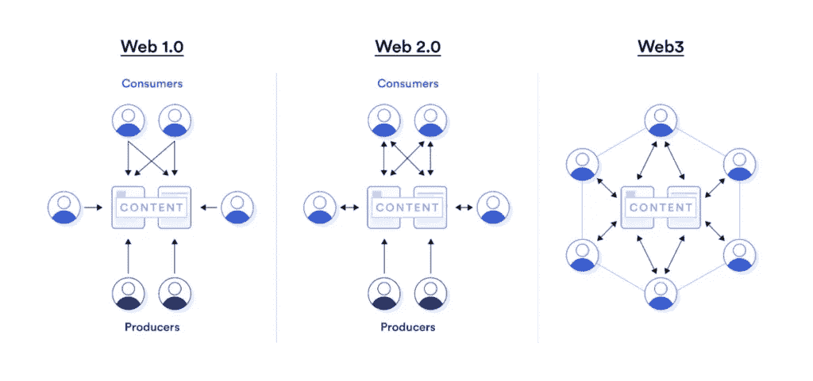
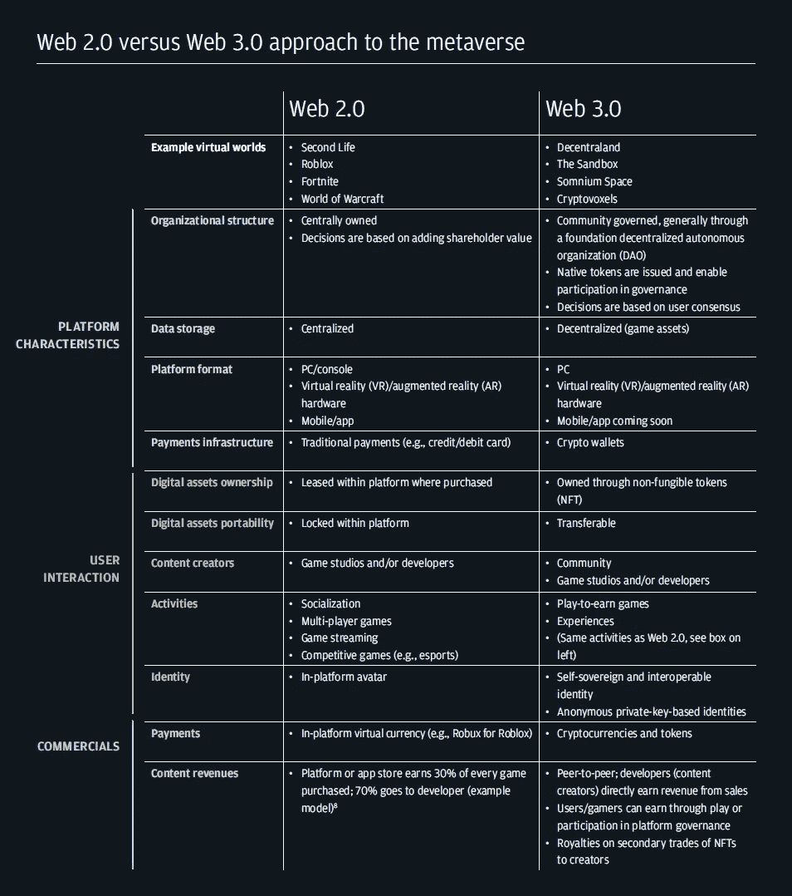

# 内容为王

> 原文：<https://medium.com/coinmonks/content-is-king-beb4486e8876?source=collection_archive---------20----------------------->

[Image source](https://www.prmarketingbollox.com/blog/content-is-king-social-media-strategy-is-its-chauffeur)

比尔·盖茨在 1996 年 1 月写下了后来成为早期互联网经典著作之一的东西。

他讨论了互联网的特质，这些特质将成为 it 领域创造者经济的基础。“互联网令人兴奋的一点是，任何人只要有一台电脑和一个调制解调器，就可以发布他们创作的任何内容，”他写道。

虽然盖茨的文章因其对互联网未来的远见而受到认可，但不太为人所知的是，他还发出了一个警告:“为了互联网的生存，内容创作者必须为他们的努力获得回报，”他写道。“长期前景很有希望，但我预计短期内会令人大失所望。”

盖茨的洞察力很有远见。诚然，互联网让几乎任何人都可以在网上创作素材，但同样真实的是，在“内容为王”四分之一世纪后，作为内容提供商谋生被证明是困难的。

创作者的生活经历讲述了这个故事:

> Spotify 90%的流媒体收入流向了收入最高的 1.4%的音乐人。所有 Twitch 彩带的前 1%赚了所有钱的一半以上。播客广告收入的大部分被 1%的播客占有。

互联网意味着带来一个媒体的黄金时代——一个无限丰富的世界，在这个世界里，任何人都可以制作他们想要的任何东西，每个人都可以找到他们想要的任何东西。虽然事实证明，盖茨关于通过内容在线赚钱的预测是正确的，但这些钱中的大部分都绕过了创建内容的制作者，而是进入了聚合内容的平台的口袋。

这是对互联网如何颠覆媒体商业模式的叙述，以及网络 3 的到来如何表明经济模式的转变有利于创造者。如果没有整合到 web2 互联网中的原生货币化技术，流行的商业模式是不透明的，基于广告的，并且依赖于封闭的花园网络，这给了平台不公平的优势。

**进入 Web 3.0**——即将出现的新商业结构和技术有可能释放经济机遇和控制，为艺术家和创作者带来真正的创意黄金时代。

**Web1 vs Web2 vs Web3**

[**Web 2.0 versus Web 3.0 approach to the metaverse by JP Morgan Onyx**](https://www.jpmorgan.com/content/dam/jpm/treasury-services/documents/opportunities-in-the-metaverse.pdf)

比尔·盖茨 1996 年的文章“内容为王”

我认为内容是互联网上真正赚钱的地方，就像广播业一样。半个世纪前开始的电视革命催生了许多行业，包括电视机制造业，但长期的赢家是那些使用这种媒体传递信息和娱乐的人。当涉及到诸如互联网的交互式网络时,“内容”的定义变得非常广泛。例如，计算机软件是内容的一种形式——一种极其重要的形式，而且对微软来说仍将是最重要的形式。但对大多数公司来说，广阔的机会包括提供信息或娱乐。没有哪家公司太小而不能参与。

> ***互联网令人兴奋的一点是，任何人只要有一台个人电脑和一个调制解调器，就可以发布他们创作的任何内容。***

从某种意义上说，互联网是复印机的多媒体等价物。它允许以低成本复制素材，不管观众的规模有多大。互联网还允许信息以对出版商来说基本为零的边际成本在世界范围内传播。机会是显著的，许多公司正在制定为互联网创造内容的计划。例如，电视网络 NBC 和微软最近同意一起进入交互式新闻业务。我们两家公司将共同拥有一家有线新闻网络 MSNBC，以及一家互联网互动新闻服务公司。NBC 将保持对合资公司的编辑控制权。

我预计社会将会看到激烈的竞争——有成功也有失败——在流行内容的所有类别中——不仅仅是软件和新闻，还有游戏、娱乐、体育节目、目录、分类广告和致力于主要兴趣的在线社区。印刷杂志拥有共同兴趣的读者群。很容易想象这些社区由电子在线版本提供服务。但是，要想在网上取得成功，杂志不能只是把印刷的内容搬到电子领域。印刷内容没有足够的深度或互动性来克服在线媒体的缺点。如果人们被期望忍受打开电脑阅读屏幕，他们必须得到他们可以随意探索的深刻和极其最新的信息。他们需要音频，可能还有视频。他们需要一个个人参与的机会，这远远超出了通过印刷杂志的编辑来信页面提供的机会。

许多人都在思考一个问题:为某个利益集团提供印刷服务的同一家公司，在为其提供在线服务方面会有多成功。甚至某些印刷杂志的未来也被互联网质疑。例如，互联网已经彻底改变了专业科学信息的交流。印刷的科学期刊往往发行量小，因此价格高。大学图书馆是市场的一大部分。这是一种笨拙、缓慢、昂贵的向特定受众发布信息的方式，但没有其他选择。现在一些研究人员开始使用互联网发布科学发现。这种做法对一些历史悠久的印刷期刊的未来提出了挑战。随着时间的推移，互联网上的信息广度将是巨大的，这将使其引人注目。尽管今天的淘金热氛围主要局限于美国，但我预计随着通信成本的下降和不同国家本地化内容的大量出现，淘金热将席卷全球。

> *为了互联网的繁荣，内容提供商必须为他们的工作获得报酬。长期前景是好的，但我预计短期内会有很多失望，因为内容公司难以通过广告或订阅赚钱。*

*它现在还不起作用，而且可能一段时间都不会起作用。至少到目前为止，投入交互式出版的大部分资金和努力只不过是一种爱的劳动，或者是帮助推销在非电子世界销售的产品的努力。这些努力通常是基于这样一种信念，即随着时间的推移，有人会想出如何获得收入。从长远来看，广告是有前途的。互动广告的一个优点是，最初的信息只需要吸引注意力，而不是传达太多信息。用户可以点击广告获得额外的信息——广告商可以衡量人们是否这样做。但是今天，在互联网上实现的订阅收入或广告收入几乎为零——总共可能只有 2000 万美元或 3000 万美元。广告商总是有点不情愿使用新的媒介，互联网当然是新的和不同的。广告商的一些不情愿可能是合理的，因为许多互联网用户对看到广告不太感兴趣。一个原因是许多广告商使用大图片，通过电话拨号连接下载需要很长时间。杂志广告也会占用空间，但读者可以快速翻动一页印刷品。随着互联网连接变得更快，等待广告加载的烦恼将会减少，然后消失。但那是几年后的事了。*

一些内容公司正在尝试订阅，通常是受到一些免费内容的诱惑。然而，这很棘手，因为一旦电子社区收取订阅费，访问该网站的人数就会急剧下降，从而降低了对广告商的价值主张。为内容付费还不是很好的一个主要原因是收取少量费用不切实际。电子交易的成本和麻烦使得收取低于相当高的订阅费是不切实际的。但是在一年之内，允许内容提供商收取一美分或几美分信息的机制将会到位。如果你决定访问一个五分镍币的页面，你就不会为五分镍币开支票或在邮件中收到账单。你只需点击你想要的，知道你将被收取一枚硬币。这项技术将解放出版商收取小额费用，以期吸引广泛的受众。那些成功的人将推动互联网作为一个思想、经验和产品的市场——一个内容的市场向前发展。"

**免责声明:**本文仅供参考。它不是投资建议，也不是购买或出售任何投资的建议或恳求，它不应用于评估做出任何投资决定的价值。它不应用于提供会计、法律或税务建议，或提出财务建议。本文表达的观点如有变更，恕不另行通知。

> 交易新手？试试[密码交易机器人](/coinmonks/crypto-trading-bot-c2ffce8acb2a)或[复制交易](/coinmonks/top-10-crypto-copy-trading-platforms-for-beginners-d0c37c7d698c)