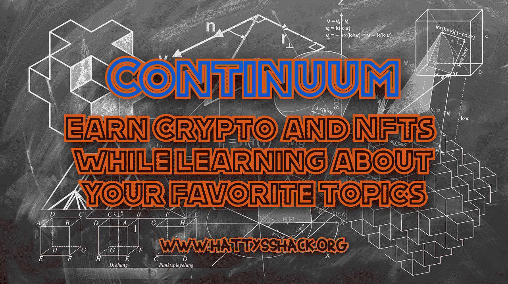
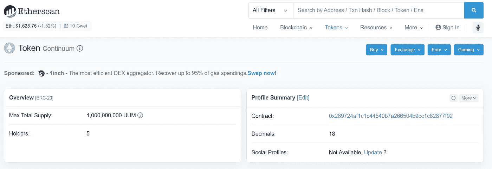

# 连续体:在学习你最喜欢的话题的同时获得加密和 NFTs

> 原文：<https://medium.com/coinmonks/continuum-earn-crypto-and-nfts-while-learning-about-your-favorite-topics-e5faa4fa6aa9?source=collection_archive---------6----------------------->

我遇到了一个有益且有回报的项目。我总是试图了解新的加密项目和几乎任何你能想到的加密和区块链技术。如果你像我一样，总是试图学习新的东西，那么我有完美的应用程序/网站给你。

[**连续统**](https://continuum.xyz/)

**什么是连续统，它是如何工作的？**

[Continuum](https://continuum.xyz/) 是独一无二的应用程序/网站。Continuum 付钱让你学习加密和各种各样的其他主题。您可以通过参加不同主题的课程获得$UUM 代币和 NFT，如 Uniswap 介绍、分类帐、多边形 ID、MoonPay、Canva 课程、自由职业者、网络写作、寿司交换介绍、煎饼交换介绍等等。一旦你完成了一门课程，你将获得$UUM 和 NFTs 的奖励。

UUM 是连续体应用程序之外的区块链以太坊上的 ERC-20 加密令牌，在不久的将来将具有货币价值。

这个网站的概念是惊人的，帮助你了解加密主题，让你更熟悉交流和不同的项目。

[Continuum](https://continuum.xyz/) 不仅是一个学习和赚钱的应用程序，它还是一个社交平台，人们可以在这里发布有趣的话题，帮助人们了解他们感兴趣的内容。你可以申请成为创建者，如果你被接受，你就可以开始就你认为值得谈论的话题创建内容。

每完成一门课程，你就可以获得宝石和经验值。宝石和 XP 没有货币价值，不能购买。宝石可以用来给创造者小费，最终你可以用它们来交换$UUM。一旦你完成了你选择的课程，你将获得$UUM 和 NFTs。Continuum 的 NFT 位于多边形链上，因此当您收到 NFT 时，您将能够在 [polyscan](https://polygonscan.com/) 上看到交易。

当你第一次登录该应用程序时，它会问你对学习什么感兴趣。在你选择了你的主题之后，你的 feed 将会被不同类型的课程和视频所填充。您可以通过进入个人资料-设置-更改兴趣随时更改您的话题。

我建议查看的第一个课程是[连续体](https://continuum.xyz/)基础知识。这将让你了解 Continuum 是如何工作的，并获得你学习该应用程序如何工作的第一份奖励。

**连续统的优点**

[Continuum](https://continuum.xyz/) 是了解更多关于加密、加密相关主题以及一系列其他有趣主题的好方法。你可以通过学习加密和其他主题来获得加密和 NFTs。

这个应用程序很容易使用，可以帮助你理解任何你想学的东西。课程相当简单，每节课大约需要 5 到 10 分钟。

[Continuum](https://continuum.xyz/) 可以在 iPhone 和 Android 上使用，非常容易使用和习惯。它可以让你以简单有趣的方式了解你感兴趣的话题。

**连续统的弊端**

连续统一体是相当新的。在以太扫描上搜索 Continuum 时，只有 5 个持有$UUM 的人。这意味着$UUM 还没有货币价值。这不是一个大骗局，总有一天它会有价值，但我不确定它会值多少钱，也不确定什么时候可以撤回。不要让这个说服你加入应用程序。一些最好的赚钱机会是那些还没有完全释放的机会。一旦它被发布，并且你从一开始就在那里，那么你就有机会收获最大的利益。

**结论**

我认为这个项目是一个惊人的想法，可以帮助大众了解加密和其他他们感兴趣的话题。如果你或你认识的任何人有兴趣了解加密、区块链、交易所和更多主题，那么我建议给 Continuum 一个机会，看看它是如何工作的。

查看 Continuum 的[网站](https://continuum.xyz/)和[白皮书](https://docs.continuum.xyz/)了解更多信息。

查看我的网站，了解更多赚取、学习和投资 Crypto 的方法。

[哈蒂小屋](https://www.hattysshack.org/)

[read.cash 上的原创文章](https://read.cash/@HattyHats/continuum-earn-crypto-and-nfts-while-learning-about-your-favorite-topics-b80ea171)

> 交易新手？试试[加密交易机器人](/coinmonks/crypto-trading-bot-c2ffce8acb2a)或者[复制交易](/coinmonks/top-10-crypto-copy-trading-platforms-for-beginners-d0c37c7d698c)