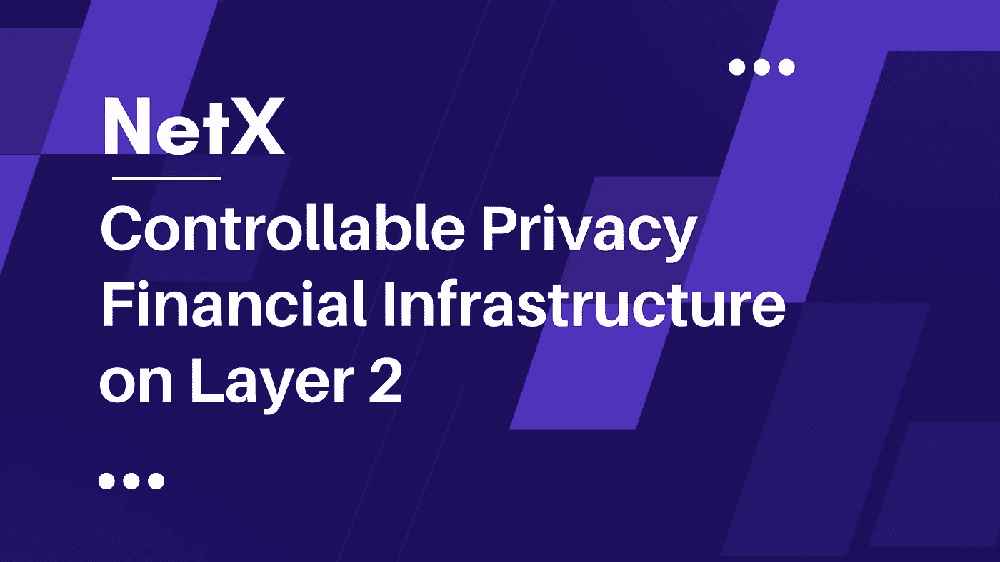

# 第 2 层上的可控隐私金融基础设施

> 原文：<https://medium.com/coinmonks/controllable-privacy-financial-infrastructure-on-layer-2-d858cd6224a3?source=collection_archive---------12----------------------->

图西玛系列第三部

**TL；博士**

Tusima 致力于构建一个去中心化的隐私金融生态，该生态安全、可跨链互操作，并具有可审计的隐私保护。目的是解决 Web 3.0 行业中的隐私、跨链和安全问题。

区块链在最近两年取得了很大进展，其技术和 DeFi 有所提高。与此同时，随着透明数据引发连续的资产盗窃和对敏感数据的隐私担忧，该行业的发展受到了越来越多的束缚。Tusima 网络将金融系统中的每一项资产都保密，并支持审计。验证器节点网络分发信任并执行隐私保护。试想，基金证明自己只在授权范围内进行隐私投资交易，投资者匿名进行交易和峰会资格，监管机构在不接触原始数据的情况下审核敏感用户数据。所有这些都是在隐私保护和互操作性持续的情况下进行的。

Tusima 是新一代的隐私金融网络，它通过 Fisher-Yates Shuffle 算法集成了零知识(zk)证明和同态加密。该平台致力于建立一个分散的隐私金融生态系统，具有有保证的安全性、跨链互操作性和可审计的隐私保护。

在 Tusima 上，隐私是通过账号模型和 zk 证明实现的。它的数万 TPS(每秒事务数)是通过 zk-rollups、POS 共识机制和跨链互操作协议实现的。其不可或缺的指标，如 TPS，让去中心化的金融应用实现了高速高频。

# **中央集权财政的紧迫困境**

如何制定公平和优化的激励措施并进行分配，突显了金融的一个核心属性。传统金融机构受到高成本、低效率、服务不平衡、低回报率、孤立生态、地下交易等严重头痛问题的困扰。

*   被截获的信息交换会带来巨大的风险。
*   成本高，效率低。
*   金融服务体系缺乏平等性。
*   个人隐私数据面临严重泄露的风险。

随着互联网金融的发展，用户在访问各种金融服务时会遇到越来越多的隐私泄露问题。银行或其他金融机构收集的用户个人信息超出了服务本身的要求，如联系人、电话、照片和用户手机上的其他敏感个人数据。

## **DeFi 的优点**

DeFi 是分散金融的缩写。在过去的两年中，DeFi 行业的总价值从 5.88 亿美元飙升至 798 亿美元。DeFi 的成就远远超出了传统金融行业。

*   汇款手续费低，效率高。
*   使用智能合同确保透明、安全、公平和无篡改的交易。
*   让全球数十亿没有银行账户的人也能平等地获得金融服务。
*   用技术激励创新，用代码保障安全，降低支付领域门槛。

## **DeFi 面临的挑战**

*   在交易过程中，IP 地址和交易金额没有分开。
*   跨链信息共享缺乏安全性和效率，并且由于艰难的跨链通信障碍，通信隐私通常得不到保护。
*   作为 DeFi 的主要运营商，ETH 遭遇了严重的拥堵，随着 DeFi 的繁荣，天然气价格飙升。
*   国库或项目的资产在集中管理下容易被盗。

# **金融时代的来临**

一个社会的金融体系强调其整体生产水平。金融进步应该为社会服务，协调供求失衡。金融创新在很大程度上推动了经济和技术的增长。All 释放了金融部门的终极价值，旨在通过其服务为其公民创造有希望的生活。

众所周知，传统金融对公众屏蔽了用户隐私，代价是零透明，但对金融机构则不然。绝对透明只能以牺牲隐私为代价来实现。大多数金融服务强调隐私。绝对透明允许审计，但限制了金融应用在大多数区块链平台上的大规模部署。

匿名项目或隐私支付项目通过加密技术保证令牌传输的匿名性，但仅限于传输的保密性。这些系统只能证明本地加密货币简单转移的有效性，无法进行复杂的逻辑运算。无法被编程或审计使匿名区块链无法获得部署金融应用程序所需的复杂逻辑。

目前，去中心化金融的当务之急是如何平衡用户隐私和数据的网络价值。zk 证明和同态加密、迭代证明等技术预示了现有密码学领域的趋势性前沿研究。这些技术验证某些权利或利益的合法所有者的身份，或者使验证者相信某些断言是正确的，在没有向验证者提供有用信息的情况下，消除了任何潜在的泄漏。Tusima 正在努力建立一个 L2 可控制的隐私金融基础设施，使该行业走出现有的 Web 3.0 世界。

# 📚必读

[图西玛系列-1](/coinmonks/public-chain-market-outlook-823eaec076cb) | [图西玛系列-2](/coinmonks/challenges-and-solutions-for-public-chain-36c183eb608e)

***NetX，面向数字生活的可信、可靠的智能自治系统链原生互联网(***[***Trias***](https://www.trias.one/)***)***

[***铁人三项***](https://www.triathon.space/#/)***|***[***Ethanim***](https://www.ethanim.network/)***|***[***tu Sima***](https://www.tusima.network/#/)***| behemotius | Leviatom | Divina***

> 交易新手？尝试[加密交易机器人](/coinmonks/crypto-trading-bot-c2ffce8acb2a)或[复制交易](/coinmonks/top-10-crypto-copy-trading-platforms-for-beginners-d0c37c7d698c)