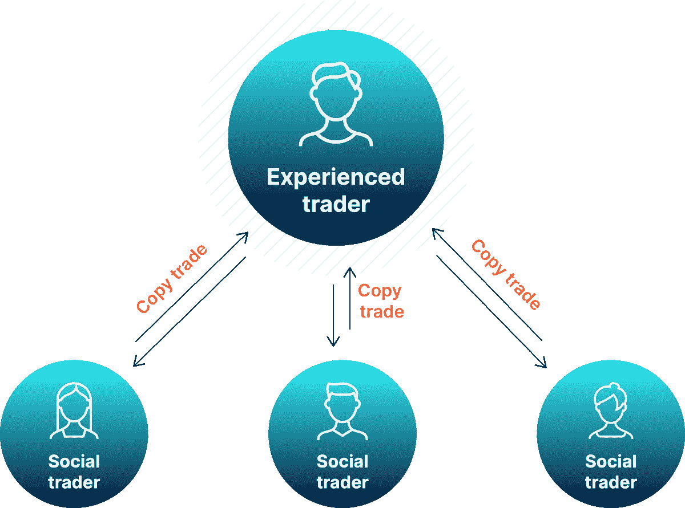
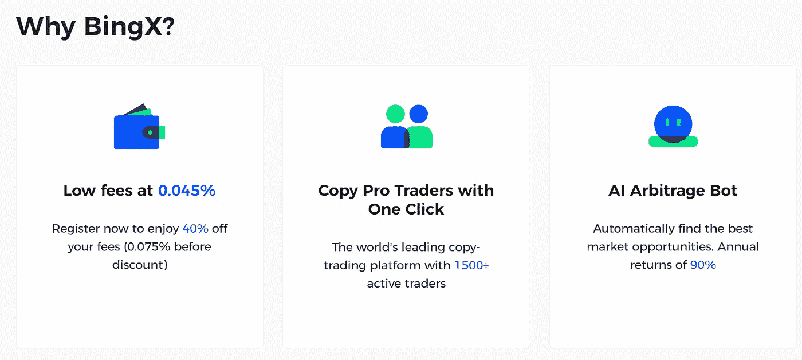
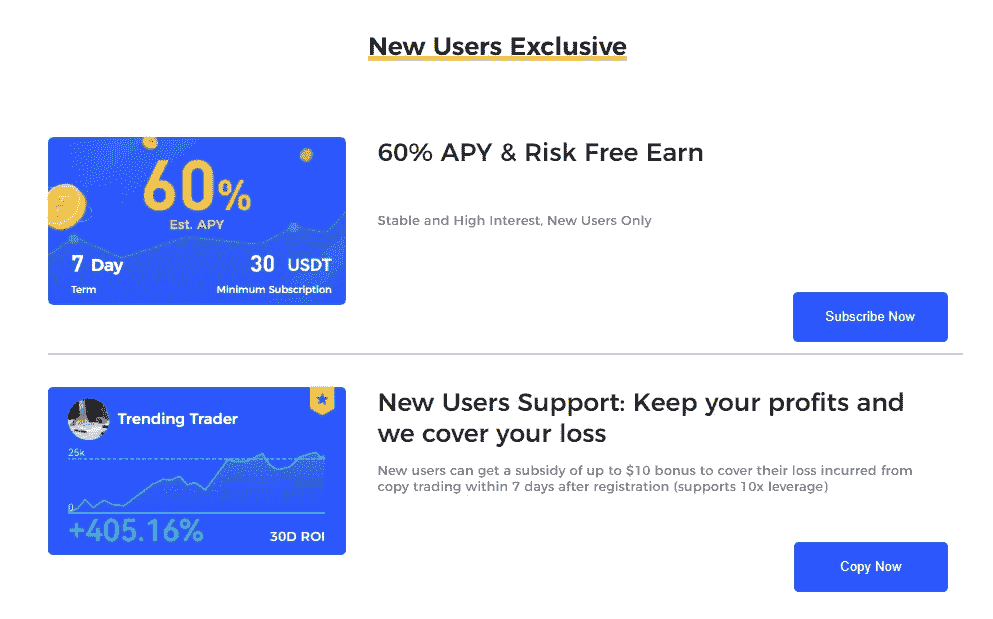
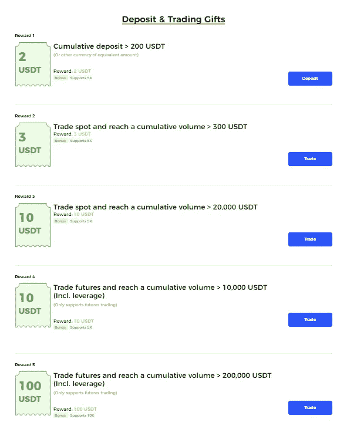
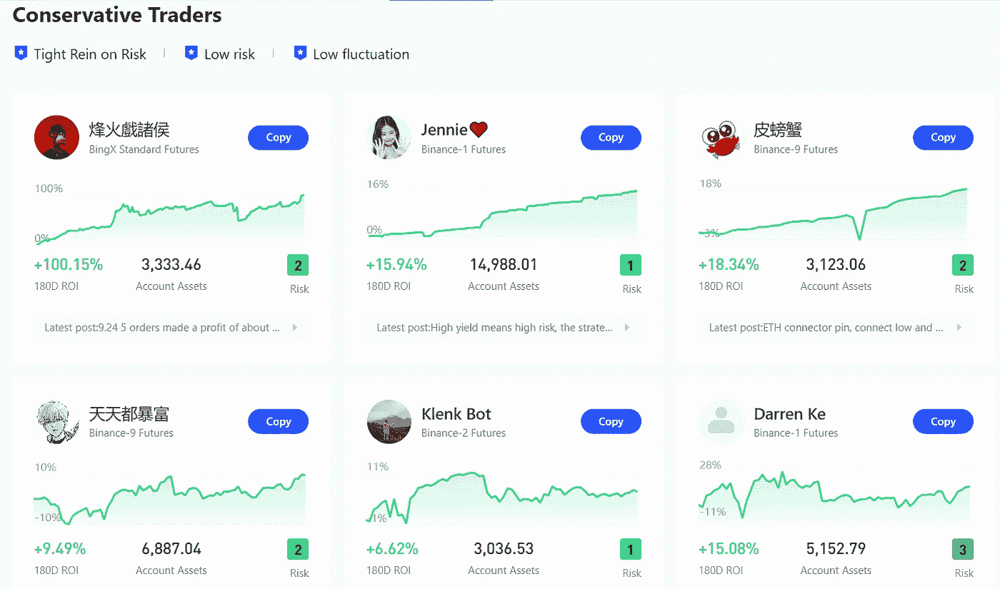
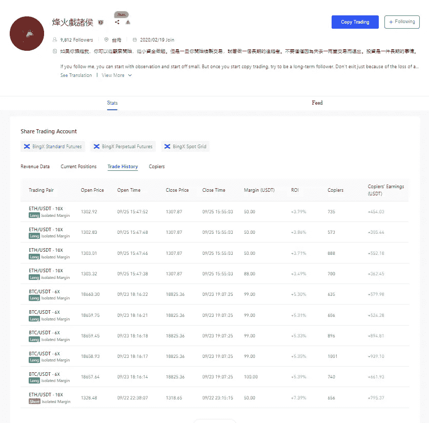
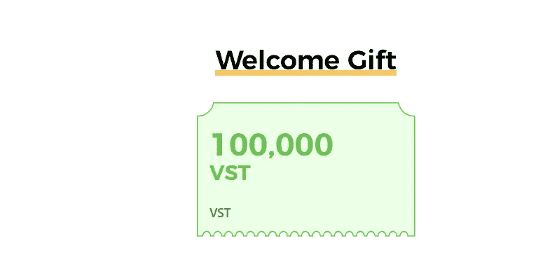

# 复制交易:用正确的方式去做

> 原文：<https://medium.com/coinmonks/copy-trading-do-it-in-the-right-way-318b2e57ba96?source=collection_archive---------31----------------------->

秉性可能比狂看要好

嘿伙计们，

希望你在熊市中表现良好。你可能会认为有另一个人有另一个复制交易的故事。但我向你保证，这个故事将不同于其他复制交易的文章。希望它能帮助你度过熊市。所以我们开始吧！

**什么是复制交易？**

> **复制交易**使[金融市场](https://en.wikipedia.org/wiki/Financial_markets)中的个人能够自动复制其他选定个人开立和管理的头寸。

Source: [https://tixee.com/what-is-copy-trading/](https://tixee.com/what-is-copy-trading/)

你可能也听说过社交交易或镜像交易这个术语。那些是同一领域的产品。与镜像交易不同，你的头寸不需要有相同的交易量。在复制交易中，你可以按初始订单的比例下单。

## 什么是 [BingX](https://bingx.com/partner/TheCryptoGambit) ？

> BingX 成立于 2018 年，是一个全球数字资产、现货和衍生品交易平台，提供以用户为中心的开放生态系统，具有直观的社交交易功能。
> 
> BingX 旨在丰富整个加密货币行业，是一个安全、可靠、用户友好的场所，用户可以在这里交易自己喜欢的资产。

**是什么让**[**BingX**](https://bingx.com/partner/TheCryptoGambit)**与众不同？**

我试过其他复制交易平台，那里每次交易的最低金额非常高，所以你每次交易需要冒更高金额的风险。但是在 BingX，你可以从 2 美元开始。

在一个平台上，我的交易在赚钱，但我的本金在减少。令我惊讶的是，我发现，交易发行商对我的每笔交易收取固定的费用。相反，在 BingX 上，您将始终被收取 0.045%的百分比**(仅针对平仓**)

## 其他好处

*   仅适用于新用户:

*   存款和交易礼品:每人最高 125 美元

## 亲提示:如何复制成功的交易者？

在你开始模仿任何投资者之前，首先要知道，你是在把你的钱的全部权力交给投资者。BingX 给每个交易者打分，1-6 分。评级为 1-2 的保守交易者。所以如果你喜欢低利润和低风险，首先试着只模仿保守的交易者。

别忘了也看看他们的贸易历史。这将帮助您了解交易者的交易行为和交易损益。

如果你不想拿你的钱冒险，但想知道交易是如何进行的，你可以用提供的 VST 开始复制。

如果你欣赏我的工作，并想在 BingX 上注册，请用我的推荐链接这样做，这样会激励我写这样一篇文章。对你来说，它不会花费你任何东西，但会帮助你在交易费用上获得额外的 20%的折扣。

[https://bingx.com/partner/TheCryptoGambit](https://bingx.com/partner/TheCryptoGambit)

如果你想错过这么棒的产品，想得到通知，请考虑关注我。谢谢:)

 [## 原始勇敢者-媒介

### 在媒体上阅读来自原始人的文字。每天，原始勇敢者和成千上万的其他声音读…

medium.com](/@primitivebrave) 

> 交易新手？试试[密码交易机器人](/coinmonks/crypto-trading-bot-c2ffce8acb2a)或者[复制交易](/coinmonks/top-10-crypto-copy-trading-platforms-for-beginners-d0c37c7d698c)