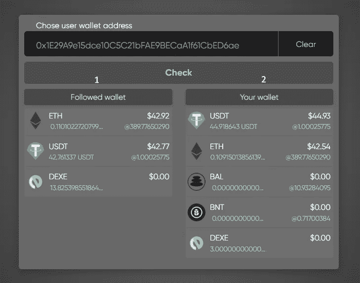

# 用 DexeNetwork 复制交易。

> 原文：<https://medium.com/coinmonks/copy-trading-with-dexenetwork-70b593ba6b03?source=collection_archive---------12----------------------->

还记得你在一次班级考试中是如何模仿你的朋友的吗，因为你没有准备考试？复制交易就是这样，只是它不是欺骗。

顾名思义，它允许你直接复制另一个交易者的头寸，并将你的投资组合和他们的联系起来。目的是从别人的好决策中获利。

它可以是自动的，选择的交易者采取的任何步骤立即应用到你的账户，也可以是手动的，你跟随一个特定的交易者，在你的账户中复制他们的步骤。

## 为什么复制交易是一个好主意。

作为一个交易经验有限的新手，这种方法有助于你熟悉金融市场，获得交易信心。交易者可以从别人的技术中赚钱，而不是花费时间和精力学习如何交易。虽然这不是最好的方法，但它可以帮助你收集足够的流动性，开始独立的交易之旅。

事实是你的成功和失败取决于你选择的交易者。所以选择一个有好的投资组合的交易者是很重要的，在这个投资组合中，赢的要比输的多。

## 钱包对钱包交易。

要轻松复制你选择的任何交易者:

如果还没有元掩码钱包，请创建一个。

要连接钱包，请访问 [dexe.network](http://dexe.network) ，然后:

1.  连接您的 metamask 钱包

2.接受条款

3.单击 Metamask 徽标并确认连接。

*   要开始复制:

**在界面的地址栏输入你想关注的 ERC20 钱包。**

在界面的左侧，你会看到你关注的钱包的资产(1)；在右侧，您将看到钱包中的资产(2)。

**注:**没有钱包数据库可循。你需要找到你自己的。

*   **选择要交换的资产**

您将看到一个弹出窗口:“将令牌交换到与交易者相同的资产？”如果选择“是”,它将被复制到与被复制的 wallet 事务中相同的资产中。如果选择“否”，您需要自己选择最终资产。

*   **配置复印设置**

**滑点** —可接受的滑点百分比，超过该百分比的交易将不会被复制。

**前置** —功能，通过增加您愿意支付的油费，允许您在复制的钱包完成交易之前完成交易。

**最小交易量过滤器** —如果被跟踪的钱包交易的资产量低于此阈值，您的钱包将不会复制它。

选择设置后，选择要拷贝的资源。让我们以 USDt 为例。

*   **您可以配置的附加参数**

您可以选择用于复制的总资产百分比(下面的红色箭头)。

从这三个选项中选择:

1.  选择预设百分比之一(25%、50%、100%)
2.  手动输入百分比
3.  输入要使用的具体数量

配置完所有设置选项后，单击“关注”按钮开始关注所选的钱包。

弹出窗口将显示为该复制请求选择的设置。请注意，当您签署此交易时，将向智能合同发送额外的 0.1 ETH 作为担保，以支付未来的复印费用。您将在屏幕左侧看到该金额，并可以随时提取。

接下来，点击交易并签名。

然后在元掩码中确认交易。

签名并确认后，等待直到看到 Metamask 弹出确认消息。

交易确认后，您将看到未来复印费用的余额(您可以随时使用“全部提取”按钮将其移回主钱包)。

请注意，任何用户都可以为跟踪的钱包设置多个复制请求。所以你可以复制一个或几个被关注的钱包的资产。所有步骤与复制第一个资产的步骤相同。

在这个版本中，一个请求执行一个复制操作(购买或销售)。要再次复制，请重复这些步骤。

如果在随后的请求中，您将看到再次添加 0.1 ETH 费用的请求，但您已经填满了您的智能合约余额，只需单击“取消”，该请求仍将正常进行。

您可以随时在“我的请求”选项卡中查看、取消或编辑您的复制请求。

享受复制的乐趣！！！

> 交易新手？试试[密码交易机器人](/coinmonks/crypto-trading-bot-c2ffce8acb2a)或者[复制交易](/coinmonks/top-10-crypto-copy-trading-platforms-for-beginners-d0c37c7d698c)