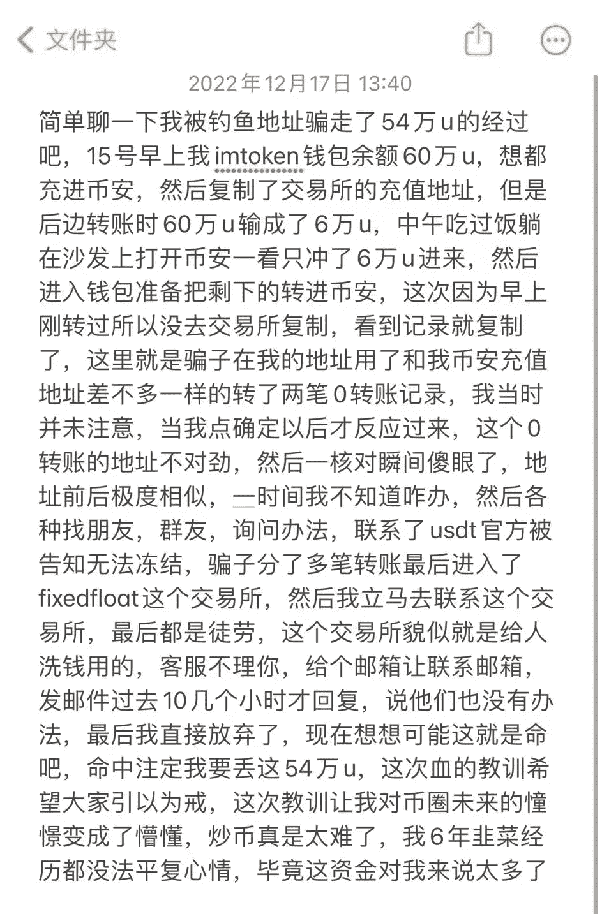
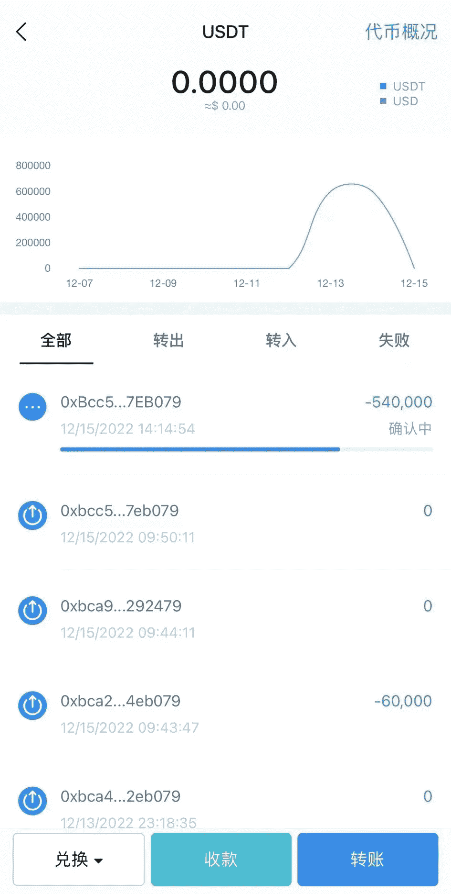
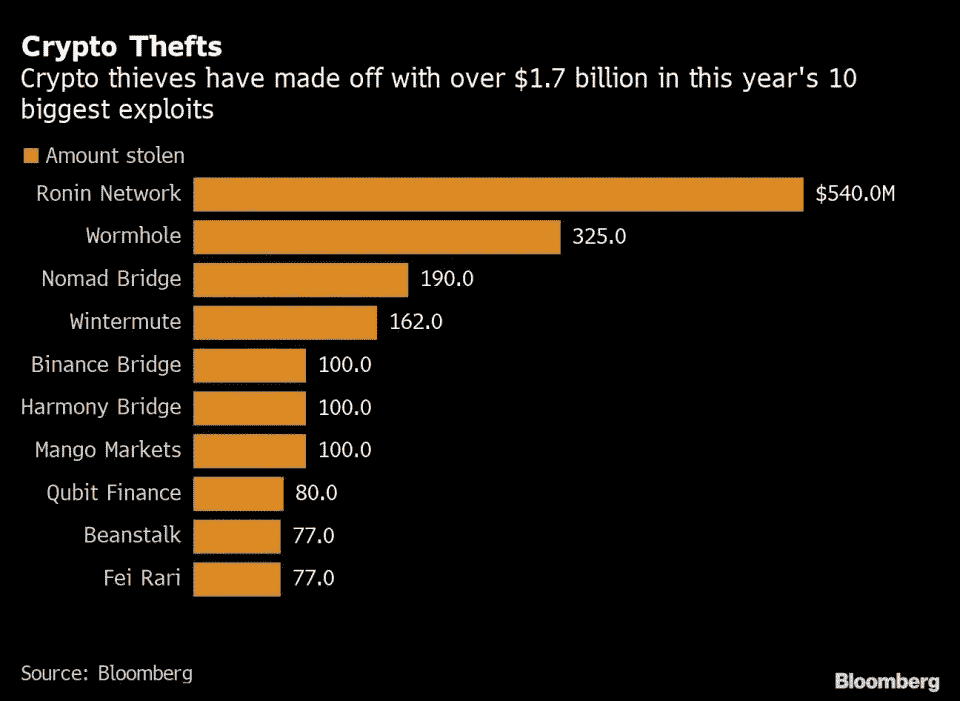
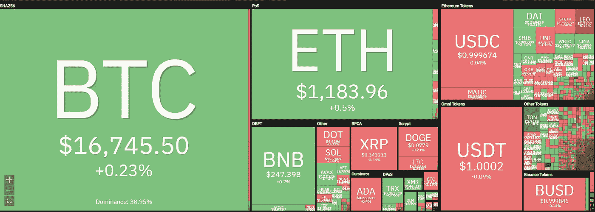
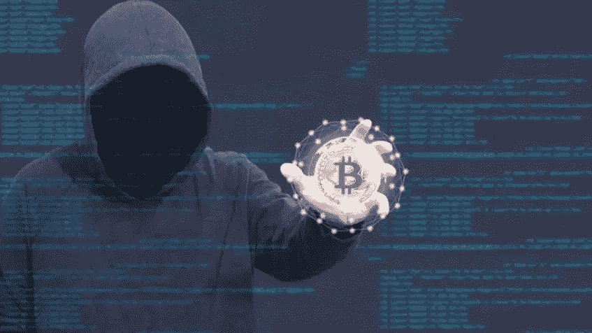
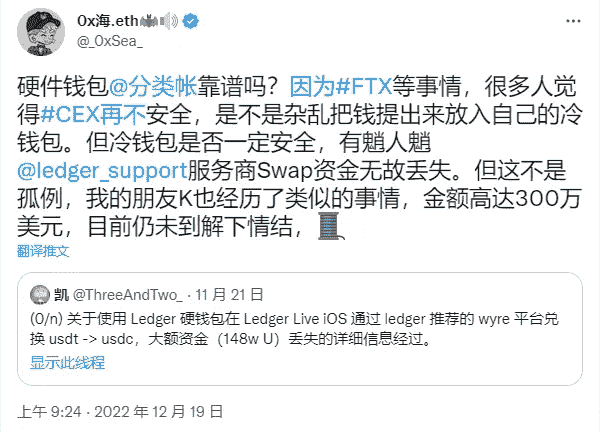

# 转账时复制钱包记录，他损失了 54 万美元

> 原文：<https://medium.com/coinmonks/copying-wallet-history-when-transferring-he-lost-540-000-ada11cd36b50?source=collection_archive---------10----------------------->

前几天有个玩家在使用 IMTOKEN 钱包转账的时候不小心丢了 54 万美元，实在是太可惜了。

这个朋友转账的时候，第一次在平台上复制了钱包地址，但是输错了金额，只转了一部分；第二次他直接从钱包的历史交易记录中复制了地址，结果他在这次转账中损失了 54 万美元。

$540,000 lost to wrong address

从玩家的记录来看，他是直接从钱包历史中复制地址，转错款才发现是钓鱼地址。

根据记录，他第一次向以 4eb079 结尾的钱包地址转了 6 万 u。当他继续操作时，他复制了历史记录中以 7eb079 结尾的地址。只有一个字母的区别，开头很像，而且这是黑客的地址。

> 多样化的密码持有，了解[币安替代品](https://coincodecap.com/binance-alternatives)

确认转账，但意识到是错误地址已经来不及，交易无法撤销。

他联系了 TEDA 官方和黑客地址被转移的交易平台客服，但钱包客服未果。

The wallet has received 3 similar wallet transaction information

在区块链上，去中心化和不可逆的特性让每个人都为自己的错误付出代价，尤其是在黑客的“推波助澜”下，错误无法交换。

黑客批量注册生成钱包地址，监控链上余额较大的钱包，获取大额钱包交互较多(转入或转出)的钱包地址，利用与该地址非常相似的钱包地址伪造合同交易记录。迷惑钱包主人。

一旦钱包主人不注意直接复制地址，就会丢失。

直接从历史交易记录中复制地址可能会将资产转移到黑客的钱包地址。黑客收到账号后，会转到交易平台出售，失主永远拿不回来。

比如看丢失 54 万 u 钱包的历史记录，已经有 3 个钱包，或者说 3 波黑客，等着他上钩。

黑客批量检查链上钱包余额，对所有大额钱包地址做类似操作，任何一个玩家都不小心被骗了。

$3 billion has been stolen by hackers by October 2022

在区块链世界，所有钱包业务都必须小心谨慎。懒一步可能要交一大笔学费。

如果你懒得每次都转账，那就直接复制到你打算转账的平台上，多核对几次钱包地址，不仅要看前后四个字母，还要检查中间字段的字母内容，然后点击确认。虽然有点麻烦，但肯定安全多了。

毕竟谁的钱都不是大风刮来的，可能是几年的辛苦，比如这个朋友辛苦赚了 6 年，转眼间就没了。现在想哭却没有眼泪，没有自信。

Encryption market overall downturn

在加密市场，可能会有暴利，但都是建立在一定的认识上。靠运气赚来的钱也会被实力输掉。

市场也充满了不确定性，尤其是在熊市环境下，风险更大。大平台可能会倒闭，黑客活动更加频繁，有些项目是来收韭菜的，防不胜防。

Crypto markets are digital cash machines for hackers

除了链上钱包，冷钱包账本的安全性也不时受到质疑。

当用户通过 Ledger 推荐的服务提供商进行掉期交易时，自己的资产被转出，交换的资产并没有转入钱包。

现在在找账本钱包，找互换平台多方踢球。问题还没有解决，我还不知道怎么拿回那 300 万美元。

Using the hardware wallet Leder service provider swap lost $3 million

数字钱包是区块链上的基础产品，任何数字资产都要通过钱包体现，真正做到去中心化；交易平台使用起来确实很方便，但也可能存在一定的风险。

这个市场有很多机会。普通人赚 100 万、200 万美元似乎更容易，但同时被盗，钱包归零。

只有提高认知，才能看到更多的机会，更好的避免陷阱。

以上只是我个人观点，没有投资建议。我是楚小莲，我正在关注元宇宙和 web3。

> 交易新手？试试[加密交易机器人](/coinmonks/crypto-trading-bot-c2ffce8acb2a)或者[复制交易](/coinmonks/top-10-crypto-copy-trading-platforms-for-beginners-d0c37c7d698c)
> 
> 多样化的密码持有，了解[币安替代品](https://coincodecap.com/binance-alternatives)
> 
> 加入 Coinmonks [电报频道](https://t.me/coincodecap)和 [Youtube 频道](https://www.youtube.com/c/coinmonks/videos)获取每日[加密新闻](http://coincodecap.com/)

## 另外，阅读

*   [复制交易](/coinmonks/top-10-crypto-copy-trading-platforms-for-beginners-d0c37c7d698c) | [加密税务软件](/coinmonks/crypto-tax-software-ed4b4810e338)
*   [网格交易](https://coincodecap.com/grid-trading) | [加密硬件钱包](/coinmonks/the-best-cryptocurrency-hardware-wallets-of-2020-e28b1c124069)
*   [密码电报信号](/coinmonks/top-3-telegram-channels-for-crypto-traders-in-2021-8385f4411ff4) | [密码交易机器人](/coinmonks/crypto-trading-bot-c2ffce8acb2a)
*   [最佳加密交易所](/coinmonks/crypto-exchange-dd2f9d6f3769) | [印度最佳加密交易所](/coinmonks/bitcoin-exchange-in-india-7f1fe79715c9)
*   [开发人员的最佳加密 API](/coinmonks/best-crypto-apis-for-developers-5efe3a597a9f)
*   最佳[密码借贷平台](/coinmonks/top-5-crypto-lending-platforms-in-2020-that-you-need-to-know-a1b675cec3fa)
*   [免费加密信号](/coinmonks/free-crypto-signals-48b25e61a8da) | [加密交易机器人](/coinmonks/crypto-trading-bot-c2ffce8acb2a)
*   杠杆代币的终极指南