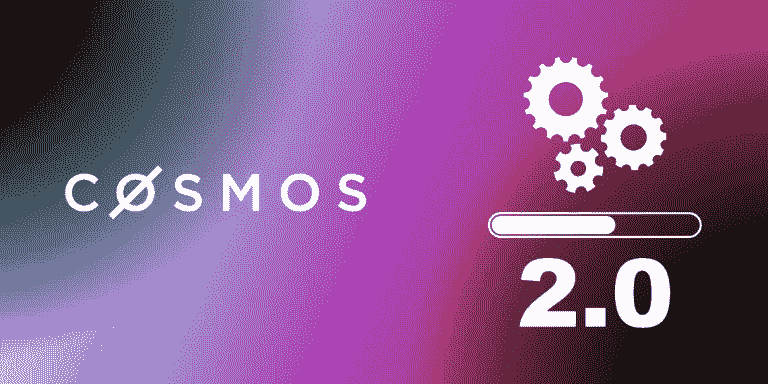

# Cosmos 2.0，新更新的回顾

> 原文：<https://medium.com/coinmonks/cosmos-2-0-a-review-of-new-updates-fbbe7fa582b6?source=collection_archive---------6----------------------->

好的加密读者，我们最近分享了一篇文章，分析了该领域最有前途和最具创新性的区块链之一 Cosmos(如果你没有阅读这篇文章，你可以在这里阅读)。在第二篇文章中，我们将讨论他们将进行的更新，这是他们在新路线图中透露的，旨在让 Cosmos 朝着完全互操作的愿景前进。区块链，让我们开始吧！