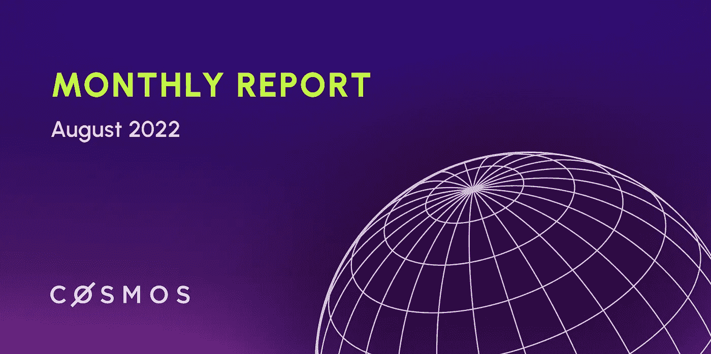
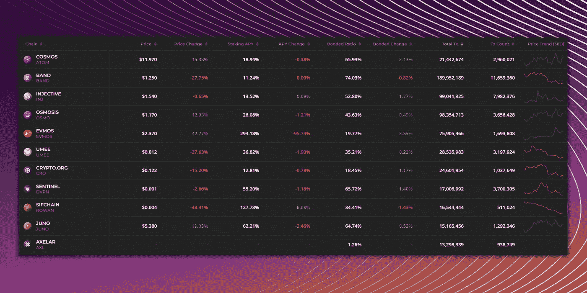
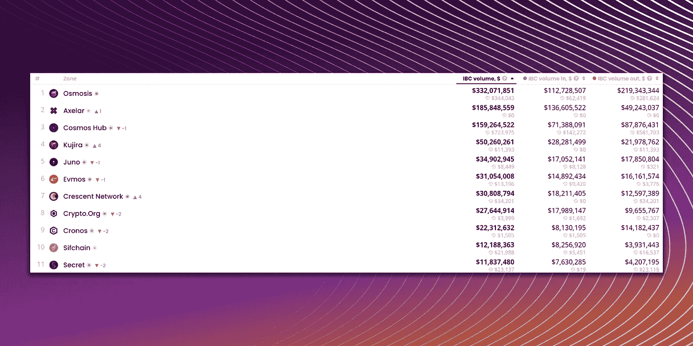

# 宇宙|月度报告—2022 年 8 月

> 原文：<https://medium.com/coinmonks/cosmos-monthly-report-august-2022-1d8d67367b31?source=collection_archive---------10----------------------->

本月的趋势、关键指标和宇宙生态系统的发展。

这个月对 Cosmos 来说是一个迷人的月份，大多数应用链都即将推出 Interchain，同时还有一系列新的应用链将于 2022 年第四季度/2023 年 Q1 期间推出。

现在，让我们来看看过去一个月中所有激动人心的发展、项目启动和合作伙伴关系！

***附言*** *如果你还没有加入旗舰公司的 Discord，你肯定错过了在市场中获得优势所需的最新和最伟大的洞察力。加入我们的不和与我们联系* [*这里*](https://discord.com/invite/yhJ2pr8ECw) *，我们很乐意帮助和拥有你！*

# 关注宇宙的新闻

## 八月份的重要新闻和更新

*   Infomal Inc 已经表示，链间安全是在 [v0.1 预发布](https://twitter.com/informalinc/status/1557786953747152897?s=19&t=A6t__xXxmUl8mb36Bkqgrg&utm_campaign=Cosmos%20Weekly&utm_medium=email&utm_source=Revue%20newsletter)，它是为 2022 年 11 月开始的公共激励测试网而设置的，其功能将于 2023 年在 Q1 推出。
*   Sifchain 带来了由 Peggy 2.0 驱动的[Cardano<>Cosmos](https://cardanofeed.com/bridge-linking-cardano-and-cosmos-coming-in-a-push-towards-interoperability-104123.html)，Peggy 2.0 是连接 Cardano 的 EVM 兼容层和 Cosmos 的桥梁，类似于 EVMOS 连接 ETH < > Cosmos 的工作方式。
*   Near 协议的 NEP 已经获得批准，通过将 IBC 技术带到 NEAR，使 [NEAR < > Cosmos](https://twitter.com/0xbrainjar/status/1562762734353383432) 更接近现实。

## 伙伴关系和整合

*   Keplr 和 Skiff [合作](https://twitter.com/keplrwallet/status/1561926070441750528)建立一个端到端的加密电子邮件、工作空间和文件共享空间，并允许任何人用他们的 Keplr 钱包登录 Skiff。
*   Secret Network 和 Injective Labs 合作创建了一个名为 [sINJ](https://twitter.com/InjectiveLabs/status/1559557744683880455) 的$INJ 包装版本，允许私人结算和转移$INJ。
*   任已经将与卡瓦整合在一起，允许将任支持的$BTC 和其他资产与卡瓦进行交易。
*   Sei 与 Axelar Network 合作，为 EVM 和 Cosmos chains 之间的 DeFi 带来了[跨链消息传递](/@seinetwork/sei-has-partnered-with-axelar-network-to-enable-cross-chain-messaging-for-defi-on-cosmos-1ad27c869f1d)，允许大量新的跨链 DeFi 用例。

## 融资和升级

*   Injective Labs】已经从 Jump 和 BH Digital 筹集了 4000 万美元来推进 Web3 融资。
*   卡瓦将于 9 月 8 日升级到卡瓦 11，并引入卡瓦的液态打桩技术。

## 新的发展

*   stkBNB 是由 pSTAKE 创建的 BNB 的流动赌注版本，与 stkBNB 持有者的保证金交易和[杠杆赌注](https://twitter.com/pStakeFinance/status/1564644490513682433)一起上线。
*   数据链带来了[和谐< >宇宙](/@datachain/datachain-successfully-completes-building-an-ibc-bridge-between-cosmos-and-harmony-on-the-local-5910e094e6c6)并在本地测试网上成功完成了 IBC 桥。
*   Stride 离它的空投日期越来越近了，并且已经发布了它的[文章](/@stride_zone/stride-tokenomics-740ecbcb8514)，该文章概述了$ST 的令牌组学，这是 Stride 的本地令牌。

# 链上分析

在本节中，我们将通过一些链上分析来了解 8 月份在更广泛的宇宙生态系统中发生了什么。

## 前 10 大连锁(按交易计数)

根据交易数量，我们看到进入前 10 名的新连锁店是 Sifchain。这可能是由于新的卡尔达诺<>宇宙桥，因此人们在交易/进行交易时都在期待这座桥上线。

## 十大连锁店(按 IBC 销量)

当我们转到基于上个月的 IBC 交易量时，我们看到 Cresent Network 和鲸声优都是 IBC 交易量的有力竞争者，在 IBC 交易量都是上个月的 3 倍以上。

***成交量增加的原因？*** 对于鲸声优来说，这是因为在 USK 和 ORCA(他们的清算机制)即将启动的情况下，购买/销售 KUJI 令牌变得很容易。对 Cresent 来说，这将是由于其最近推出的流动性范围广泛的 AMM 订单。

# 利用趋势

根据我们收集的信息，我们看到:( 1)非宇宙链正在寻求与宇宙链整合,( 2)液体 Staked 协议正在增加,( 3) DEXes 在 IBC 的数量与日俱增。

关于这些趋势和链接的更多信息，请看看我在这里发布的 Twitter 帖子。我不会在文章中写下来，这样我们可以保持每月更新的简短和简洁！

## 跨链是游戏的名字

在看到许多非 cosmos 连锁店希望与 Cosmos 整合以利用 IBC 后，如 NEAR、Cardano 和 Harmony(也可能是 Polkadot)，我相信利用这一趋势的最佳方式是保持更新，并在跨链桥启动后成为第一个将资产连接到各种链的人

## 液态打桩解决方案是热门话题

我们也看到一些流动的 staking 解决方案涌现出来，例如 pSTAKE 的 stkBNB、KAVA 的 bKAVA、Quicksilver 的 qAssets 和 Stride Zone 的 stTokens。

利用这一趋势的最佳方式是保留一些主要资产，如 ATOM、JUNO 和/或 OSMO，以便在这些协议推出后，您可以成为首批与这些协议互动的少数人之一，然后在这些 liquid staking 应用链上线后，继续开发即将推出的各种 DeFi 应用。

## 德克斯正在吞食 IBC 卷

最后但同样重要的是，我们看到鲸声优和 Cresent Network 等指数在 IBC 的交易量每月都在增加。对于这些连锁店来说，最好的办法是购买其本土资产，并利用增加的交易量，直到炒作平息。

# 把一切都包起来

这就是这个月的宇宙更新！Cosmos 最近获得了很多关注，许多令人兴奋的应用链目前仍在开发中，所有这些应用链都希望利用链间模块来实现跨链用例。

请务必关注我们本月即将发布的链间文章，它将解释各种链间模块将为 Cosmos 做些什么，以及为什么我们认为它将改变 Cosmos 的进程。

展望未来，我们也将把每月的宇宙更新改为每两周更新一次，因为我们意识到宇宙发展如此之快，所以最好尽快为您带来宇宙中的最新消息。

好了，我们 9 月 17 日再见。

在那之前，注意安全！

> 交易新手？试试[密码交易机器人](/coinmonks/crypto-trading-bot-c2ffce8acb2a)或者[复制交易](/coinmonks/top-10-crypto-copy-trading-platforms-for-beginners-d0c37c7d698c)