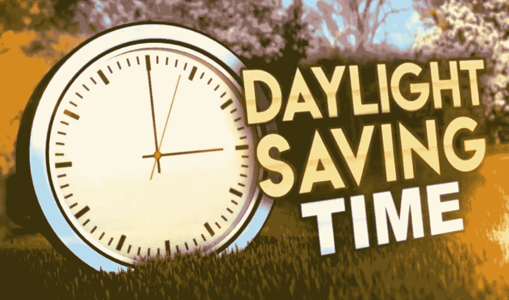
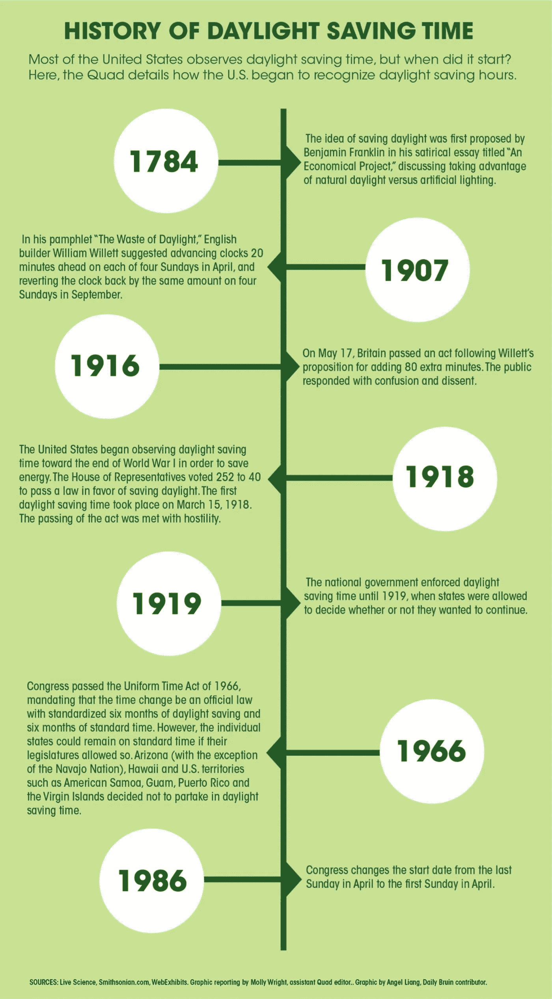

# 2022 年可能是我们永久实行夏令时的一年吗？不再换钟了？？

> 原文：<https://medium.com/coinmonks/could-2022-be-the-year-we-make-daylight-savings-time-permanent-no-more-clock-changes-44db7b602216?source=collection_archive---------21----------------------->

随着这个国家继续努力应对其内部的动荡，一些议员正在关注一个潜在的一线希望:这是一个最终结束大多数美国人今天面临的每年两次更换时钟的仪式的机会。

2022 年 3 月，一个由两党参议员组成的小组推出了 2021 年阳光保护法(S.623)，该法案将在美国永久实行夏令时(DST)。该法案由参议员马尔科·卢比奥(共和党)和来自两党的许多共同提案人提出，将结束每年两次“向前跳”和“向后跳”一小时的做法。

如果颁布，阳光保护法不会立即生效。相反，它将给予各州选择退出夏令时的权利。

该法案获得了各种利益相关者的支持，包括美国商会、全国家长教师协会，甚至一些能源公司。

商会主席苏珊娜·克拉克在一份声明中说:“让夏令时永久化是一个唾手可得的结果，它将为经济提供立竿见影的显著提振。”

卢比奥还吹捧该法案的潜在经济效益，认为它将“拯救生命，节省资金，创造就业机会。”

“研究表明，永久实行夏令时将减少能源消耗，提高生产率，并促进户外活动和旅游业，”他说。

这项阳光保护法案于 2022 年 3 月 15 日在美国参议院通过，但尚未在众议院投票表决。随着我们即将迎来即将离任的政治家们的“跛脚鸭”时期，人们严重关注议长是否会将其提前进行投票。

如果议案没有在众议院通过，总统就不能签署成为法律。

你怎么想呢?这项立法会在今年年底前获得投票吗？这将是你们州两年一次的时间变化的最后一年吗？

## **附录** —(夏令时)时间简史:

## **我们连线吧！**

大家好，我是里克·格雷森，这篇文章的作者。我正努力在 Medium、Instagram 和 Twitter 上建立粉丝群。你知道，试着找到适合我的部落。:-)

一份追随一份追随，一份分享一份分享；只是想放大这里的声音。

IG: [里克·格雷森(@ therickgregson)insta gram 照片和视频](https://www.instagram.com/therickgregson/)

推特:[里克·格雷森(@therickgregson) /推特](https://twitter.com/therickgregson)

LinkedIn: [里克·格雷森| LinkedIn](https://www.linkedin.com/in/therickgregson/)

> 交易新手？试试[加密交易机器人](/coinmonks/crypto-trading-bot-c2ffce8acb2a)或者[复制交易](/coinmonks/top-10-crypto-copy-trading-platforms-for-beginners-d0c37c7d698c)