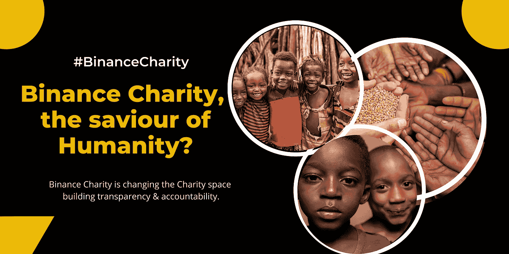
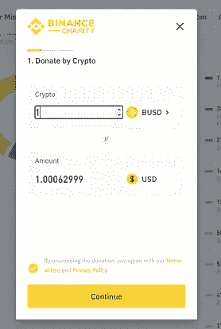

# 币安慈善会是人类的救星吗？

> 原文：<https://medium.com/coinmonks/could-binance-charity-be-the-savior-of-humanity-f1c9a04e26a6?source=collection_archive---------31----------------------->

*币安慈善机构将慈善捐赠推向了一个全新的高度……*

我打赌你已经听过无数次关于币安的事了。嗯，它是最大的加密货币交易所；如果你正在读这篇文章，很有可能你已经有了一个币安账户。

虽然我热衷于教授币安的技术，但那是另外一个故事了。让我们稍微改变一下。

*我们关注更大的议程怎么样？…一个更大的议程，比如人性…*

改变和拯救生命是一种生意…因为这就是币安慈善的全部。事实上，币安是一个数十亿美元的公司，但是，他们致力于币安慈善事业，为各种人道主义事业筹集资金。

*从支持阿富汗妇女教育到支持乌克兰紧急救助基金；这些家伙正在做这一切。*

[*币安慈善机构*](https://www.binance.charity/binance-charity-wallet?ref=431277160) 简而言之，就是要通过促进透明度、消除腐败和坚持问责制来彻底改革慈善行业。

我们都听说过那些“去资助我吧”的捐款丑闻。所有这些案例中出现的一个共同问题是，缺乏透明的平台来确保资金确实到达受益人手中。

***币安慈善会的核心使命包括:***

*   缩小贫困差距
*   夯实基础的教育
*   平等的未来
*   健康的身心
*   我们的星球，我们的遗产

*拥有一个币安账户很酷，但是我们把它提升一个档次怎么样……*

因为加密不仅仅是为了赚钱。这是一场旨在改变我们破碎的金融体系的运动的一部分。

今天，我们能庆祝币安慈善吗？我们可以吗？

为此，我刚刚向币安慈善机构捐赠了 1 BUSD。

和我一起加入这场运动，为一项改变生活的更大的事业捐赠一枚 BUSD

你只需要在你的币安账户里存一些 BUSD、BNB、瑞士联邦理工学院、BTC 和 XRP 的账户。

我们来改变一下 crypto 的故事。一次一个捐赠…

[***捐此处> >***](https://www.binance.charity/binance-charity-wallet?ref=431277160)

没有币安账号， [**这里随便找一个**](https://accounts.binance.com/en/register?ref=431277160) > >

> 交易新手？试试[加密交易机器人](/coinmonks/crypto-trading-bot-c2ffce8acb2a)或者[复制交易](/coinmonks/top-10-crypto-copy-trading-platforms-for-beginners-d0c37c7d698c)