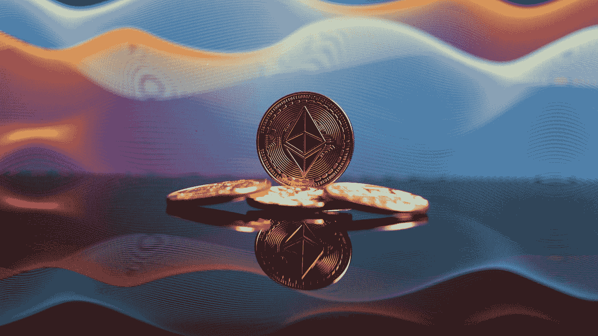

# 以太坊会塌缩到零吗？

> 原文：<https://medium.com/coinmonks/could-ethereum-collapse-to-zero-3eee44e8f851?source=collection_archive---------4----------------------->

Photo by [Bastian Riccardi](https://unsplash.com/@shutter_speed_?utm_source=medium&utm_medium=referral) on [Unsplash](https://unsplash.com?utm_source=medium&utm_medium=referral)

世界上最大的 altcoin 凭借其股权证明(PoS)机制是否有导致以太坊价格完全崩溃的风险？与今年五月发生在月球上的事情非常相似？

MicroStrategy 创始人迈克尔·塞勒(Michael Saylor)似乎对此深信不疑。无论如何，他支持以太坊会像月球一样崩溃的观点。就在昨天，他在推特上写道: