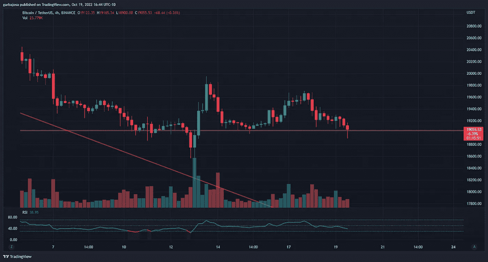
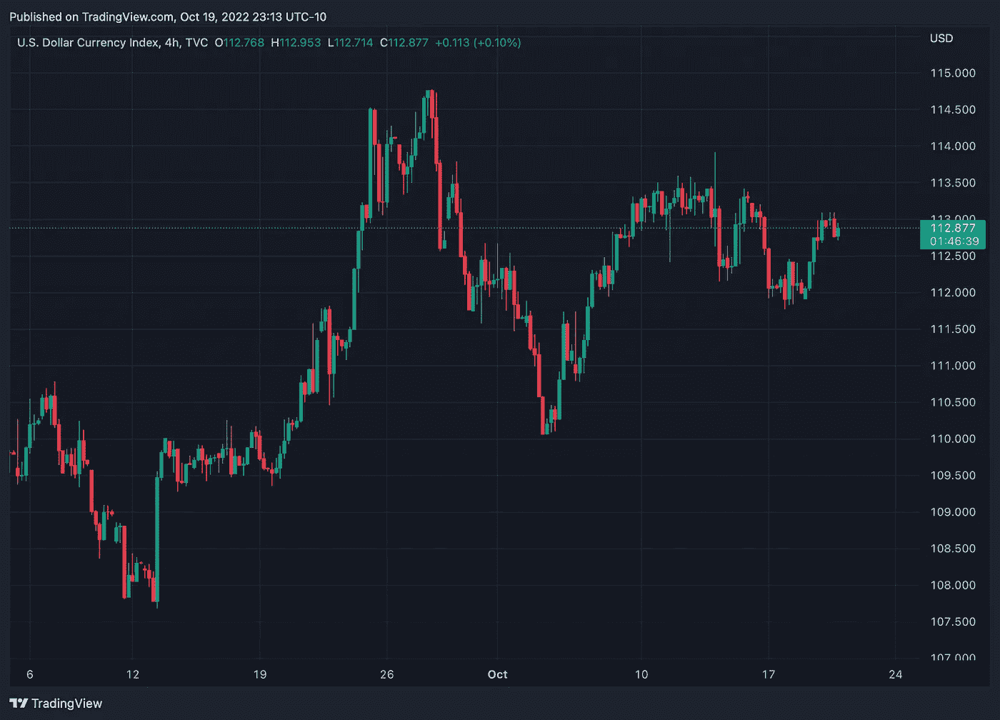
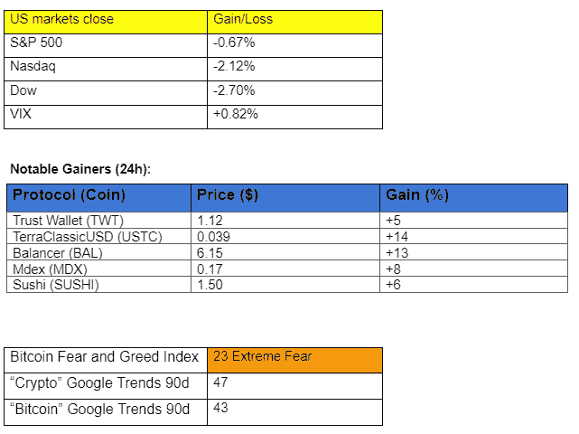
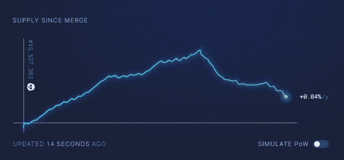

# 这是否意味着 DeFi 的终结？

> 原文：<https://medium.com/coinmonks/could-this-mean-the-end-of-defi-4d661b7e05be?source=collection_archive---------16----------------------->

## 每日征服#108

问题#108

Photo by [Mathew MacQuarrie](https://unsplash.com/@matmacq?utm_source=medium&utm_medium=referral) on [Unsplash](https://unsplash.com?utm_source=medium&utm_medium=referral)

密码市场是一个狂野、奇妙而令人生畏的地方；不要一个人跋涉！订阅加密征服者，让我们成为您的向导。

S [*订阅*](https://tradergabi.substack.com/subscribe?) *本刊每日快讯，永不错过一期。*

概观

*   SBF，比特币基地和德菲？
*   DXY 位于一个重要的整合点附近。
*   富达推出 ETH trading。
*   以色列将测试数字国家债券。
*   Sorare 推出了一款基于 NFT 的 NBA 梦幻游戏。

早上好，家人，

不管你喜不喜欢，加密法规即将出台，昨天，这方面有了重大进展。

**泄密**

德尔福实验室总领事 Gabriel Shapiro 以透明的名义泄露了一份**数字商品消费者保护法(DCCPA)** 的草案。该法案是国会中最重要的加密立法之一，概述了有关 DeFi 未来的重要法规。

该法案由参议员黛比·斯塔伯诺(D-MI)和约翰·布兹曼(R-AR)在两个月前提出，并得到了加密行业两位大佬的支持:FTX 首席执行官山姆·班克曼-弗里德(SBF)和比特币基地首席执行官布莱恩·阿姆斯壮。

这两个人代表着集中的交易所，他们因为该法案可能威胁分散金融(DeFi)的某些方面受到了一些批评。

SBF 声称该法案将“在不危及软件、区块链、验证器、DeFi 等的存在的情况下，为集中交易的客户提供保护。”

SBF 后来在推特上发布了他对密码监管的想法，这引发了一场有趣的讨论。该帖子包括知名加密重量级人物的观点，如 Bankless 的 Ryan Sean Adams、Frax Finance 的 Sam Kazemian、“比特币做了什么”的 Peter McCormack 和 YouTuber Bitboy。此外，SBF 接受了 Peter McCormack 的播客邀请，这将有助于澄清他的立场。

然而，监管措施总是会招致批评。SBF 和比特币基地是在做对集中交易最有利的事情，还是在为整个加密的最大利益游说？

随着故事的展开，我们将继续写下去，但现在，如果你想更深入地了解，我建议你阅读推文。

# 市场更新🌍

**BTC/USDT 4H**

BTC 昨日跌至 18.9 美元的低点，随后多头捍卫了长期存在的 19 美元支撑位，并在 4 小时图上创造了多头针棒形态。预计价格将继续横向波动，直到波动性回到加密市场。BTC 收盘下跌 1.05 %，至 19，123 美元。

*高清* [***图表***](https://www.tradingview.com/x/rMNwUUXG/)

**DXY 4H**

美元指数(DXY)今天强劲反弹，但仍处于经典的三角形模式，价格继续巩固至 112.50 水平附近。这种模式通常预示着两个方向的强劲走势。加密多头希望看到价格下跌，表明远离美元。

如果你喜欢这份报告，并且认为它值 20 分(0.01 美分)，请点击下面的鼓掌按钮来支持我的写作。(最多 50 次！)谢谢！

# 新闻观察📰

**富达允许 ETH 交易。**从 10 月 28 日开始，富达数字资产客户可以根据公司的进行 ETH [交易。此前，该公司在 9 月份为机构客户推出了以太坊指数基金。富达是世界上最大的资产管理公司之一。](https://twitter.com/CryptoGucci/status/1582897704396476416?s=20&t=4RFjCFS2VmxMmx-lENDfrA)

币安成为 Uniswap 的第二大投票人。根据 Uniswap 创建者 Hayden Adams 的说法，币安涉嫌利用客户资金成为 UNI 代币的第二大持有者。此举引发了人们对集中式实体在分散式网络上获得权力的担忧。币安表示这不是公司的意图，并计划就此事联系 Uniswap 团队。

以色列将测试数字国家债券。以色列财政部和特拉维夫证券交易所(TASE)计划[测试使用区块链技术的](https://twitter.com/ShortSqueezed1/status/1582734797608464385?s=20&t=4RFjCFS2VmxMmx-lENDfrA)数字国家债券。测试将着眼于该技术如何通过降低发行成本和持续时间来简化债券发行过程。

**新闻花絮:**

*   4400 名愤怒的投资者[追杀](https://cointelegraph.com/news/4-400-disgruntled-investors-are-hunting-for-terra-s-do-kwon)跆拳道。
*   英国可以考虑让私人稳定公司发行 CBDC。
*   Celestia Labs [筹集](https://twitter.com/CelestiaOrg/status/1582771528763965440?s=20&t=N5iYGQrtxKLGSpUX6SMrPA)5500 万美元启动模块化区块链网络。
*   Terra [推出](https://twitter.com/SylvieLeroy_/status/1582719699049410561?s=20&t=4RFjCFS2VmxMmx-lENDfrA)一项为期 4 年的吸引用户计划。
*   雪崩[推出](https://twitter.com/avalancheavax/status/1582428030961864704?s=20&t=EvQjFMIYzjAXCoX8MXELYw)班夫，雪崩的最新版本。
*   SushiSwap [集成了](https://twitter.com/Transak/status/1582751669363691522?s=20&t=EvQjFMIYzjAXCoX8MXELYw)菲亚特坡道 Transak。

**NFT &元宇宙更新🐵**

*   **美国职业棒球大联盟** [**正在寻找**](https://twitter.com/theblock__/status/1582732546668122112?s=61&t=fdYhMHkBzPV_xlyPTafHPw) **招聘一名数字游戏、NFTs 和元宇宙运营的授权经理。**
*   **Sorare 是** [**利用 NFT 收藏品推出的**](https://t.co/lkpXYDH5pK) **一款 NBA 奇幻游戏。目前处于测试阶段。**

# 我的五分钱…

**通缩 ETH，那是快了。**

*来源:Ultrasound.money*

自从以太坊合并以来，我一直在监测的一个指标是 Ultrasound.money 上的供应图，因为有一个问题一直在我脑海中盘旋。以太坊是不是马上就要通缩了？

图表给了我们一个早期的答案。

*EIP-1559 颁布后，以太坊的网络燃烧用作气体的 ETH。这些烧毁的令牌随后被计入由验证者发布的 ETH。*

现在是加密冬天的中期，虽然区块链以太坊的交易仍然相对低迷，但以太坊已经连续 10 天处于通缩状态！

现在还为时过早，但对于通货紧缩的长期前景来说，前景非常乐观。

# ***加布里埃尔***

*关注我* [*推特*](https://twitter.com/web3_gabri) *每日更新！*

订阅这份每日时事通讯，不要错过任何一期。

> 交易新手？试试[加密交易机器人](/coinmonks/crypto-trading-bot-c2ffce8acb2a)或者[复制交易](/coinmonks/top-10-crypto-copy-trading-platforms-for-beginners-d0c37c7d698c)