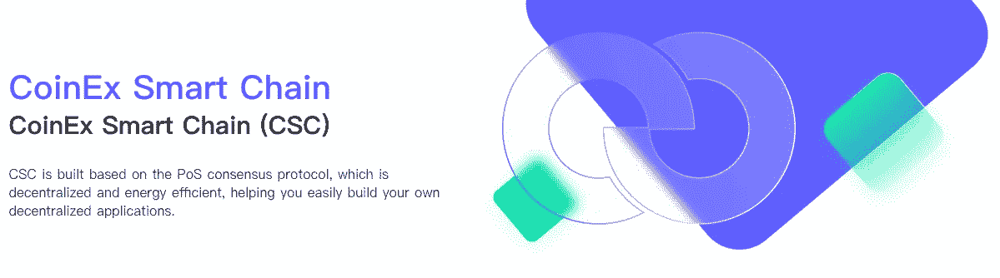

# CRC20 令牌部署

> 原文：<https://medium.com/coinmonks/crc20-token-deployment-96f3ce0c5762?source=collection_archive---------19----------------------->

也许您的项目出于任何目的需要一个令牌(例如:投票权、治理、传统支持的稳定硬币等)，CRC20 是 coinex 智能链上可替换令牌的 CSC 标准。在本教程中，我们将看看 CRC20 标准及其实施。



## CRC20

CRC20 是可替换令牌的 coinex 智能链标准。CSC 与以太坊完全兼容，因此 CRC20 与 ERC20 相同。

 [## EIP-20:令牌标准

### 令牌的标准接口。以下标准允许实现令牌的标准 API

eips.ethereum.org](https://eips.ethereum.org/EIPS/eip-20) 

在本教程中，我们将使用 ERC20 的 OpenZeppelin 实现:

[](https://github.com/OpenZeppelin/openzeppelin-contracts/tree/master/contracts/token/ERC20) [## open zeppelin-contracts/contracts/token/er C20 at master open zeppelin/open zeppelin-contracts

### 有关 ERC20 令牌的概述以及如何创建令牌合同的演练，请阅读我们的 ERC20 指南。有一个…

github.com](https://github.com/OpenZeppelin/openzeppelin-contracts/tree/master/contracts/token/ERC20) 

首先，我们需要为我们的项目创建一个目录，所以我终端类型:

```
mkdir CRC20
cd CRC20
```

然后创建一个名为 crc20.sol 的文件，如下所示:

```
touch crc20.sol
```

克隆 Openzeppelin github repo 并将 Openzeppelin ERC20.sol 代码粘贴到此处:

```
// SPDX-License-Identifier: MIT
// OpenZeppelin Contracts (last updated v4.8.0) (token/ERC20/ERC20.sol)

pragma solidity ^0.8.0;

import "./IERC20.sol";
import "./extensions/IERC20Metadata.sol";
import "../../utils/Context.sol";

contract ERC20 is Context, IERC20, IERC20Metadata {
    mapping(address => uint256) private _balances;

    mapping(address => mapping(address => uint256)) private _allowances;

    uint256 private _totalSupply;

    string private _name;
    string private _symbol;

    constructor(string memory name_, string memory symbol_,uint256 totalSupply_) {
        _name = name_;
        _symbol = symbol_;
        _totalSupply = totalSupply_;

    }

    /**
     * @dev Returns the name of the token.
     */
    function name() public view virtual override returns (string memory) {
        return _name;
    }

    function symbol() public view virtual override returns (string memory) {
        return _symbol;
    }

    function decimals() public view virtual override returns (uint8) {
        return 18;
    }

    /**
     * @dev See {IERC20-totalSupply}.
     */
    function totalSupply() public view virtual override returns (uint256) {
        return _totalSupply;
    }

    /**
     * @dev See {IERC20-balanceOf}.
     */
    function balanceOf(address account) public view virtual override returns (uint256) {
        return _balances[account];
    }

    function transfer(address to, uint256 amount) public virtual override returns (bool) {
        address owner = _msgSender();
        _transfer(owner, to, amount);
        return true;
    }

    /**
     * @dev See {IERC20-allowance}.
     */
    function allowance(address owner, address spender) public view virtual override returns (uint256) {
        return _allowances[owner][spender];
    }

    function approve(address spender, uint256 amount) public virtual override returns (bool) {
        address owner = _msgSender();
        _approve(owner, spender, amount);
        return true;
    }

    function transferFrom(
        address from,
        address to,
        uint256 amount
    ) public virtual override returns (bool) {
        address spender = _msgSender();
        _spendAllowance(from, spender, amount);
        _transfer(from, to, amount);
        return true;
    }

    function increaseAllowance(address spender, uint256 addedValue) public virtual returns (bool) {
        address owner = _msgSender();
        _approve(owner, spender, allowance(owner, spender) + addedValue);
        return true;
    }

    function decreaseAllowance(address spender, uint256 subtractedValue) public virtual returns (bool) {
        address owner = _msgSender();
        uint256 currentAllowance = allowance(owner, spender);
        require(currentAllowance >= subtractedValue, "ERC20: decreased allowance below zero");
        unchecked {
            _approve(owner, spender, currentAllowance - subtractedValue);
        }

        return true;
    }

    function _transfer(
        address from,
        address to,
        uint256 amount
    ) internal virtual {
        require(from != address(0), "ERC20: transfer from the zero address");
        require(to != address(0), "ERC20: transfer to the zero address");

        _beforeTokenTransfer(from, to, amount);

        uint256 fromBalance = _balances[from];
        require(fromBalance >= amount, "ERC20: transfer amount exceeds balance");
        unchecked {
            _balances[from] = fromBalance - amount;
            // Overflow not possible: the sum of all balances is capped by totalSupply, and the sum is preserved by
            // decrementing then incrementing.
            _balances[to] += amount;
        }

        emit Transfer(from, to, amount);

        _afterTokenTransfer(from, to, amount);
    }

    function _mint(address account, uint256 amount) internal virtual {
        require(account != address(0), "ERC20: mint to the zero address");

        _beforeTokenTransfer(address(0), account, amount);

        _totalSupply += amount;
        unchecked {
            // Overflow not possible: balance + amount is at most totalSupply + amount, which is checked above.
            _balances[account] += amount;
        }
        emit Transfer(address(0), account, amount);

        _afterTokenTransfer(address(0), account, amount);
    }

    function _burn(address account, uint256 amount) internal virtual {
        require(account != address(0), "ERC20: burn from the zero address");

        _beforeTokenTransfer(account, address(0), amount);

        uint256 accountBalance = _balances[account];
        require(accountBalance >= amount, "ERC20: burn amount exceeds balance");
        unchecked {
            _balances[account] = accountBalance - amount;
            // Overflow not possible: amount <= accountBalance <= totalSupply.
            _totalSupply -= amount;
        }

        emit Transfer(account, address(0), amount);

        _afterTokenTransfer(account, address(0), amount);
    }

    function _approve(
        address owner,
        address spender,
        uint256 amount
    ) internal virtual {
        require(owner != address(0), "ERC20: approve from the zero address");
        require(spender != address(0), "ERC20: approve to the zero address");

        _allowances[owner][spender] = amount;
        emit Approval(owner, spender, amount);
    }

    function _spendAllowance(
        address owner,
        address spender,
        uint256 amount
    ) internal virtual {
        uint256 currentAllowance = allowance(owner, spender);
        if (currentAllowance != type(uint256).max) {
            require(currentAllowance >= amount, "ERC20: insufficient allowance");
            unchecked {
                _approve(owner, spender, currentAllowance - amount);
            }
        }
    }

    function _beforeTokenTransfer(
        address from,
        address to,
        uint256 amount
    ) internal virtual {}

    function _afterTokenTransfer(
        address from,
        address to,
        uint256 amount
    ) internal virtual {}
}
```

**注意:**我删除了注释以减少代码行。

可通过以下方式更改名称、符号和总供应量:

```
_name = "My Token";
_symbol = "TKN";
_totalSupply = 1000000;
```

当你编译你的代码时，它会创建 ABI 文件。我们已经在之前的教程中讨论过 ABI，它看起来是这样的:

```
ABI = '[{"constant":true,"inputs":[],"name":"name","outputs":[{"name":"","type":"string"}],"payable":false,"type":"function","stateMutability":"view"},{"constant":false,"inputs":[{"name":"_spender","type":"address"},{"name":"_value","type":"uint256"}],"name":"approve","outputs":[{"name":"","type":"bool"}],"payable":false,"type":"function","stateMutability":"nonpayable"},{"constant":true,"inputs":[],"name":"totalSupply","outputs":[{"name":"","type":"uint256"}],"payable":false,"type":"function","stateMutability":"view"},{"constant":false,"inputs":[{"name":"_from","type":"address"},{"name":"_to","type":"address"},{"name":"_value","type":"uint256"}],"name":"transferFrom","outputs":[{"name":"","type":"bool"}],"payable":false,"type":"function","stateMutability":"nonpayable"},{"constant":true,"inputs":[],"name":"decimals","outputs":[{"name":"","type":"uint8"}],"payable":false,"type":"function","stateMutability":"view"},{"constant":true,"inputs":[{"name":"_owner","type":"address"}],"name":"balanceOf","outputs":[{"name":"","type":"uint256"}],"payable":false,"type":"function","stateMutability":"view"},{"constant":true,"inputs":[],"name":"symbol","outputs":[{"name":"","type":"string"}],"payable":false,"type":"function","stateMutability":"view"},{"constant":false,"inputs":[{"name":"_to","type":"address"},{"name":"_value","type":"uint256"}],"name":"transfer","outputs":[{"name":"","type":"bool"}],"payable":false,"type":"function","stateMutability":"nonpayable"},{"constant":true,"inputs":[{"name":"_owner","type":"address"},{"name":"_spender","type":"address"}],"name":"allowance","outputs":[{"name":"","type":"uint256"}],"payable":false,"type":"function","stateMutability":"view"},{"inputs":[{"name":"_totalSupply","type":"uint256"}],"payable":false,"type":"constructor","stateMutability":"nonpayable"},{"anonymous":false,"inputs":[{"indexed":true,"name":"from","type":"address"},{"indexed":true,"name":"to","type":"address"},{"indexed":false,"name":"value","type":"uint256"}],"name":"Transfer","type":"event"},{"anonymous":false,"inputs":[{"indexed":true,"name":"owner","type":"address"},{"indexed":true,"name":"spender","type":"address"},{"indexed":false,"name":"value","type":"uint256"}],"name":"Approval","type":"event"}]'
```

让我们在 CSC 网络上部署我们的智能合同。我们可以用松露、安全帽或混音来做。我用 Remix 是因为它对初学者非常友好，而且重量轻，不需要安装任何东西。

[](/coinmonks/introduction-to-smart-contract-development-and-dapp-development-on-csc-part2-13f253c60c13) [## CSC 上的智能合约开发和 Dapp 开发简介-第 2 部分

### 嘿嘿嘿！

medium.com](/coinmonks/introduction-to-smart-contract-development-and-dapp-development-on-csc-part2-13f253c60c13) 

现在是时候使用我们的 dapp 与我们的智能合约进行交互了。

```
const Web3 = require('web3');
const w3 = new Web3("https://testnet-rpc.coinex.net");

const crc20_abi = "Past Your Smart Contract ABI Here"
const contranctAddress = "Paste Smart Contract Address Here";
const crcContract = new web3.eth.Contract(crc20_abi, contranctAddress);

// get total supply of crc20 token
crcContract.methods.totalSupply().call();
//1000000

// get name of crc20 token
const name = crcContract.methods.name().call();
//My Token

// get symbol of crc20 token
const symbol = crcContract.methods.symbol().call()
//TKN

// get decimals of crc20 token
const decimals = crcContract.methods.decimals().call()
//18
```

恭喜你！

我们在 coinex 智能链上部署了可替换令牌，在接下来的教程中，我们将进一步讨论 crc20 令牌。

> 交易新手？试试[密码交易机器人](/coinmonks/crypto-trading-bot-c2ffce8acb2a)或者[复制交易](/coinmonks/top-10-crypto-copy-trading-platforms-for-beginners-d0c37c7d698c)
> 
> 加入 Coinmonks [电报频道](https://t.me/coincodecap)和 [Youtube 频道](https://www.youtube.com/c/coinmonks/videos)获取每日[加密新闻](http://coincodecap.com/)

## 另外，阅读

*   [复制交易](/coinmonks/top-10-crypto-copy-trading-platforms-for-beginners-d0c37c7d698c) | [加密税务软件](/coinmonks/crypto-tax-software-ed4b4810e338)
*   [网格交易](https://coincodecap.com/grid-trading) | [加密硬件钱包](/coinmonks/the-best-cryptocurrency-hardware-wallets-of-2020-e28b1c124069)
*   [密码电报信号](/coinmonks/top-3-telegram-channels-for-crypto-traders-in-2021-8385f4411ff4) | [密码交易机器人](/coinmonks/crypto-trading-bot-c2ffce8acb2a)
*   [最佳加密交易所](/coinmonks/crypto-exchange-dd2f9d6f3769) | [印度最佳加密交易所](/coinmonks/bitcoin-exchange-in-india-7f1fe79715c9)
*   [面向开发人员的最佳加密 API](/coinmonks/best-crypto-apis-for-developers-5efe3a597a9f)
*   最佳[密码借贷平台](/coinmonks/top-5-crypto-lending-platforms-in-2020-that-you-need-to-know-a1b675cec3fa)
*   [免费加密信号](/coinmonks/free-crypto-signals-48b25e61a8da) | [加密交易机器人](/coinmonks/crypto-trading-bot-c2ffce8acb2a)
*   杠杆代币的终极指南