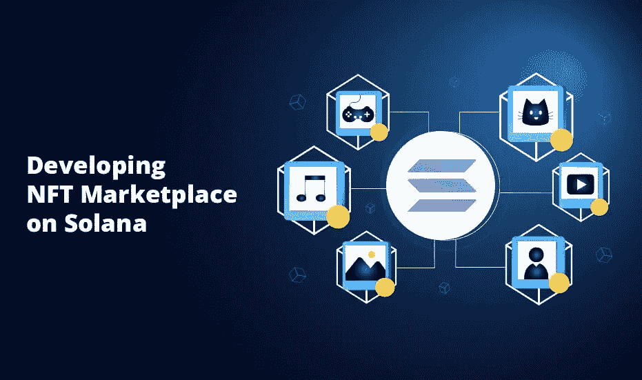

# 在 Solana 上创建 NFT 市场|引导您进入 Web3

> 原文：<https://medium.com/coinmonks/create-nft-marketplace-on-solana-guides-your-way-into-web3-93427d7c1c59?source=collection_archive---------23----------------------->

**NFT Marketplace On Solana**

T2 的 FTs 给了子孙后代创造生活的希望。所以，人们正在考虑用它来做生意。NFT 地区最突出的业务是建立一个专营交易的市场。要做到这一点，他们需要使用安全技术来保护每一份数据的安全。因为他们已经属于这一类，他们想选择那种能消除任何威胁的区块链。因此，他们决定接受索拉纳，这对创业来说是可取的。由于索拉纳是由**苹果、谷歌、英特尔和 Dropbox 的数字头脑创造的，**他们有能力消除现有数字和区块链世界面临的问题。因此，获得一个基于索拉纳的市场在数字世界中打开了许多机会，并为未来带来了巨大的空间。

> 因此，让我们来看看一个基于索拉纳的 NFT 市场发展项目对于未来派企业来说是如何的完美。

## **什么是索拉纳 NFT 市场？**

[**Solana**](https://solana.com/) 是最快、最安全、最具可扩展性的加密解决方案，引领您走向未来。它是由在领先公司有软件经验的工程师创建的。该项目在很短的时间内获得了来自基金会资助、多币资本和国际发行的 2500 万美元。

Solana 的交易速度接近每秒 50，000 次，每 400 毫秒创建一个块，在不到一秒的时间内确认它们。因此，它无疑是最快的网络规模的区块链，其容量与互联网不相上下。此外，由于它的速度，索拉纳很快就在块数上超过了以太坊。与以太坊相比，**索拉纳的交易成本更低**。因为它有不同的能力使交易发生得更快更安全，所以它比其他的更适合市场开发。这也是人们利用最受期待的连锁店 Solana 寻找商机的原因。

[**索拉纳 NFT 市场发展**](https://bit.ly/3S3dytb) 有一些好处，使其成为 NFT 珍奇收藏品交易的绝佳场所。让我们看看它们。

## **索拉纳 NFT 市场的好处**

👉索拉纳 NFT 市场的开发非常强调分散化、安全性和可伸缩性。

👉利用桩开发协议使用户能够享受高回报和激励。

👉通过避免中央集权，使交易能够顺利进行。

👉由于低廉的天然气成本和网络拥堵，位于索拉纳的 NFT 市场吸引了大量的加密用户。

👉索拉纳 NFT 平台允许它纳入广泛的安全协议和尖端的附加功能。因此，它有助于获得优异的可组合性。

以下是你如何利用索拉纳链建立自己的市场。

**Developing NFT Marketplace On Solana**

## **建立索拉纳 NFT 市场的步骤**

可以在各种区块链网络上创建 NFT，因为它们更有特色，适应性更强。索拉纳区块链是最著名和最广泛使用的网络，具有**最快的交易时间和最值得信赖的安全功能。**

➡ **步骤 01:** 开始之前，确定你的需求并评估项目的范围。

➡ **步骤 02:** 制作一份文件，概述你希望你的非功能性测试市场满足的要求。

➡ **步骤 03:** 联系一家可靠的 NFT 市场开发公司的熟练程序员。

➡ **步骤 04:** 为平台创建简单而强大的用户界面和用户体验(UI/UX)。

➡ **步骤 05:** 获取服务器后端连接，保证平台后端高效运行。

➡ **步骤 06:** 通过整合有效合适的钱包，提高你收藏的 NFT 收藏品的安全性。

➡ **步骤 07:** 在智能合约审计期间使用各种测试用例创建智能合约。

➡ **第 8 步:**发布测试版，获得公众评论，并在全面推出前进行修改。

➡:第 09 步:确保技术支持人员全天候帮助你完成所有升级和维护工作。

你可以使用这个指南从头开始创建一个市场，但是你还有另外一个选择。您可以使用**白标解决方案**，这通常是一个预先测试的模块，您可以定制它来满足您的期望。它为你节省时间和金钱。此外，它让你放心地进入市场。

## **结论**

索拉纳上的 NFT 市场打开了一条通往 Web3 的道路，让你成为网络成功的领跑者。你可以成为一名企业家，给人们想要的东西，并决定下一代的样子。你的企业可以成为一种标准力量，推动人们走向一个平台，进行无止境的交易，获得大量利润。因此， [**在 Solana**](https://bit.ly/3S3dytb) 上，在市场平台服务提供商的协助下，开始您的 NFT 市场开发，构建一个强大的 NFT 销售领域。在这个充满数字化竞争的世界里，它也可能是你开始商业生活的地方。

> 交易新手？试试[密码交易机器人](/coinmonks/crypto-trading-bot-c2ffce8acb2a)或[复制交易](/coinmonks/top-10-crypto-copy-trading-platforms-for-beginners-d0c37c7d698c)