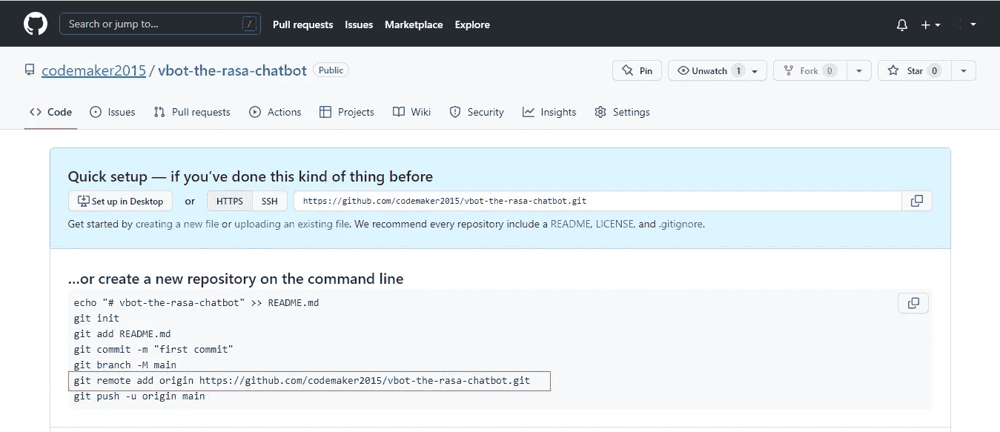
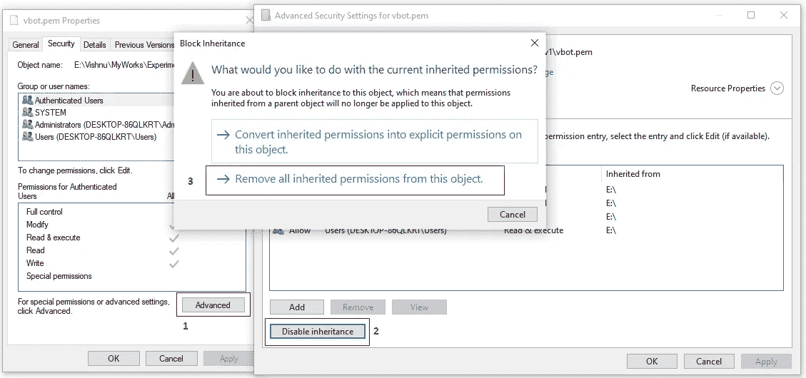

# 使用 Rasa 创建您的聊天机器人，并将其部署在 AWS 上

> 原文：<https://medium.com/coinmonks/create-your-chatbot-using-rasa-and-deploy-it-on-aws-e59b4f296605?source=collection_archive---------0----------------------->


聊天机器人已经成为客户服务自动化的重要组成部分，因为它可以帮助客户对他们的查询做出快速响应。在 covid 爆发后，80%的营销人员计划开始使用聊天机器人来改善客户支持。据《福布斯》报道，聊天机器人市场预计到 2025 年将达到 12.5 亿美元。

聊天机器人是一种通过文本或语音交互模拟人类对话的计算机程序。它带来了成本节约并提高了企业的运营效率，因为他们可以通过自动化常见问题解答和快速回复来减少对人工交互的需求。

[**Rasa**](https://rasa.com/) 是一个开源框架，使用 Python 和 NLU 构建定制的 AI 聊天机器人。使用 Rasa 构建的聊天机器人可以部署在多个社交平台上，如 Whatsapp、脸书、slack 等网站

在本节中，我们将学习使用 Rasa 创建一个自定义聊天机器人，并将其部署在 AWS VM 上。

# 入门指南

## 目录

*   [**A 部分:Rasa 聊天机器人的创建和集成到前端**](#22d9)
*   [先决条件](#b8ec)
*   [Rasa 安装](#deb7)
*   [创建第一个 Rasa 项目](#ce1c)
*   [了解项目结构](#65df)
*   [定制您的聊天机器人](#6e5e)
*   [拉莎形象化](#2dcf)
*   [Rasa 测试](#42a4)
*   [前端集成](#8519)
*   [版本控制](#fa1e)
*   [**B 部分:在 AWS EC2 上部署聊天机器人**](#070a)
*   [虚拟机实例创建](#e415)
*   [通过 SHH](#ed89) 连接到虚拟机
*   [安装依赖项](#eed5)
*   [Rasa 安装](#02fb)
*   [克隆代码](#f909)
*   [前端部署](#9dfb)

# A 部分:Rasa 聊天机器人的创建和集成到前端

## 先决条件

*   Python 3.7 或 3.8(文章基于[Python 3 . 8 . 4](https://www.python.org/downloads/release/python-384/)/Python 3 . 8 . 10)
*   pip 的最新版本
*   [Visual Studio 代码](https://code.visualstudio.com/download)

从[官方网站](https://www.python.org/downloads/release/python-384/)下载 Python 3.8.4 并安装在你的机器上。请注意，您在安装它时选择了“添加到路径并为所有用户安装”选项。

## Rasa 安装

本文的重点是在 windows 操作系统上创建 rasa 聊天机器人。Rasa 有一个定义良好的文档，如果您使用其他操作系统，请参考以下链接。

[](https://rasa.com/docs/rasa/installation/) [## 装置

### 想先探索一下吗？您甚至可以在安装之前使用 Rasa Playground 在线探索 Rasa 开源。在…

rasa.com](https://rasa.com/docs/rasa/installation/) 

*   在首选目录中打开命令提示符，并创建一个虚拟环境来隔离 python 项目

```
python3 -m venv ./venv
```

*   激活虚拟环境

```
venv\Scripts\activate
```

*   在安装 Rasa 之前，使用以下命令升级 pip 软件包

```
pip install --upgrade pip
or
python -m pip install --upgrade pip
```

*   使用以下命令安装 rasa

```
pip install rasa
```


## 创建第一个 Rasa 项目

通过创建一个 rasa 项目来创建你的第一个聊天机器人。您可以通过在终端中运行`rasa init`命令来实现。选择您对 rasa 项目创建初始步骤中所提问题的偏好。在模型训练之后，你得到一个问题‘你想在命令行上和助手说话吗’。如果你说是，那么你可以在命令行中与你的第一个聊天机器人互动。

```
rasa init
```


## 了解项目结构

`rasa init`命令创建 Rasa 需要的必要项目文件，并根据样本数据训练一个简单的机器人。


*   **__init__。py** —帮助查找动作的空文件
*   **actions.py** —用于编写您的自定义操作。您可以定义自定义动作，通过 REST API 调用外部服务器。此外，我们可以创建多个脚本来实现自定义操作。
*   **config.yml** —包含您的 NLU 和核心模型的配置。它主要用于定义聊天机器人的语言、管道和策略。
*   **credentials.yml** —包含连接到其他服务的信息。你可以使用这个文件连接各种社交媒体平台，如 Whatsapp，Facebook Messenger 等，也可以将机器人与网站集成。
*   **data/nlu.yml** —包含您的 nlu 培训数据并定义用户响应。您可以在此定义您的聊天机器人意图。例如:问候、订购物品、显示地图等。为此，你必须在 nlu 文件上添加相关的句子。
*   **data/stories.md** —包含您的故事，Rasa Core 需要这些故事来设置您和聊天机器人之间的对话流程。让你的聊天机器人在各种路径上尽善尽美是必不可少的一部分。
*   **domain.yml** —包含聊天机器人可以检测到的不同意图以及机器人回复列表。
*   **endpoints.yml** —包含您的 bot 可以像 FB messenger 一样使用的不同端点。这对生产是有用的。
*   **models/<timestamp><random-name>. tar . gz**—你的初始模型

## 自定义您的聊天机器人

执行 rasa init 命令后，您将获得一个完美运行的基本聊天机器人。文件结构和基本意图格式可以从 rasa 团队提供的文档中找到。因此，通过参考这些文档，您可以轻松定制您的聊天机器人。

> 将正确版本的 Rasa 用于机器人的正确操作和定制是非常重要的，没有它机器人就不能被训练。例如，对于 rasa 版本 2.7.1，版本为 2.0。同样，对于 rasa 版本 3.2.5，版本是 3.1。这个版本应该在 nlu.yml，stories.yml，rules.yml 和 domain.yml 中指定。

*   让我们从添加一个新的意图到`nlu.yml`文件开始。将以下代码添加到文件中，用于查询 bot 名称。我们使用 yml 格式。因此，请确保制表符间距是正确的。否则，它会在训练模型时抛出一些错误。

```
- intent: bot_name
  examples: |
    - what is your name?
    - what are you called?
    - how can i address you?
```


*   在`domain.yml`文件中添加 bot 响应。这里我们将添加一个名为`utter_bot_name`的新发音和一个名为 **Enthiran 3.0** 的文本响应。

```
utter_bot_name:
  - text: "Enthiran 3.0"
```


*   在`rules.yml`文件中定义一组新的规则，用于将意图与机器人响应进行映射。这里，我们将把意图`bot_name`和机器人动作`utter_bot_name`对应起来。为此，将以下代码添加到`rules.yml`文件中，

```
- rule: Say 'I am a bot' anytime the user challenges
  steps:
  - intent: bot_name
  - action: utter_bot_name
```


*   在`stories.yml`文件中添加一个新路径，为您的定制聊天机器人查询和机器人响应创建一个流。

```
- story: path 4
  steps:
  - intent: bot_name
  - action: utter_bot_name
```


我们已经将所有信息添加到指定的文件中，以创建一个自定义意图来询问机器人名称并获得类似于" **Enthiran 3.0"** 的响应。我们需要再次训练模型，以将新添加的意图映射到模型。执行以下任一命令，再次训练模型。

```
rasa train --config config.yml --domain domain.yml --data data/
```

现在，我们可以在终端上试用我们修改过的聊天机器人，通过执行下面的命令来验证更改。

```
rasa shell
```


万岁！我们已经创建了第一个定制的聊天机器人。

## 拉沙·天眼

我们可以使用`rasa visualize`命令将故事可视化。为你的故事生成一个可视化的表现是非常有帮助的。执行`rasa visualize`命令后，您可以在根文件夹下的`graph.html`文件中找到结果。

```
rasa visualize
```


## Rasa 试验

Rasa 启用了一个测试选项来测试经过训练的 Rasa 模型。您可以使用以下命令测试模型，

```
rasa test
```


关于 rasa 命令的更多信息: [Rasa 备忘单](https://rasa.com/docs/rasa/command-line-interface/)

## 前端集成

在终端上运行聊天机器人看起来并不吸引人，而且交互性较差。我们可以在一个前端站点上集成我们的聊天机器人，以使交互更好。Rasa 团队提供了与网站整合的基本步骤。参考下面的链接，了解更多关于如何在网站上集成聊天机器人。

[](https://rasa.com/docs/rasa/connectors/your-own-website/) [## 你自己的网站

### 如果您已经有一个现有的网站，并希望添加一个 Rasa 助理，您可以使用 Rasa 聊天小工具 a…

rasa.com](https://rasa.com/docs/rasa/connectors/your-own-website/) 

*   您必须启用`credentials.yml`文件中的`socket.io`凭证来创建 rasa 后端和前端插件之间的通道。为此，只需取消对`socket.io`凭证的注释，并进行如下所述的更改，

```
socketio:
 user_message_evt: user_uttered
 bot_message_evt: bot_uttered
 session_persistence: true
```


*   在根文件夹中创建一个名为`index.html`的 html 文件，并向其中添加以下内容。

```
<!DOCTYPE html>
<html>
    <body>
        <div 
            id="rasa-chat-widget" 
            data-websocket-url="[http://localhost:5005/](http://localhost:5005/)"  
            data-height=475>
        </div>
        <script src="[https://unpkg.com/@rasahq/rasa-chat](https://unpkg.com/@rasahq/rasa-chat)" type="application/javascript"></script>
    </body>
</html>
```

*   使用以下命令运行 rasa 后端

```
rasa run -m models --enable-api --cors "*"
rasa run -m models --enable-api --cors "*" --debug
```


*   在终端显示“Rasa 服务器启动并运行”消息后，在浏览器上加载`index.html`文件。


我们已经在前端(网站)整合了我们的聊天机器人。

## 版本控制

建议对您的代码应用任何版本控制来跟踪代码上的更改。它使我们能够回滚我们的代码，跟踪变化，管理版本等等。Github 是最好的版本控制工具之一。

在 GitHub 上创建一个存储库，并按照步骤将代码推送到远程存储库。


在项目文件夹中打开一个终端，并执行以下命令，将您的代码推送到远程存储库。

```
git init
git add .
git commit -m "initial commit"
git remote add origin <origin url>
git push origin master
```

你可以查看 GitHub 页面获取原始网址。



# 第二部分:在 AWS EC2 上部署聊天机器人

到目前为止，我们已经学会了使用 rasa 创建自定义聊天机器人。现在，我们可以尝试在 AWS EC2 实例上部署我们创建的基本聊天机器人。

## 虚拟机实例创建

如果您还没有 AWS 帐户，请创建一个。

*   首先，登录 AWS 帐户，从搜索窗口中选择 EC2 实例仪表板。


*   点击**启动实例**按钮，进入实例创建窗口。在“名称和标签”字段中提供一个实例名称。


*   选择 **Ubuntu Server 20.04 LTS (HVM)，SSD 卷类型**为 AMI。


*   选择 **t2.micro** 作为实例类型。


*   创建一个密钥对来通过 SSH 访问虚拟机。确保将密钥文件保存在安全的文件夹中，不要丢失，因为这是验证虚拟机访问的唯一方法。点击**创建新的密钥对**，在弹出窗口中提供密钥对名称、密钥对类型和密钥文件格式(保存为 pem)。


*   在网络设置中勾选**允许来自任何地方的 SHH 流量**和**允许来自互联网的 HTTP 流量**。选中 http 流量复选框，否则它将不允许访问您虚拟机上的 HTTP 端口(80)。


*   将存储大小设置为 16(默认值为 8)，因为我们需要 8 GB 以上的空间来安装 rasa 依赖项。之后，点击**启动实例**按钮启动虚拟机。


*   单击实例 id 以获取有关虚拟机的基本信息。


## 通过 SHH 连接到虚拟机

*   点击**连接**按钮，获取连接相关信息。


*   选择 SHH 选项卡，复制下面提供的命令，通过终端上的 SHH 连接到虚拟机。


*   在通过 SHH 连接到虚拟机之前，我们必须限制对关键文件的访问。如果你使用的是 ubuntu 机器，那么执行`chmod 400 key-file-name.pem`。如果您使用的是 windows 机器，请尝试以下步骤来限制 pem 文件访问。
*   选择 pem 文件并打开属性窗口。选择安全选项卡并点击**高级**按钮。点击**禁用继承**按钮并选择**移除该对象的所有继承权限**选项。



*   现在，所有用户都从列表中删除了。点击**添加**按钮，弹出添加用户信息的窗口。点击 S **选择负责人**文本，添加当前用户。在给定的输入列表中输入用户名，并按下**检查名称**按钮。


*   完成了。我们可以通过 SHH 使用 pem 文件连接虚拟机。在 pem 文件所在的文件夹中打开终端，并执行以下命令(在 SSH 选项卡中作为示例提供)。

```
ssh -i "vbot.pem" ubuntu@ec2-54-193-138-236.us-west-1.compute.amazonaws.com
```


## 安装依赖项

**先决条件**

*   Python3.7 或 3.8(首选 python 3.8.10)
*   pip3 22 或更高版本
*   venv
*   张量流 2.7.0
*   nginx

在安装依赖项之前，使用以下命令更新您的虚拟机，

```
sudo apt-get update
```


将 pip3 安装到虚拟机

```
sudo apt-get install python3-pip
```


将 python 虚拟环境安装到虚拟机

```
sudo apt-get install python3.8-venv
```


使用以下命令安装 nginx 来托管您的前端，

```
sudo apt install nginx
```


## Rasa 安装

EC2 实例中的 rasa 安装与普通安装略有不同。AWS 不允许我们直接在 VM 中安装 tensorflow。因此，我们必须在虚拟机中安装 rasa 之前单独安装它。

*   通过在终端上执行以下命令，在所需的文件夹上创建一个虚拟环境。

```
python3 -m venv ./venv
```

*   激活虚拟环境

```
source ./venv/bin/activate
```

*   升级 pip 包，因为 rasa 需要更新的 pip

```
pip3 install -U pip
```

*   在虚拟机中安装 tensorflow

```
pip3 install tensorflow==2.7.0 --no-cache-dir
```


*   使用以下命令安装 rasa 并验证版本

```
pip3 install rasa
rasa --version
```


## 克隆代码

我们已经在虚拟机中安装了所需的依赖项和 rasa 框架。现在，我们可以克隆您已经推送到 git 的代码。

```
git clone <repo-url>
```


*   导航到克隆的项目文件夹。有时候模型需要重新训练。从模型文件夹中删除以前的模型，然后重新训练最新的模型。


*   使用以下命令在终端上测试 chatbot

```
rasa shell
```


## 前端部署

我们必须对防火墙和虚拟机网络入站规则进行一些更改，以便在虚拟机中部署我们的前端站点。

*   单击实例仪表板中“安全”选项卡下列出的安全组 id。


*   添加新的入站规则以允许`socket.io`访问。点击**添加规则**按钮。将 type 设置为 Custom HTTP，port 设置为 5005，source 设置为 Anywhere。


*   启用对 ufw 防火墙服务的访问。执行以下命令，允许在虚拟机中进行 nginx、SHH、tcp 访问。

```
sudo ufw allow ssh
sudo ufw allow 'Nginx Full'
sudo ufw enable
sudo ufw status numbered
```


*   有必要启用 5005 端口访问，以便从前端站点通过 socket.io 与 rasa 后端进行通信。执行以下代码以允许 ufw 中的 5005 端口访问。

```
sudo ufw allow 5005/tcp
```

*   您可以将前端文件移动到默认的 nginx 文件夹，并备份目录中可用的默认索引文件。为此，请执行以下命令。

```
cd /var/www/html/
sudo mv index.nginx-debian.html index.html.bckpcd ~/vbot-the-rasa-chatbot/
sudo cp index.html /var/www/html/index.html
sudo cp bg.png /var/www/html/bg.png
```


*   重启 nginx 服务器以反映文件的变化

```
sudo systemctl restart nginx
sudo systemctl status nginx
```


*   最后，使用 **nohup** 包运行 rasa 后端。nohup 使即使终端关闭也能运行该命令。

```
nohup rasa run -m models --enable-api --cors "*" &
```

您可以通过打开公共 IPv4 地址在浏览器上查看该站点。您可以从仪表板获取公共 IPv4 地址。注意，如果您没有使用任何 SSL 证书，那么手动提供`http://`作为 URL 的前缀([http://54.183.218.201/](http://54.183.218.201/))。


## 输出


感谢阅读这篇文章。

感谢 [Gowri M Bhatt](https://www.linkedin.com/in/gowri-m-bhatt-85b31814b/) 审阅内容。

如果你喜欢这篇文章，请点击拍手按钮👏并且分享出来帮别人找！

这篇文章也可以在 Dev 上找到。

本教程的完整源代码可以在这里找到，

[](https://github.com/codemaker2015/vbot-the-rasa-chatbot) [## GitHub-codemaker 2015/vbot-the-rasa-chatbot:使用 Rasa 框架创建的自定义聊天机器人

### 使用 Rasa 框架创建的自定义聊天机器人。通过创建……为 codemaker 2015/vbot-the-rasa-chatbot 开发做出贡献

github.com](https://github.com/codemaker2015/vbot-the-rasa-chatbot) 

> 加入 Coinmonks [电报频道](https://t.me/coincodecap)和 [Youtube 频道](https://www.youtube.com/c/coinmonks/videos)了解加密交易和投资

# 另外，阅读

*   [Capital.com 评论](https://coincodecap.com/capital-com-review) | [香港的加密借贷平台](https://coincodecap.com/crypto-lending-hong-kong)
*   如何在 Uniswap 上交换加密？ | [A-Ads 审查](https://coincodecap.com/a-ads-review)
*   [WazirX vs coin dcx vs bit bns](/coinmonks/wazirx-vs-coindcx-vs-bitbns-149f4f19a2f1)|[block fi vs coin loan vs Nexo](/coinmonks/blockfi-vs-coinloan-vs-nexo-cb624635230d)
*   [本地比特币评论](/coinmonks/localbitcoins-review-6cc001c6ed56) | [加密货币储蓄账户](https://coincodecap.com/cryptocurrency-savings-accounts)
*   [什么是融资融券交易](https://coincodecap.com/margin-trading) | [成本平均法](https://coincodecap.com/dca)